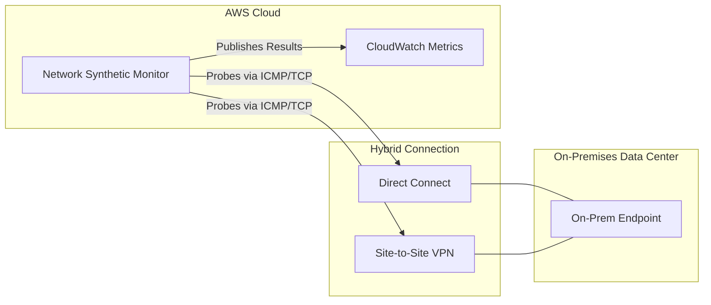

# 🌐 AWS CloudWatch Network Synthetic Monitor: Hybrid Connectivity Health

This guide focuses on **CloudWatch Network Synthetic Monitor**, a specialized tool designed to provide visibility into the performance of the "bridge" between your on-premises infrastructure and the AWS Cloud.

---

## 1. What is Network Synthetic Monitor? 🔗

If you have a hybrid architecture using **AWS Direct Connect** or a **Site-to-Site VPN**, you need to know if the "pipes" are leaking. This service acts as a continuous tester that probes your network path to ensure it meets performance requirements.

### **Core Capabilities**

* **Performance Tracking:** Identifies degradation in real-time, specifically focusing on the "Big Three" network health indicators:
* **Packet Loss:** Data that never reaches its destination.
* **Latency:** The delay in data transmission (Round Trip Time).
* **Jitter:** The variation in latency over time (critical for VOIP and video).

* **Agentless Execution:** Unlike the CloudWatch Unified Agent, this monitor **does not require any software installation** on your on-premises servers.
* **Traffic Simulation:** It tests connectivity using **ICMP (Ping)** or **TCP** traffic over **IPv4**.

---

## 2. Architecture: The Hybrid View 🏗️

The monitor sits within AWS and actively probes your on-premises endpoints through your established private connections.

---

## 3. Technical Specifications Table 📊

| Feature | Details |
| --- | --- |
| **Supported Protocols** | **ICMP** (standard ping) and **TCP** (port-specific checks). |
| **IP Version** | **IPv4** (On-premises traffic). |
| **Connection Types** | **Direct Connect (DX)** and **Site-to-Site VPN**. |
| **Primary Metrics** | Packet loss (%), Average Latency (ms), and Jitter (ms). |
| **Integration** | All results flow into **CloudWatch Metrics** for alerting. |

---

## 4. Missing Concepts: The Bigger Picture 🧩

While the transcript focuses on network path monitoring, a complete learning experience includes how this fits into the broader **CloudWatch Synthetics** family.

### **A. Synthetics Canaries**

Network Synthetic Monitor is part of **CloudWatch Synthetics**. The most common type is the **Canary**—a script that follows a user's path through a website.

* **Difference:** Canaries test the **Application Layer** (HTTP/API), while the Network Monitor tests the **Network Layer** (Connectivity/Plumbing).

### **B. Automated Response (The "So What?")**

Monitoring is useless without action. Once these metrics hit CloudWatch, you should:

* **CloudWatch Alarms:** Set a threshold (e.g., "Alarm if Packet Loss > 2% for 5 minutes").
* **SNS Notifications:** Alert the Network Operations Center (NOC) immediately via email or Slack.
* **Route Table Changes:** (Advanced) Use a Lambda function to automatically failover traffic to a secondary VPN if the Primary Direct Connect shows high jitter.

### **C. Comparison: Network Health Tools**

| Tool | Focus |
| --- | --- |
| **Network Synthetic Monitor** | **Hybrid Path** (AWS to On-Prem). |
| **VPC Flow Logs** | **Security & Troubleshooting** (Which IP talked to which Port). |
| **Internet Monitor** | **Internet Path** (AWS to your end-users over the public web). |

---

## 5. Summary for the Exam 🎓

If the scenario asks about **detecting network performance issues** (latency/loss) between a **Data Center** and **AWS** without installing software, **CloudWatch Network Synthetic Monitor** is your answer.

---between hybrid and public path monitoring?**