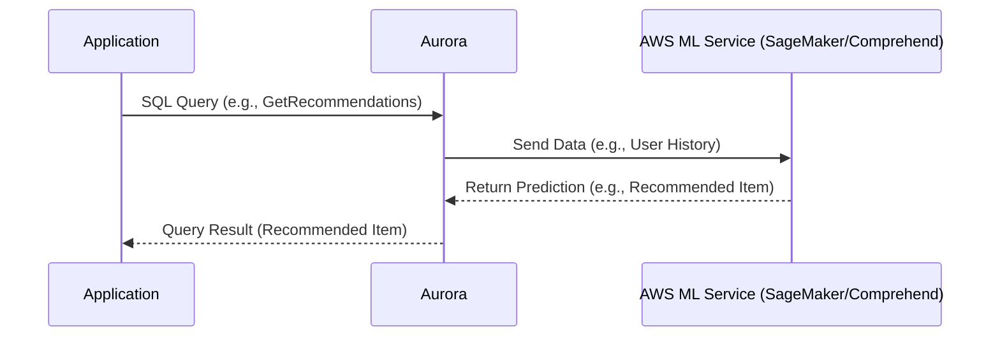
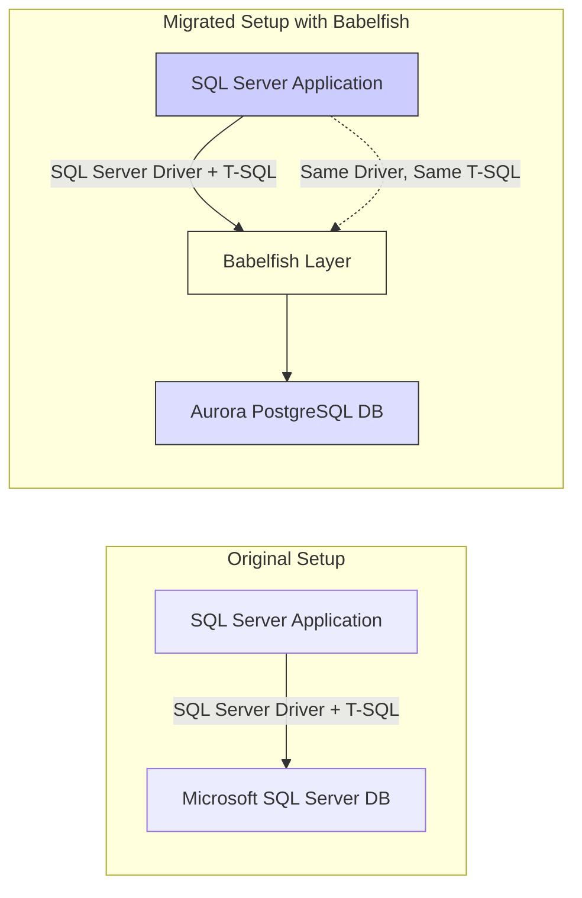

# ✨ Advanced Amazon Aurora Features Learning Guide

This guide details the specialized capabilities of Amazon Aurora, focusing on scaling, global deployment, serverless architecture, ML integration, and compatibility layers.

-----

## ⚖️ Advanced Scaling: Endpoints and Auto-Scaling

While the basic Reader and Writer endpoints simplify connections, advanced scaling allows for workload-specific instance management.

### 1\. Replica Auto-Scaling

  * **Purpose:** Automatically adjusts the number of **Aurora Read Replicas** based on performance metrics (e.g., increased CPU usage due to many read requests).
  * **Mechanism:**
    1.  Increased read traffic pushes up Aurora database CPU usage.
    2.  Auto-scaling adds more Aurora replicas (instances).
    3.  The **Reader Endpoint** is automatically updated to include the new replicas.
    4.  Traffic is distributed, lowering the overall CPU usage.

### 2\. Custom Endpoints

  * **Purpose:** To define a **subset** of Aurora instances for a specific workload or use case.
  * **Mechanism:** You create a custom endpoint that only points to a designated group of read replicas.
      * **Example Use Case:** Define a custom endpoint for your largest instances (`db.r5.2xlarge`) to handle heavy **analytical queries**, while smaller instances handle regular OLTP reads.
  * **Note:** When using custom endpoints, the default **Reader Endpoint** is generally **not used** for new workload routing. You would typically set up multiple custom endpoints for various workload types.

-----

## 🌐 Aurora Global Database & Disaster Recovery

Aurora Global Database is the recommended approach for true global scale and disaster recovery.

| Feature | Detail |
| :--- | :--- |
| **Architecture** | **One Primary Region** (Read/Write) and up to **10 Secondary Regions** (Read-Only). |
| **Replication Speed** | Replication lag is **sub-one second** across regions (average **less than one second**). *(A key exam indicator for Global Aurora)* |
| **Regional Scaling** | Up to **16 Read Replicas** can be configured per secondary region. |
| **Benefits** | **1. Low Read Latency:** Serves reads globally. **2. Disaster Recovery:** Provides resilience against a full region outage. |
| **Recovery Time Objective (RTO)** | Promoting a secondary region for disaster recovery is very fast, with an RTO of **less than one minute**. |
| **Cross-Region Read Replica (Simple)** | This is a simpler disaster recovery option, but Global Database is the modern, recommended approach. |

-----

## ☁️ Aurora Serverless

Aurora Serverless provides an on-demand, pay-per-use scaling model.

  * **Best For:** **Infrequent, intermittent, or unpredictable workloads**.
  * **Key Benefit:** **No capacity planning** is required.
  * **Billing:** You pay only for the second each Aurora instance is active and running.
  * **Architecture:** Clients connect through an **AWS-managed Proxy Fleet**, which dynamically scales up and spins down the Aurora instances in the backend based on actual usage.

-----

## 🧠 Aurora Machine Learning (ML) Integration

Aurora allows applications to execute ML predictions using a simple SQL interface, without needing dedicated ML expertise.

  * **Function:** Integrate ML-based predictions directly into your applications via **SQL queries**.
  * **Supported Services:**
    1.  **Amazon SageMaker:** Use any custom machine learning model.
    2.  **Amazon Comprehend:** Specialized for **sentiment analysis**.
  * **How it Works:**
    1.  Application sends a standard SQL query (e.g., `SELECT recommended_products(...)`).
    2.  Aurora sends data (e.g., user profile, history) to the ML service.
    3.  The ML service returns the prediction (e.g., "red shirt and blue pants").
    4.  Aurora returns the prediction as the SQL query result to the application.
  * **Use Cases:** Fraud detection, ads targeting, sentiment analysis, and product recommendation.

### ML Integration Flow (Mermaid Diagram)

-----

## 🔠 Babelfish for Aurora PostgreSQL

Babelfish is a key feature for simplifying database migration from Microsoft SQL Server.

  * **Purpose:** Allows **Amazon Aurora PostgreSQL** to understand commands written for **Microsoft SQL Server**.
  * **Translation:** It understands the **T-SQL** language used by SQL Server applications.
  * **Migration Benefit:** SQL Server applications can communicate with Aurora PostgreSQL using their **original SQL Server Client Driver** and **T-SQL** queries.
  * **Result:** Facilitates migration to Aurora PostgreSQL with **little to no code changes** to the application layer.
  * **Migration Tools:** AWS Schema Conversion Tool (SCT) and AWS Database Migration Service (DMS) are used to move the data and schema, while Babelfish handles the language translation.

### Babelfish Migration (Mermaid Diagram)

