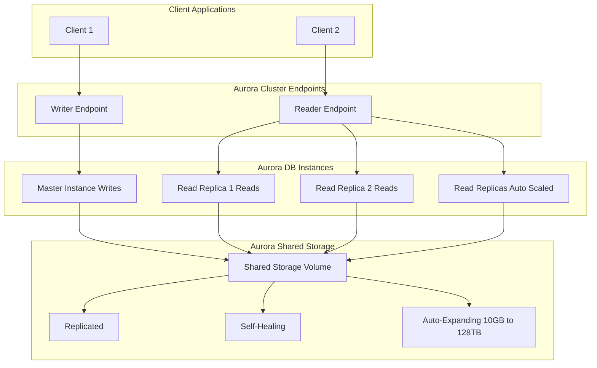

# 💡 Amazon Aurora: The Cloud-Native Database Learning Guide

Amazon Aurora is a proprietary, cloud-optimized relational database service from AWS. It is designed for high performance, availability, and scalability, offering compatibility with popular open-source databases while providing superior features and performance.

-----

## 🚀 Performance & Compatibility

| Feature | Detail |
| :--- | :--- |
| **Compatibility** | **PostgreSQL** and **MySQL** compatible drivers. You connect to Aurora as if it were a standard PostgreSQL or MySQL database. |
| **Performance Gain** | Up to **5x** the performance of MySQL on RDS and **3x** the performance of PostgreSQL on RDS due to deep cloud-native optimization. |
| **Proprietary** | It is an AWS **proprietary technology**, not open source. |

-----

## 💾 Storage & Scaling: The **Auto-Pilot** Feature

Aurora's storage architecture is one of its most innovative features, eliminating the need for manual disk monitoring.

  * **Automatic Scaling:** Storage starts at **10 GB** and automatically grows as data is added, up to **128 TB**.
  * **Worry-Free Operations:** Database Administrators (DBAs) or SysOps personnel **do not** need to monitor disk space.
  * **Volume Design:** It relies on **hundreds of volumes** in the backend, significantly reducing the risk associated with reliance on a single volume.

-----

## 🛡️ High Availability & Durability

Aurora is designed for maximum resilience, built on a shared, distributed storage layer across multiple Availability Zones (AZs).

### Data Replication & Durability

Aurora stores **six copies** of your data across **three Availability Zones (AZs)**.

| Component | Requirement for Operation | Impact |
| :--- | :--- | :--- |
| **Writes** | Only needs **four out of six** copies to be acknowledged. | Allows one entire AZ to be down without interrupting write availability. |
| **Reads** | Only needs **three out of six** copies. | Ensures high read availability, even under adverse conditions. |

### Self-Healing

  * Aurora incorporates a **self-healing process**. If data is corrupted or bad, it performs **peer-to-peer replication** in the backend to automatically fix it.

### Failover & Recovery

  * **Failover Speed:** Failover is designed to be **instantaneous** (much faster than Multi-AZ on MySQL RDS). Average failover time is typically **less than 30 seconds**.
  * **Backtrack Feature:** Allows you to restore data to **any point in time** without relying on traditional backups. It uses a different mechanism to rewind the database state.

-----

## 📈 Read Scaling & Cluster Architecture

Aurora clusters use specialized endpoints to simplify connection management, especially when dealing with multiple read replicas and auto-scaling.

### Core Cluster Components

1.  **Master Instance (Writer):** There is **only one** instance that handles all **writes**.
2.  **Read Replicas (Readers):** You can have up to **15 read replicas** that serve all read workloads.
      * **Fast Replication:** Replication lag is typically **sub-10 milliseconds**.
      * **Auto Scaling:** Read replicas support **auto-scaling**, ensuring you always have the right number of instances for your read workload.
      * **Failover Role:** Any read replica can become the new master in case of a master failure.
      * **Cross-Region Replication:** Read replicas support replication across different AWS regions.

### Connection Management (The Endpoints)

This is a critical concept for the exam\!

#### 1\. Writer Endpoint

  * **Function:** A stable **DNS name** that **always points to the current Master** instance.
  * **Benefit:** Clients always connect to the correct write instance, even after a failover.

#### 2\. Reader Endpoint

  * **Function:** A stable **DNS name** that performs **connection load balancing** across all available Read Replicas.
  * **Benefit:** Simplifies client application code, which doesn't need to track individual replica URLs, especially with auto-scaling.
  * **Note:** Load balancing happens at the **connection level**, not the statement level.

### Visualizing the Cluster Architecture (Mermaid Diagram)

-----

## 💰 Cost and Efficiency

While the baseline cost is about **20% more than standard RDS**, Aurora is often more cost-effective **at scale** due to its superior efficiency, performance, and the reduction in operational overhead (like storage management).

-----

## ✅ Summary of Managed Features

All of the following "magic" is handled for you by AWS:

  * Automatic failover
  * Backup and recovery
  * Isolation and security
  * Industry compliance
  * Push-button scaling (via auto-scaling)
  * Automated patching with zero downtime
  * Advanced monitoring and routine maintenance