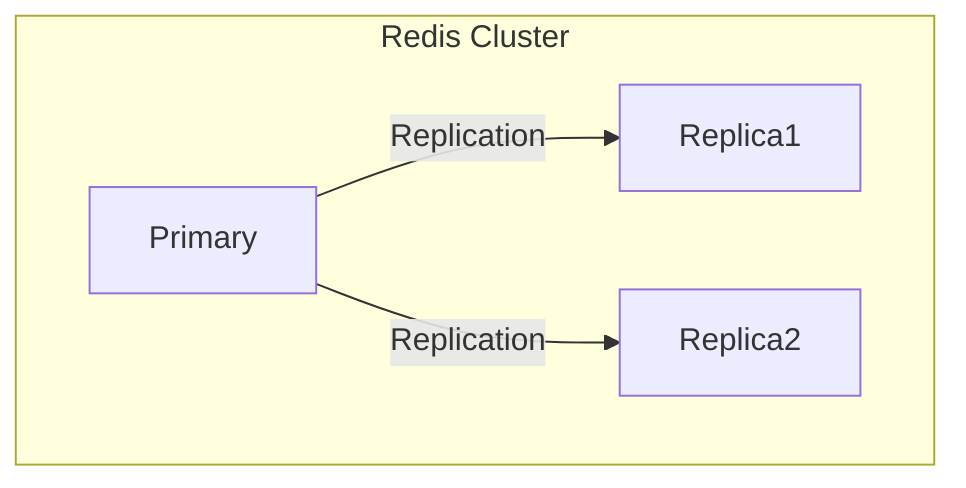
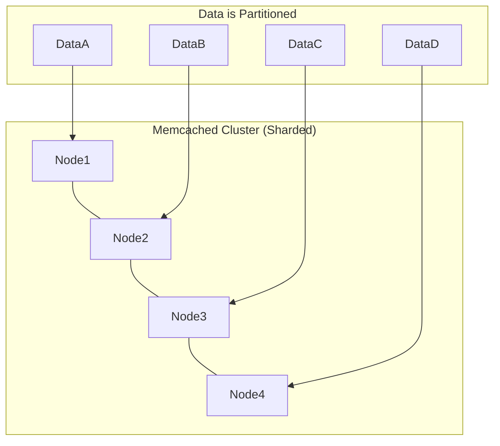

-----

# ⚡️ Supercharging Your Apps with Amazon ElastiCache

This guide explores Amazon ElastiCache, a service that provides managed, in-memory caches to dramatically improve your application's performance and scalability.

-----

## \#\# What is a Cache? The "Short-Term Memory" Analogy

Imagine your main database (like RDS) is a vast library. Finding a specific book can take time. A **cache** is like a small desk right next to you where you keep the books you're currently using or reference frequently. It's much faster to grab a book from your desk than to walk back into the library stacks every single time.

**Amazon ElastiCache** is a managed service that sets up this "desk" for you in the cloud. It runs popular open-source in-memory data stores: **Redis** and **Memcached**.

### \#\#\# Why Use ElastiCache?

1.  **Reduce Database Load**: For read-heavy applications, a cache can handle the vast majority of common queries. This protects your main database from being overwhelmed, saving it for the crucial write operations.
2.  **Improve Latency**: Reading from memory (RAM) is orders of magnitude faster than reading from a disk-based database. This results in a snappier, more responsive application for your users.
3.  **Enable Stateless Applications**: You can store temporary application state, like user login sessions, in a centralized cache. This allows you to scale your application servers horizontally without worrying about which server a user connects to.
4.  **It's a Managed Service**: Just like RDS, AWS handles the tedious work: OS patching, setup, configuration, monitoring, and failure recovery.

> **Important Note:** Implementing a cache is not a simple "flick of a switch." It requires significant changes to your application's code to query the cache and handle the logic of when to read from the database.

-----

## \#\# The Caching Logic: Hits and Misses

The core of a caching strategy revolves around two concepts:

  * **Cache Hit**: The application looks for data in the cache, and it's there\! The data is returned instantly, and the database is never touched. This is the ideal scenario.
  * **Cache Miss**: The application looks for data in the cache, but it's *not* there. The application must then query the main database to get the data. To make future requests faster, it then writes this data into the cache.

<!-- end list -->

```mermaid
sequenceDiagram
    participant App as Application
    participant Cache as ElastiCache
    participant DB as RDS Database

    App->>+Cache: Does data X exist?
    alt Cache Hit
        Cache-->>-App: Yes, here is X
    else Cache Miss
        Cache-->>-App: No, X not found
        App->>+DB: Please give me data X
        DB-->>-App: Here is data X
        App->>+Cache: Store data X for next time
        Cache-->>-App: OK, X is stored
    end

```

A key challenge with caching is **cache invalidation**: ensuring that old or stale data in the cache is updated or removed when the original data changes in the database.

-----

## \#\# Use Case: Stateless User Sessions

A common use for ElastiCache is to manage user sessions.

1.  A user logs into your application, which is running on multiple EC2 instances behind a load balancer.
2.  The application instance that handles the login writes the user's session information (e.g., user ID, login status) to a central ElastiCache cluster.
3.  The load balancer might direct the user's next request to a *different* EC2 instance.
4.  This new instance checks ElastiCache for the session data, finds it, and knows the user is already logged in.

The result is a seamless experience for the user, and your application instances become **stateless**, making them much easier to scale.

-----

## \#\# Choosing Your Engine: Redis vs. Memcached

ElastiCache offers two distinct engines, each with its own strengths.

| Feature | Redis | Memcached |
| :--- | :--- | :--- |
| **Primary Model** | Replication & High Availability | Simplicity & Performance via Sharding |
| **High Availability** | ✅ **Multi-AZ with auto-failover** | ❌ No (in standard version) |
| **Read Scaling** | ✅ **Read Replicas** | ❌ No |
| **Data Durability** | ✅ Backups & AOF Persistence | Serverless-only backups |
| **Data Types** | Rich (Strings, Lists, Sets, Hashes) | Simple (Strings only) |
| **Special Features** | Pub/Sub, Leaderboards (Sorted Sets) | Multi-threaded architecture |

### \#\#\# Redis: The Feature-Rich Powerhouse

Think of Redis as a Swiss Army knife. It's excellent for high availability and durability. Its model focuses on replicating data from a primary node to one or more replica nodes.



**Choose Redis when you need:**

  * High availability and automatic failover.
  * The ability to scale reads with replicas.
  * Data persistence and backups.
  * Advanced data structures like sets for leaderboards.

### \#\#\# Memcached: The Simple, Raw Speedster

Think of Memcached as a pure drag racer. It's all about raw, multi-threaded performance and simplicity. Its model is based on **sharding**—partitioning data across multiple nodes. Each node holds a piece of the total cache.



**Choose Memcached when you need:**

  * The simplest possible caching model.
  * To scale out horizontally by adding more nodes to partition data.
  * To handle high traffic where losing the cache data is not critical (as it can be repopulated from the database).