-----

# 🔩 RDS Custom: When You Need More Control

This guide explains Amazon RDS Custom, a deployment option that bridges the gap between the fully managed Amazon RDS and a self-managed database on EC2.

-----

## \#\# The Problem: When "Managed" is Too Restrictive

Standard Amazon RDS is like a fully-serviced apartment. The building management handles all the plumbing, electricity, and maintenance (OS patching, backups, scaling). It's incredibly convenient, but you're not allowed to knock down walls or install custom fixtures.

Some legacy applications, especially those using **Oracle** or **Microsoft SQL Server**, require specific configurations, third-party patches, or direct access to the underlying operating system that standard RDS doesn't permit.

**RDS Custom** is the solution. It's like an apartment where you still get the building maintenance, but the landlord gives you the keys to go inside and customize the paint, fixtures, and internal settings yourself.

-----

## \#\# What is RDS Custom?

**RDS Custom** is a managed database service for **Oracle and Microsoft SQL Server** that gives you full administrative access to the underlying database and operating system.

You get the benefits of a managed service—like automated provisioning and scaling—while also having the freedom to:

  * Apply custom patches and install third-party drivers.
  * Change specific database or OS configuration settings.
  * Enable native features that aren't supported by standard RDS.
  * Access the underlying EC2 instance directly using **SSH** or **AWS Systems Manager (SSM) Session Manager**.

This creates a **shared responsibility model**: AWS manages the hardware and basic automation, but *you* are responsible for the customizations you make to the database and OS.

```mermaid
graph TD
    subgraph "Standard RDS"
        User1[🧑‍💻 You] --> RDSEndpoint1[RDS Endpoint]
        RDSEndpoint1 -->|Manages| DBMachine1((DB & OS))
        User1 -.->|⛔ Blocked Access| DBMachine1
    end

    subgraph "RDS Custom"
        User2[🧑‍💻 You] --> RDSEndpoint2[RDS Endpoint]
        RDSEndpoint2 -->|Manages| DBMachine2((DB & OS))
        User2 -->|✅ SSH / SSM Access| DBMachine2
    end
```

-----

## \#\# With Great Power Comes Great Responsibility

Because you can directly modify the system, you can also accidentally break the automation that RDS relies on. To customize your instance safely, you must follow two critical best practices:

1.  **Pause Automation Mode**: Before making any changes, you should temporarily pause the RDS Custom automation. This prevents the service from trying to perform maintenance or scaling while you're in the middle of a delicate configuration.
2.  **Take a Snapshot First**: Always create a manual database snapshot *before* you make customizations. If your changes cause an issue, this snapshot is your only way to recover the database to a known good state.

-----

## \#\# At a Glance: RDS vs. RDS Custom

| Feature | Standard RDS | RDS Custom |
| :--- | :--- | :--- |
| **OS Access** | ⛔ No | ✅ **Yes** (Full Admin) |
| **DB Customization** | Limited | ✅ **Yes** (Full) |
| **Supported Engines** | Many (PostgreSQL, MySQL, etc.) | **Oracle & MS SQL Server only** |
| **Responsibility** | Fully Managed by AWS | **Shared Responsibility** |
| **Automation** | Always On | Can be paused by user |