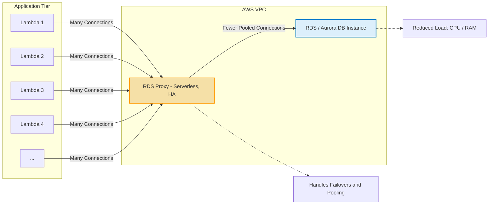

# 🔌 Amazon RDS Proxy: The Serverless Connection Manager

The Amazon RDS Proxy is a fully managed, highly available database proxy that sits between your application and your RDS/Aurora database. It's designed to improve application performance, resilience, and security by efficiently managing database connections.

-----

## 🎯 Core Functionality: Connection Pooling

The primary purpose of the RDS Proxy is to manage and reuse database connections.

  * **Problem:** Applications (especially those with rapidly scaling components like **AWS Lambda functions**) frequently open and close connections, stressing the database's resources (CPU, RAM). This leads to open connections, timeouts, and inefficiency.
  * **Solution:** The RDS Proxy **pools and shares** connections. Instead of every application instance connecting directly to the database, they connect to the proxy, which maintains a smaller, more efficient set of connections to the RDS/Aurora instance.
  * **Benefits:**
      * **Improved Efficiency:** Reduces stress on database resources (CPU and RAM).
      * **Minimized Overheads:** Reduces open connections and timeouts.
      * **Scalability:** Especially beneficial for bursty, unpredictable workloads like those generated by **Lambda functions**, which can quickly multiply and overload a database.

-----

## 🚀 Resilience and Failover Improvement

The RDS Proxy acts as a stable intermediary, significantly enhancing failover handling.

  * **Problem:** When a database failover occurs (e.g., from primary to standby instance in Multi-AZ RDS), application connections are dropped, requiring the application to handle the disruption and reconnect.
  * **Solution:** The RDS Proxy **handles the failover transparently** to the application.
  * **Benefit:** Reduces failover time by up to **66%** for both RDS and Aurora, as the application only interacts with the stable proxy endpoint.

-----

## 🔒 Security and Access Control

The proxy adds key security features and simplifies credential management.

  * **Enforce IAM Authentication:** The proxy can be used to **enforce IAM authentication** for database access, eliminating the need for applications to use traditional username/password credentials.
  * **Secrets Manager Integration:** Database credentials (if required) are **securely stored** in **AWS Secrets Manager**, and the proxy uses these to manage its pooled connections.
  * **Network Security:** The RDS Proxy is **never publicly accessible**. It is only reachable from **within your Virtual Private Cloud (VPC)**, providing enhanced security by default.

-----

## ✅ Compatibility and Deployment

  * **Supported Engines:** MySQL, PostgreSQL, MariaDB, Microsoft SQL Server, and **Aurora** (MySQL and PostgreSQL).
  * **Serverless and Managed:** The proxy is **fully serverless**, **auto-scaling**, and **highly available** across multiple AZs. You manage no capacity for the proxy itself.
  * **Zero Code Changes:** The application only needs to **change its connection string** to point to the proxy endpoint instead of the database endpoint; **no other code changes are required**.

### Connection Pooling with RDS Proxy (Mermaid Diagram)

