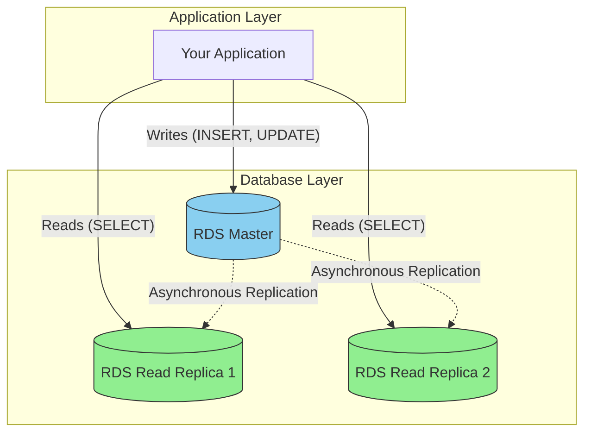
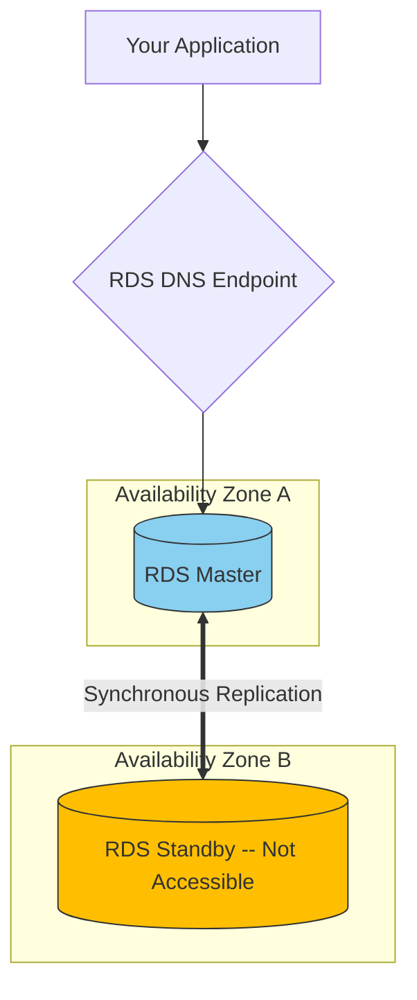

-----

# 🚀 RDS Deep Dive: Read Replicas vs. Multi-AZ

This guide clarifies two of the most important (and often confused) features of Amazon RDS: **Read Replicas** for performance scaling and **Multi-AZ** for high availability and disaster recovery. Mastering this distinction is crucial for designing robust applications and for success in AWS certification exams.

-----

## \#\# 📈 RDS Read Replicas: Scaling Your Read Performance

Think of a Read Replica as a photocopy of your main database. If too many people want to read the same book (your main database), you can make copies and hand them out, reducing the load on the original.

The primary use case for Read Replicas is to **scale read-heavy workloads**.

### \#\#\# How It Works

1.  **Asynchronous Replication**: Your main ("master") database sends a copy of its data changes to the Read Replicas. This process is **asynchronous**, meaning the master database doesn't wait for the replicas to confirm they've received the data before completing a write operation.
2.  **Eventual Consistency**: Because replication is asynchronous, there might be a small lag. This means a Read Replica might be a few milliseconds or even seconds behind the master. This is known as **eventual consistency**.
3.  **Application Configuration**: Your application must be configured to send all write operations (`INSERT`, `UPDATE`, `DELETE`) to the master database's endpoint and all read operations (`SELECT`) to the endpoints of one or more Read Replicas.

You can create up to **15 Read Replicas** and place them:

  * In the same Availability Zone (AZ).
  * Across different AZs.
  * Across different Regions.

<!-- end list -->

### \#\#\# Common Use Case: Isolating Workloads

Imagine your main production database is running smoothly. A new analytics team wants to run heavy, complex queries against your data for business reports. If they run these queries on the master database, it could slow down your entire application for actual users.

**Solution**: Create a Read Replica. The production app continues to use the master, while the analytics team runs its heavy queries against the replica, ensuring no performance impact on your primary workload.

### \#\#\# A Note on Networking Costs

  * **Same Region**: If your Read Replica is in the same AWS Region as the master (even in a different AZ), the data replication traffic between them is **FREE**.
  * **Cross-Region**: If you create a Read Replica in a different AWS Region, you **will be charged** for the inter-region data transfer.

-----

## \#\# 🛡️ RDS Multi-AZ: For Disaster Recovery

Think of Multi-AZ as a trapeze artist with a safety net. The artist (your master database) performs in one location (AZ-A), while a safety net (your standby database) is ready in another location (AZ-B). If the artist falls, the net catches them instantly.

The primary use case for Multi-AZ is **high availability** and **automatic failover** for disaster recovery. It is **NOT** used for performance scaling.

### \#\#\# How It Works

1.  **Synchronous Replication**: AWS creates an exact copy of your master database, called a **standby**, in a *different* Availability Zone within the same region. Every single write to your master database is simultaneously and **synchronously** written to the standby. This ensures the standby is always an exact, up-to-the-second copy.
2.  **Standby is Inaccessible**: You cannot connect to or read from the standby instance. It is purely passive, waiting in the wings for a disaster.
3.  **Automatic Failover**: Your application uses a single DNS endpoint to connect to the database. If the master instance or its entire AZ fails, RDS automatically promotes the standby instance to become the new master and updates the DNS endpoint to point to it. This failover typically completes in 1-2 minutes without any manual intervention.

<!-- end list -->

-----

## \#\# 💡 Key Differences & Exam Tips

| Feature | Read Replicas | Multi-AZ |
| :--- | :--- | :--- |
| **Primary Goal** | Performance Scaling (Reads) | Disaster Recovery (High Availability) |
| **Replication** | **Asynchronous** (eventual consistency) | **Synchronous** (data is always consistent) |
| **Secondary Instance** | **Accessible** and used for read traffic | **Not Accessible** (passive standby) |
| **Failover** | Manual promotion to a new master | **Automatic** failover |
| **Performance** | ✅ Improves application performance | ❌ Does not improve performance |

### \#\#\# Important Exam Scenarios

  * **Converting to Multi-AZ**: You can change an existing Single-AZ RDS instance to Multi-AZ with **ZERO downtime**. AWS handles creating a snapshot, restoring it to a new standby, and establishing synchronization in the background.
  * **Combining Both**: For the ultimate in resilience and performance, a **Read Replica can itself be configured as Multi-AZ**. This is a common exam question\! It protects your read replica from an AZ failure.