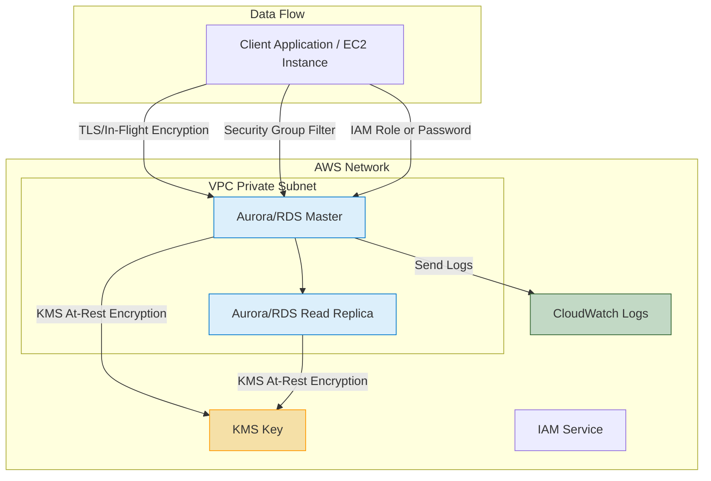

-----

# 🛡️ AWS RDS & Aurora Security Guide

Security is paramount for managed databases. AWS provides robust features for securing data both **at-rest** (storage) and **in-flight** (transit), along with flexible authentication and access control.

-----

## 🔐 Data Encryption

### 1\. Data At-Rest Encryption (Storage)

  * **Mechanism:** Encrypts the data on the underlying storage volumes.
  * **Key Management:** Uses **AWS Key Management Service (KMS)**.
  * **Implementation:**
      * Encryption must be defined during the **initial launch** of the database/cluster.
      * **Rule:** If the **Master (Primary) database** is unencrypted, **Read Replicas cannot be encrypted**.
  * **Modifying Existing Databases:** To encrypt an existing **unencrypted** database, you **MUST** perform a **snapshot and restore** operation:
    1.  Take a **Database Snapshot** of the unencrypted database.
    2.  **Restore** the snapshot, specifying a **KMS key** to create a *new, encrypted* database instance.

### 2\. Data In-Flight Encryption (Transit)

  * **Mechanism:** Encrypts the connection between the client application and the database using **SSL/TLS**.
  * **Default State:** Every RDS and Aurora database is **ready for in-flight encryption by default**.
  * **Client Requirement:** Clients must use the **TLS Root Certificates** provided by AWS to establish a secure, encrypted connection.

-----

## 🔑 Authentication Methods

You have two primary ways to manage user access and authenticate to your RDS/Aurora databases.

| Method | Detail | Benefit |
| :--- | :--- | :--- |
| **Traditional** | Standard **Username and Password** authentication (stored within the database engine). | Familiar and universally supported by clients/tools. |
| **IAM Database Authentication** | Use **IAM roles and policies** (e.g., attached to an EC2 instance or Lambda function) to generate a temporary authentication token. | Enhanced security, eliminates storing static passwords, centralizes security management within AWS IAM. |

-----

## 🚪 Network and Instance Access Control

### Network Access

  * **Security Groups (SGs):** Essential for controlling network access. You can define rules to **allow or block**:
      * Specific **Ports** (e.g., 3306 for MySQL, 5432 for Postgres).
      * Specific **IP Addresses** or IP ranges.
      * Other **Security Groups** (recommended for EC2-to-RDS traffic).

### SSH Access

  * **Standard RDS/Aurora:** **NO SSH access** is provided, as they are fully managed services.
  * **RDS Custom:** This specialized service *does* provide limited operating system and management access (but it is an exception to the rule for standard RDS/Aurora).
  * **Missing Concept: VPC/Subnet Placement:** For maximum security, all RDS/Aurora databases **must** be deployed into **private subnets** within a Virtual Private Cloud (VPC), isolating them from the public internet. Access is only routed through carefully controlled Security Groups and Bastion Hosts (if necessary for management).

-----

## 📝 Auditing and Logging

### Audit Logs

  * **Purpose:** To track and record **SQL queries** and **database activities** over time.
  * **Default Behavior:** Audit Logs are enabled but will eventually be **lost** as they are cycled on the database instance.
  * **Long-Term Retention:** To maintain logs for long periods, they must be configured to be sent to **Amazon CloudWatch Logs**, a dedicated AWS service for log aggregation and retention.

### RDS/Aurora Security Overview (Mermaid Diagram)

