Of course\! Here is a comprehensive learning guide in `README.md` format based on your transcript, enhanced with diagrams, analogies, and added context for a complete learning experience.

-----

# 💾 Amazon RDS: Your Managed Relational Database in the Cloud

This guide introduces Amazon Relational Database Service (RDS), a service that simplifies setting up, operating, and scaling a relational database in the AWS cloud.

-----

## \#\# What is a Relational Database?

Before diving into RDS, let's quickly clarify what a relational database is. Imagine your data is neatly organized in spreadsheets (tables) with rows and columns. Each table can be linked—or *related*—to other tables. For example, a `Customers` table could be related to an `Orders` table. To query and manipulate this structured data, you use a language called **SQL (Structured Query Language)**.

RDS is a managed service that runs popular relational database engines for you.

### \#\#\# Supported Database Engines

RDS isn't one single database; it's a service that can run several popular SQL-based database engines. You need to know which ones are supported:

  * PostgreSQL
  * MySQL
  * MariaDB (a community-developed fork of MySQL)
  * Oracle
  * Microsoft SQL Server
  * IBM DB2
  * **Amazon Aurora** (AWS's own proprietary, high-performance engine)

-----

## \#\# Why Use RDS Instead of a DIY Database on EC2?

You could always install a database like MySQL on an EC2 instance, so why pay for RDS? The answer is simple: RDS is a **managed service**. It automates the tedious, time-consuming administrative tasks, so you can focus on your application, not on managing database infrastructure.

Think of it as the difference between owning a car (EC2) and using a ride-sharing service (RDS). With your own car, you're responsible for oil changes, tire rotations, and repairs. With a ride-sharing service, you just get in and go.

Here’s what AWS manages for you with RDS:

| Feature | What AWS Handles (The "Managed" Part) |
| :--- | :--- |
| **Provisioning & Patching** | Automated database setup and OS patching. No need to worry about security updates. |
| **Backups & Recovery** | Continuous backups and the ability to restore to a specific second (**Point-in-Time Restore**). |
| **Monitoring** | Built-in performance dashboards via CloudWatch. |
| **Read Performance** | Easy setup of **Read Replicas** to offload read queries and improve speed. |
| **High Availability** | Simple configuration of a **Multi-AZ** setup for disaster recovery. |
| **Maintenance** | Scheduled **maintenance windows** for upgrades to minimize downtime. |
| **Scaling** | Both **vertical scaling** (increasing the instance size) and **horizontal scaling** (adding read replicas). |

The one trade-off for all this convenience is that **you cannot SSH into the underlying instance**. AWS manages the machine, so you don't get direct access.

-----

## \#\# Never Run Out of Space: RDS Storage Auto Scaling

One of the most common headaches for a database administrator is running out of disk space. RDS has a fantastic feature to solve this automatically.

**RDS Storage Auto Scaling** monitors your database's free space and automatically increases its storage capacity before it runs out, without causing any downtime.

### \#\#\# How It Works

You enable this feature and set a **maximum storage threshold** to prevent infinite, costly growth. RDS will then trigger an automatic scaling event when all of the following conditions are met:

1.  The available free space is **less than 10%** of the total allocated storage.
2.  This low-storage condition persists for at least **5 minutes**.
3.  At least **6 hours** have passed since the last storage modification.

This feature is a lifesaver for applications with unpredictable growth or spiky workloads. It works with all RDS database engines.

```mermaid
graph TD
    Start[RDS DB - 91% Full] --> Check{Free Space < 10%?};
    Check -- No --> Monitor(Continue Monitoring);
    Check -- Yes --> Timer{Has it been > 5 mins?};
    Timer -- No --> Monitor;
    Timer -- Yes --> Cooldown{Last scaling > 6 hrs ago?};
    Cooldown -- No --> Monitor;
    Cooldown -- Yes --> Action[🚀 Storage Scaled Up Automatically!];
```

