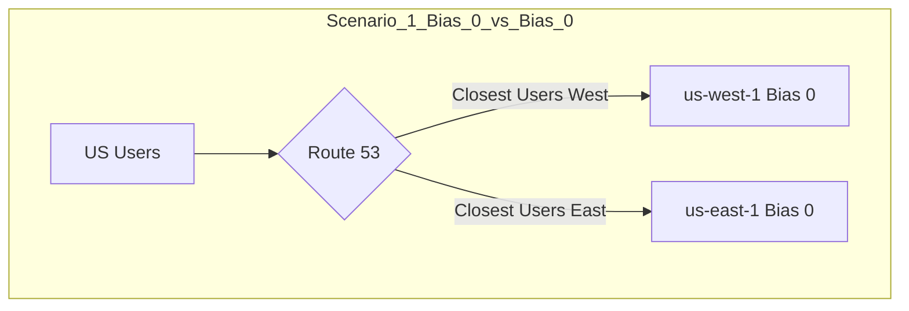
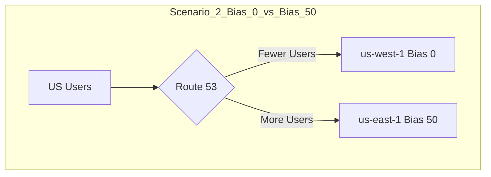

-----

# 🧲 Route 53: The Geoproximity Routing Policy

This guide explains the **Geoproximity Routing Policy** in Amazon Route 53. This is an advanced routing method that lets you influence traffic flow based on the physical distance between your users and your resources.

-----

## \#\# The Core Concept: "Traffic Magnets"

Think of Geoproximity Routing as giving your application's servers (endpoints) **"gravity"** or **"magnetic pull."** This policy routes traffic to the resource that is *geographically* closest to the user, but it gives you a special dial called a **"bias"** to increase or decrease that magnetic pull.

This policy is all about influencing the *size* of the geographic "catchment area" for each of your resources.

-----

## \#\# How It Works: The "Bias" Dial

The **bias** is a number (from -99 to +99) that you assign to a resource to change the size of its geographic region.

  * **Zero Bias (`0`):** This is the default. Traffic is routed purely based on the closest geographic distance. If you have a server in `us-west-1` and one in `us-east-1`, the dividing line will be roughly down the middle of the country.
  * **Positive Bias (e.g., `+50`):** This **expands** the geographic area for that resource. You're telling Route 53, "I want this resource to pull in users from *further away*." More traffic will be routed to this resource.
  * **Negative Bias (e.g., `-25`):** This **shrinks** the geographic area for that resource. You're telling Route 53, "I want this resource to *only* serve users who are very close to it." Less traffic will be routed to this resource.

-----

## \#\# Visualizing the Bias

Let's use the transcript's example of two resources in the US.

### \#\#\# Scenario 1: No Bias (Balanced)

Both `us-west-1` and `us-east-1` have a bias of `0`. The geographic "line" is drawn based on pure proximity, splitting the user base evenly.

### \#\#\# Scenario 2: Positive Bias (Shifted)

`us-west-1` has a bias of `0`, but `us-east-1` has a bias of `+50`. The "magnetic pull" of the East coast server is now much stronger.

To compensate, Route 53 **shifts the dividing line to the left**. Now, users in central states who were previously "closer" to the West coast will be pulled into the catchment area for the East coast server.

-----

## \#\# 🎯 Geoproximity vs. Geolocation: A Critical Difference

This is a common point of confusion.

  * **Geolocation Policy:** Routes based on a *static rule* you define. It answers the question, "Where is this user *from*?"
      * *Example:* "All users from `Country: France` go to this server." (Used for content restriction or localization).
  * **Geoproximity Policy:** Routes based on the *relative distance* between the user and your resources, which you can then *influence* with a bias. It answers the question, "Where is this user *in relation to* my servers?"
      * *Example:* "I want my `us-east-1` server to handle more load, so I'll increase its bias to pull users from the central US." (Used for shifting traffic).

-----

## \#\# Configuration & Requirements

  * **Traffic Flow:** You **must** configure Geoproximity routing using the visual **Route 53 Traffic Flow** editor. It cannot be set up as a simple record in the main dashboard.
  * **AWS Resources:** For resources inside AWS (like an ALB or EC2 instance), you simply specify the **AWS Region** it's in.
  * **Non-AWS Resources:** For on-premises servers, you must specify their exact **Latitude and Longitude**.

-----

## \#\# When to Use It: Shifting Traffic

The primary use case, as highlighted in the transcript, is to **shift traffic from one region to another** for performance or load management.

**Practical Example:**
Imagine you need to perform maintenance on your `eu-west-1` (Ireland) server, but you don't want to failover completely. You can:

1.  Set the bias of `eu-west-1` to **`-25`** (shrinking its pull).
2.  Set the bias of your `us-east-1` (N. Virginia) server to **`+25`** (expanding its pull).

This will gently "nudge" users in places like the UK and Western Europe away from the Ireland server and route them to the US server instead, reducing the load on your `eu-west-1` resource without a hard cutover.