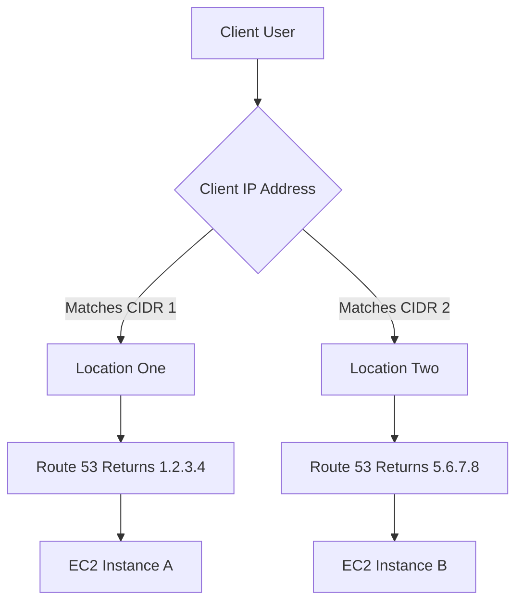

-----

# 🗺️ Route 53: IP-Based Routing Learning Guide

This guide is designed to help you quickly understand and implement **IP-Based Routing** using AWS Route 53. This routing strategy is a powerful way to direct user traffic based on their geographic location or network provider.

## 🎯 Core Concept: What is IP-Based Routing?

**IP-Based Routing** is a strategy where you define how DNS queries are resolved based on the client's **source IP address**. Unlike simple round-robin or latency-based routing, this method uses predefined ranges of IP addresses (known as **CIDR blocks**) to determine the optimal endpoint for a user.

### Key Terminology

| Term | Definition | Context in Routing |
| :--- | :--- | :--- |
| **CIDR** | **C**lassless **I**nter-**D**omain **R**outing. A standard for specifying a range of IP addresses. | Used to define the **IP ranges** for your clients, effectively creating a "location." |
| **Endpoint** | The final destination, typically a server or application load balancer. | The IP address (e.g., of an EC2 instance) where the traffic is ultimately sent. |
| **Location** | In Route 53, a grouping that links a specific **CIDR block** to a particular **endpoint**. | Defines the rule: *"If a user's IP is in this range, send them to this endpoint."* |

-----

## 💡 Use Cases & Benefits

The main motivations for using IP-Based Routing are:

1.  **🚀 Optimize Performance:** By knowing the client's IP range, you can explicitly route them to the closest or most performant server that is geographically or logically optimized for their network path.
2.  **💸 Reduce Network Costs:** You can ensure users are routed to endpoints within a specific network or geographic zone to minimize data transfer costs across regions or providers.
3.  **🤝 Specific Provider Routing:** Directly route traffic from a known **Internet Service Provider (ISP)** or corporate network (defined by their specific CIDR) to a dedicated endpoint tailored for them.

-----

## 🏗️ How It Works in Route 53

The process involves two main steps: defining the **Locations** and linking them to a **Record**.

### Step 1: Define Locations (CIDR Blocks)

You start by defining two or more **Locations**. Each location is essentially a label for a specific list of **CIDR blocks**.

| Location Name | CIDR Block | Represents |
| :--- | :--- | :--- |
| **Location One** | `203.0.113.0/24` | A range of IPs, possibly from a specific ISP or region (e.g., Asia-Pacific users). |
| **Location Two** | `200.100.50.0/20` | Another distinct range (e.g., North American users). |

### Step 2: Link Locations to Endpoints (Records)

Next, you create a DNS record (e.g., `example.com`) and assign a unique **endpoint value** to each defined location.

| DNS Record | Location | Endpoint Value (Public IP) | Destination |
| :--- | :--- | :--- | :--- |
| `example.com` | **Location One** | `1.2.3.4` | EC2 Instance A |
| `example.com` | **Location Two** | `5.6.7.8` | EC2 Instance B |

### Resolution Flow

When a user makes a request to `example.com`:

1.  **User A** has an IP address within the `Location One` CIDR block.

2.  Route 53 matches the IP to **Location One**.

3.  Route 53 returns the IP `1.2.3.4` as the DNS answer. **(Traffic directed to EC2 Instance A)**

4.  **User B** has an IP address within the `Location Two` CIDR block.

5.  Route 53 matches the IP to **Location Two**.

6.  Route 53 returns the IP `5.6.7.8` as the DNS answer. **(Traffic directed to EC2 Instance B)**

-----

## 🌐 Concept Visualization (Mermaid Diagram)

This diagram illustrates the decision flow based on the client's IP address.

-----

## ⚙️ Missing Concept: The Default Rule

A crucial concept *not* explicitly mentioned in the transcript is the **Default Rule** (or **Fallback Location**).

### Why the Default Rule is Necessary

If a user's IP address **does not match** *any* of the defined CIDR blocks, the DNS query needs a response. Without a default rule, the query would fail.

In a real-world implementation, you must define a default location that catches all unlisted IP ranges. This is often routed to a generally available or centrally located endpoint to ensure service availability for all users.

| Location Name | CIDR Block | Destination |
| :--- | :--- | :--- |
| **Default** | *Any IP not listed above* | EC2 Instance C (e.g., central region fallback) |