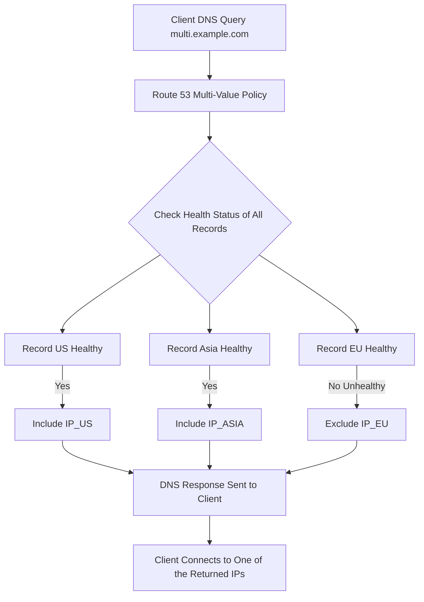

-----

# 🚦 Route 53: Multi-Value Answer Routing Learning Guide

This guide focuses on **Multi-Value Answer Routing** in AWS Route 53, a policy designed for **client-side load balancing** and enhanced resource reliability using integrated Health Checks.

## 🎯 Core Concept: Multi-Value Answer Routing

The Multi-Value Answer Routing policy allows you to **associate multiple resources (like EC2 instances) with a single DNS record** and return multiple IP addresses in the DNS response.

Unlike simple routing, the key feature here is the **integration with Health Checks**, which ensures that only IPs corresponding to **healthy resources** are returned to the client.

### Key Characteristics

| Feature | Description | Importance |
| :--- | :--- | :--- |
| **Response** | Returns **multiple values** (IPs/resources) for a single query. | Enables the client to choose an available endpoint. |
| **Health Checks** | **Mandatory.** Only records associated with a **Healthy** status are returned. | Guarantees reliability and avoids sending traffic to failed resources. |
| **Limit** | Returns up to **eight healthy records** per query. | A reasonable maximum to keep the DNS response size manageable. |
| **Function** | Facilitates **Client-Side Load Balancing**. | The client (browser/application) receives multiple healthy options and selects one (usually randomly). |
| **Analogy** | **NOT** a substitute for an **Application/Network Load Balancer (ELB)**. | ELBs handle server-side traffic distribution; this handles DNS resolution. |

-----

## 💡 Why Use Multi-Value?

The primary advantage of Multi-Value routing over a **Simple Routing Policy** is **safety and reliability**.

| Policy | Health Check Support | Risk | Benefit |
| :--- | :--- | :--- | :--- |
| **Simple Routing** | ❌ **No.** | The DNS response might contain an IP for an **unhealthy** resource, leading to client connection failure. | Simplest setup. |
| **Multi-Value Answer** | ✅ **Yes.** | The client will always receive an IP for a **healthy** resource. | Guarantees the client can connect to an operational endpoint. |

-----

## 🏗️ Step-by-Step Implementation Example

The transcript demonstrates setting up three records across different AWS regions for the same DNS name (`multi.example.com`).

| Record ID | Region | Endpoint Value | Health Check Status |
| :--- | :--- | :--- | :--- |
| **US** | `us-east-1` | `IP_US` | **Healthy** |
| **Asia** | `ap-southeast-1` | `IP_ASIA` | **Healthy** |
| **EU** | `eu-central-1` | `IP_EU` | **Healthy** (Initially) |

### 1\. Initial State (All Healthy)

When all three Health Checks are working and healthy:

  * **Action:** A `dig` query is run against `multi.example.com`.
  * **Result:** All three IP addresses (`IP_US`, `IP_ASIA`, `IP_EU`) are returned in the DNS response.
  * **Client Behavior:** The client application receives all three and randomly selects one to connect to.

### 2\. Failure State (One Unhealthy)

The demonstrator intentionally fails the `eu-central-1` Health Check by **inverting the health status** (a quick trick to simulate a failure).

  * **State:** Health Check for `eu-central-1` is **Unhealthy**.
  * **Action:** A `dig` query is run again.
  * **Result:** Only the two healthy IP addresses (`IP_US`, `IP_ASIA`) are returned. The IP for the EU region (`IP_EU`) is suppressed.
  * **Outcome:** The client safely connects to one of the two healthy endpoints, avoiding the failed EU resource.

-----

## 🌐 Concept Visualization (Mermaid Diagram)

This diagram illustrates the filtering process applied by Route 53 before the client receives the response.

-----

## 🧠 Missing Concept: The Default Behavior

While the transcript is very detailed, one practical consideration when setting up records is the **Record ID**.

### 🔑 The Record ID

In Route 53's Multi-Value Routing policy, the **Record ID** is essential.

  * **Purpose:** It acts as a **unique identifier** for each specific record value associated with the same DNS name.
  * **Requirement:** Since you are defining multiple entries (up to 8) for the same name (e.g., `multi.example.com`), Route 53 requires a unique identifier (like **US**, **Asia**, **EU** in the example) to manage and track the health status of each individual endpoint. You cannot have two different Multi-Value records with the same DNS name and no unique ID.

**Note:** If *all* associated records become unhealthy, Route 53 will typically return no answers, or in some edge cases, it might return a set of unhealthy records as a last resort, depending on specific Route 53 and client resolver behaviors, but the intent of the policy is to return **zero** unhealthy records. This scenario should be monitored via alarms.