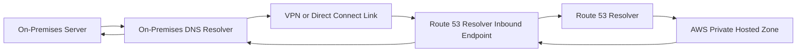
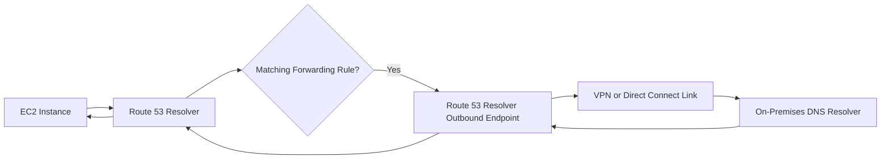

-----

# ☁️🏠 Route 53 Resolver: Hybrid DNS Connectivity Guide

This guide breaks down the architecture required to achieve **Hybrid DNS**—seamless name resolution between your AWS Cloud environment and your on-premises data center using the AWS Route 53 Resolver.

## 🎯 Core Concept: Bridging the DNS Gap

By default, the **Route 53 Resolver** in your AWS VPC handles all DNS queries for:

1.  **Local Domain Names** (for your EC2 instances).
2.  **Private Hosted Zones** (custom domains visible only within your VPCs).
3.  **Public Name Servers** (external internet lookups).

To make AWS resources (like an EC2 in a Private Hosted Zone) resolvable from your on-premises network, and vice versa, you need to establish a **bi-directional DNS path** using **Resolver Endpoints**.

-----

## 🔑 The Crucial Prerequisite

Before any DNS queries can be routed between environments, you must have established **network connectivity** between your AWS VPC and your on-premises data center.

| Connection Method | Purpose |
| :--- | :--- |
| **AWS Direct Connect** | Dedicated, high-throughput, low-latency physical connection. |
| **VPN (Virtual Private Network)** | Encrypted connection over the public internet (Site-to-Site VPN). |

The Resolver Endpoints rely on this underlying connection to route the actual DNS traffic.

-----

## ➡️ Direction One: On-Premises to AWS (Inbound Endpoint)

The **Inbound Resolver Endpoint** allows your **on-premises DNS resolvers** to look up domain names hosted in your AWS Private Hosted Zones.

### How it Works

1.  **AWS Setup:** You create an **Inbound Endpoint** within your VPC. This endpoint is an Elastic Network Interface (ENI) with an IP address that acts as the target for incoming DNS queries.
2.  **On-Premises Configuration:** You configure your on-premises DNS resolvers to conditionally **forward** specific queries (e.g., for domains ending in `.internal`) to the IP address of the AWS Inbound Endpoint.
3.  **Resolution:** The query hits the Inbound Endpoint, which passes it to the Route 53 Resolver, which then resolves the name (e.g., a private EC2 IP) and sends the answer back.

### Scenario Example

An on-premises server wants to find `database.internal.com` (which is in a Private Hosted Zone).

-----

## ⬅️ Direction Two: AWS to On-Premises (Outbound Endpoint)

The **Outbound Resolver Endpoint** allows resources in your AWS VPC (like EC2 instances) to look up domain names hosted exclusively on your on-premises network.

### How it Works

1.  **AWS Setup:** You create an **Outbound Endpoint** within your VPC. This endpoint is an ENI that acts as the source for outgoing DNS queries.
2.  **Route 53 Rules:** You create **Forwarding Rules** in Route 53 specifying which domain suffixes (e.g., `.onpremise.private`) should use the Outbound Endpoint.
3.  **Resolution:** An EC2 instance queries a domain. If it matches a Forwarding Rule, the query is sent via the Outbound Endpoint across the connection link to the on-premises DNS resolvers for resolution.

### Scenario Example

An EC2 instance wants to find `web.onpremise.private` (which is hosted on-premises).

-----

## 🧠 Missing Concept: The VPC and Security

The transcript simplifies the diagram, but a key operational concept is the **VPC and Subnet association** with the endpoints, and the role of **Security Groups**:

### 🛡️ Security Groups

  * **Endpoint Security:** Resolver Endpoints are created within specific subnets and require an associated **Security Group**.
  * **Inbound Endpoint:** The Security Group must allow **inbound UDP/TCP port 53** traffic *only* from your on-premises DNS resolver IPs.
  * **Outbound Endpoint:** The Security Group must allow **outbound UDP/TCP port 53** traffic *only* to your on-premises DNS resolver IPs.

This is critical to prevent unauthorized access to your DNS resolution service.