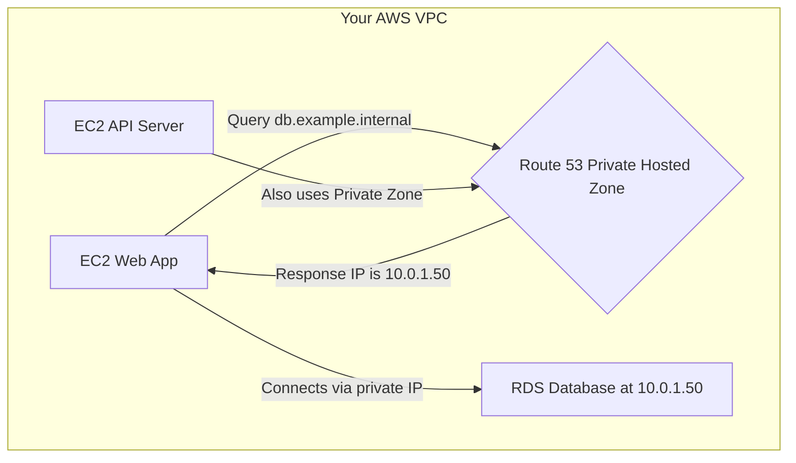

-----

# 🗺️ Amazon Route 53: AWS's Managed DNS

This guide introduces Amazon Route 53, a highly available and scalable cloud Domain Name System (DNS) web service. It's designed to give developers and businesses a reliable and cost-effective way to route end users to internet applications.

-----

## \#\# What is Route 53?

Amazon Route 53 is a fully managed and **authoritative DNS** service. "Authoritative" means you have complete control to create and manage the public DNS records for your domains. It effectively translates human-readable names like `www.example.com` into the numeric IP addresses like `192.0.2.1` that computers use to connect to each other.

**Key Features**:

  * **Domain Registrar**: You can buy and manage domain names directly within Route 53.
  * **Health Checks**: It can monitor the health of your resources, like web servers.
  * **100% Availability SLA**: Route 53 is the only AWS service that guarantees 100% uptime.

> **Why the name "Route 53"?** 🤔
> DNS servers respond to queries on port **53**. The name is a clever reference to this standard networking port, combined with the concept of routing traffic, much like the famous US Route 66 highway.

-----

## \#\# The Building Blocks: DNS Records

The core of Route 53 is its DNS records. Each record in a "Hosted Zone" is a rule that tells DNS how to respond to a query for your domain.

A record contains several key pieces of information:

  * **Domain/Subdomain Name**: The name being queried, like `app.example.com`.
  * **Record Type**: The kind of record, which determines what kind of value it holds.
  * **Value**: The data the record points to, such as an IP address or another domain name.
  * **Routing Policy**: *How* Route 53 should respond to queries (e.g., based on location, health, etc.).
  * **TTL (Time to Live)**: The duration (in seconds) that DNS resolvers should cache the record before asking for it again.

-----

## \#\# Core Record Types You Must Know

While Route 53 supports many record types, these are the essential ones for the exam and general use:

| Record Type | Purpose | Example |
| :--- | :--- | :--- |
| **A** | Maps a hostname to an **IPv4** address. | `example.com` → `54.22.33.44` |
| **AAAA** | Maps a hostname to an **IPv6** address. | `example.com` → `2001:0db8:85a3::8a2e:0370:7334` |
| **CNAME** | Canonical Name. Maps a hostname to **another hostname**. | `www.example.com` → `myapp.herokuapp.com` |
| **NS** | Name Server. Specifies the authoritative name servers for your domain. | `example.com` → `ns-1.awsdns.com` |

> **CNAME Restriction**: You cannot create a CNAME record for the "Zone Apex" (the bare domain, like `example.com`). It must be used for subdomains like `www.example.com` or `app.example.com`.

-----

## \#\# Where Records Live: Hosted Zones

A **Hosted Zone** is a container for the DNS records of a specific domain and its subdomains. Route 53 offers two types of hosted zones for different use cases.

### \#\#\# Public Hosted Zones 🌍

This is for domains that need to be resolved on the public internet. When someone types your website address into their browser, the query is resolved using the records in your public hosted zone.

```mermaid
graph TD
    Client[🌐 Internet Client] -- "Query: www.example.com?" --> R53[Route 53 Public Hosted Zone];
    R53 -- "Response: A record is 54.22.33.44" --> Client;
    Client -- "Connects to IP" --> Server[EC2 Instance @ 54.22.33.44];
```

### \#\#\# Private Hosted Zones 🏢

This is for internal DNS within your Amazon Virtual Private Cloud (VPC). The records in a private hosted zone can only be resolved by resources inside that VPC. This is perfect for giving your internal servers (like databases or backend APIs) easy-to-remember private domain names instead of using their private IP addresses.

> **A Note on Cost**: Route 53 is not free. You pay a monthly fee for each hosted zone (around $0.50/month) and an annual fee for domain registration (starting around $12/year).