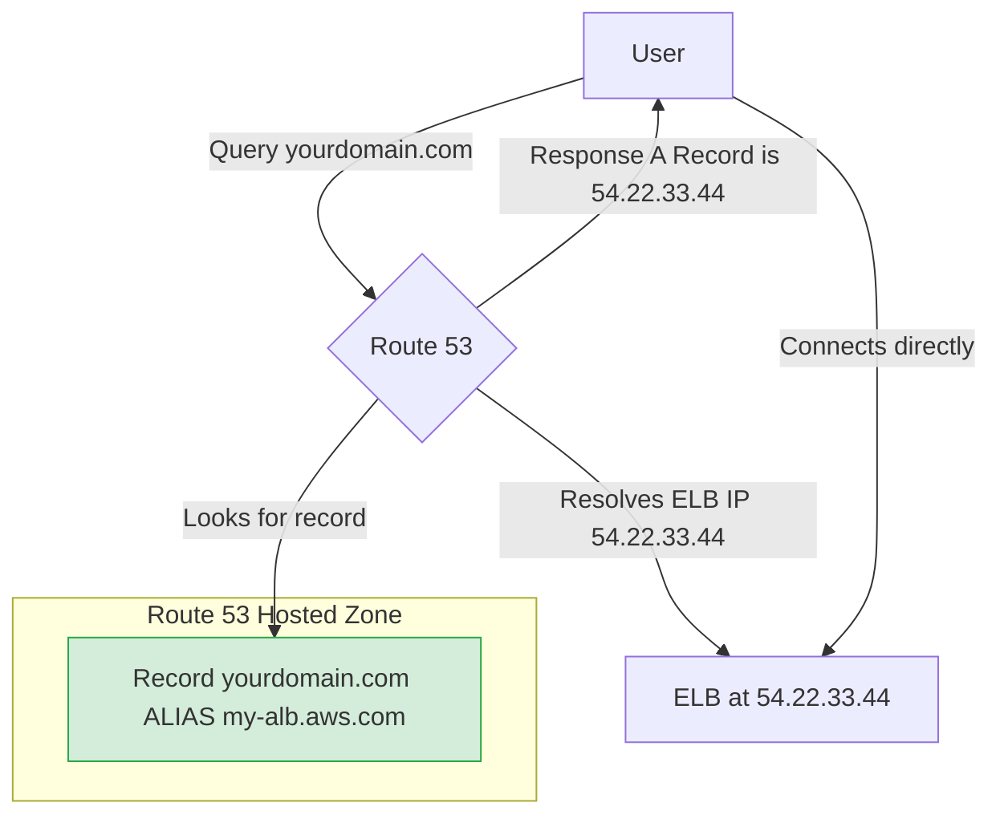

-----

# 🔗 Route 53: CNAME vs. Alias Records

This guide explains two fundamental ways to map your custom domain name to an AWS resource in Route 53: **CNAME** records and **Alias** records. Understanding the difference is critical for building robust applications and for success on AWS certification exams.

-----

## \#\# The Core Problem

You've just launched a resource in AWS, like an Elastic Load Balancer (ELB) or a CloudFront distribution. It has a long, auto-generated DNS name, something like `my-alb-1234567890.us-east-1.elb.amazonaws.com`.

Nobody is going to type that into their browser. You want users to access it via a clean, professional domain you own, like `myapp.yourdomain.com`. How do you create that link? You have two main options.

-----

## \#\# Option 1: The CNAME Record (The "Forwarding Address")

A **CNAME (Canonical Name)** record is a standard DNS record that maps a hostname to another hostname.

Think of it as a simple postal forwarding instruction. You're telling the DNS system, "If you're looking for `app.yourdomain.com`, please go look at this other address: `my-alb-1234567890.us-east-1.elb.amazonaws.com` instead."

### \#\#\# The Big Limitation: The Zone Apex Problem

A CNAME record works perfectly for subdomains (like `www.yourdomain.com` or `app.yourdomain.com`). However, due to DNS standards, you **cannot** create a CNAME record for a **Zone Apex** (the root or "bare" domain, like `yourdomain.com`).

Attempting to do so in Route 53 will result in an error. This is a major limitation if you want your main website to point directly to an AWS resource.

-----

## \#\# Option 2: The Alias Record (The "Smart Pointer")

An **Alias Record** is a special, AWS-native feature within Route 53 that solves the limitations of CNAMEs. It allows you to map a hostname directly to a specific **AWS Resource**.

Think of it not as a forwarding address, but as a direct, intelligent pointer. Route 53 knows what the resource is and resolves its IP address directly behind the scenes.

### \#\#\# Key Advantages of Alias Records

  * ✅ **Solves the Zone Apex Problem**: You can create an Alias record for your root domain (`yourdomain.com`) and point it to an ELB, CloudFront distribution, etc.
  * **Automatic Resolution**: If the IP address of your AWS resource changes (which happens with load balancers), the Alias record automatically updates. You don't have to do anything.
  * **Native Health Checks**: Alias records can inherit the health status of the target resource (like an ELB), enabling more intelligent routing.
  * **Free of Charge**: Queries to Alias records that point to AWS resources are **free**. CNAME queries incur standard DNS query charges.

<!-- end list -->

-----

## \#\# At a Glance: CNAME vs. Alias

| Feature | CNAME Record | Alias Record |
| :--- | :--- | :--- |
| **Zone Apex Support (`yourdomain.com`)?** | ⛔ **No** | ✅ **Yes** |
| **Points To?** | Any external hostname | Specific **AWS resources** |
| **Cost?** | Standard DNS query charges apply | **Free** for queries to AWS resources |
| **Health Checks?** | No native integration | ✅ Yes, evaluates target health |
| **Record Type Shown** | `CNAME` | Masquerades as an `A` or `AAAA` record |
| **TTL Control** | You set the TTL | Managed automatically by AWS |

-----

## \#\# Supported Alias Targets

You can't point an Alias record to just anything. It must be one of the following AWS resources:

  * Elastic Load Balancers (ALB, NLB, CLB)
  * CloudFront Distributions
  * API Gateway
  * Elastic Beanstalk environments
  * S3 Buckets (when configured as static websites)
  * VPC Interface Endpoints
  * Global Accelerator
  * Another Route 53 record in the *same* hosted zone

> **Important Exception**: You **cannot** set an Alias record to point to an EC2 instance's public DNS name. You must point it to the instance's public IP address using a standard `A` record.