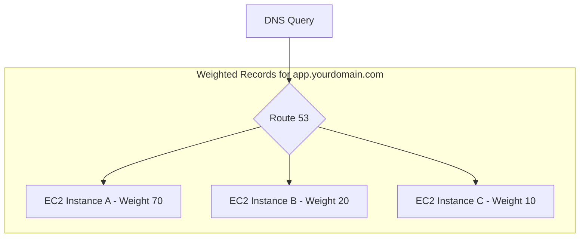

***

# ⚖️ Route 53: The Weighted Routing Policy

This guide explains the **Weighted Routing Policy** in Amazon Route 53, a powerful tool for distributing traffic to your resources in specific, controlled proportions.

---

## ## What is a Weighted Routing Policy?

Think of a Weighted Routing Policy as a smart traffic controller that you can program with percentages. It allows you to send a specific portion of your DNS queries to different resources. For example, you can send 70% of your traffic to one server, 20% to another, and the remaining 10% to a third.

This is a server-side control mechanism; Route 53 itself decides which IP address to return based on the weights you've configured.

### ### How It Works

You create multiple records with the **same name and type** (e.g., `app.yourdomain.com` as an `A` record) and assign each one a **weight**, which is a number from 0 to 255.

Route 53 then distributes the DNS responses according to the following formula for each record:

$$
\text{Traffic \%} = \frac{\text{Weight of one record}}{\text{Sum of all weights}}
$$

**Key Points:**
* The weights **do not need to sum to 100**. They are relative. A record with weight 80 will get twice the traffic of a record with weight 40.
* You can associate **health checks** with each record, making this policy highly resilient.
* Each record in the weighted set needs a unique **Record ID** to differentiate it from the others.

---

## ## Common Use Cases

The ability to control traffic percentages opens up several powerful patterns.

### ### Load Balancing Across Regions
You can distribute traffic between identical application stacks in different AWS regions to balance the load or manage costs.

### ### A/B Testing & Canary Releases
This is a classic use case. When you launch a new version of your application, you can start by giving it a small weight (e.g., 5%). This sends only 5% of your users to the new version, allowing you to monitor its performance and stability with minimal risk. If it performs well, you can gradually increase its weight while decreasing the weight of the old version, eventually shifting all traffic over.

### ### Phasing Out a Resource
To stop sending traffic to a specific resource, simply change its weight to **0**. Route 53 will no longer include it in DNS responses. If all records in a set have a weight of 0, Route 53 will treat them as if they all have a weight of 1, distributing traffic equally.

---

## ## ➕ A Missing Piece: Interaction with Health Checks

The transcript mentions health checks, but their interaction with weighted policies is a crucial concept.

When you associate a health check with a weighted record, Route 53 constantly monitors the health of that endpoint.

* If an endpoint is **healthy**, it receives traffic according to its weight.
* If an endpoint **fails its health check**, Route 53 will **temporarily remove it from the set of possible answers**.

The traffic that would have gone to the unhealthy endpoint is then automatically redistributed among the remaining **healthy** endpoints, proportional to their weights. This makes the Weighted Routing Policy an excellent choice for building fault-tolerant, active-active systems.