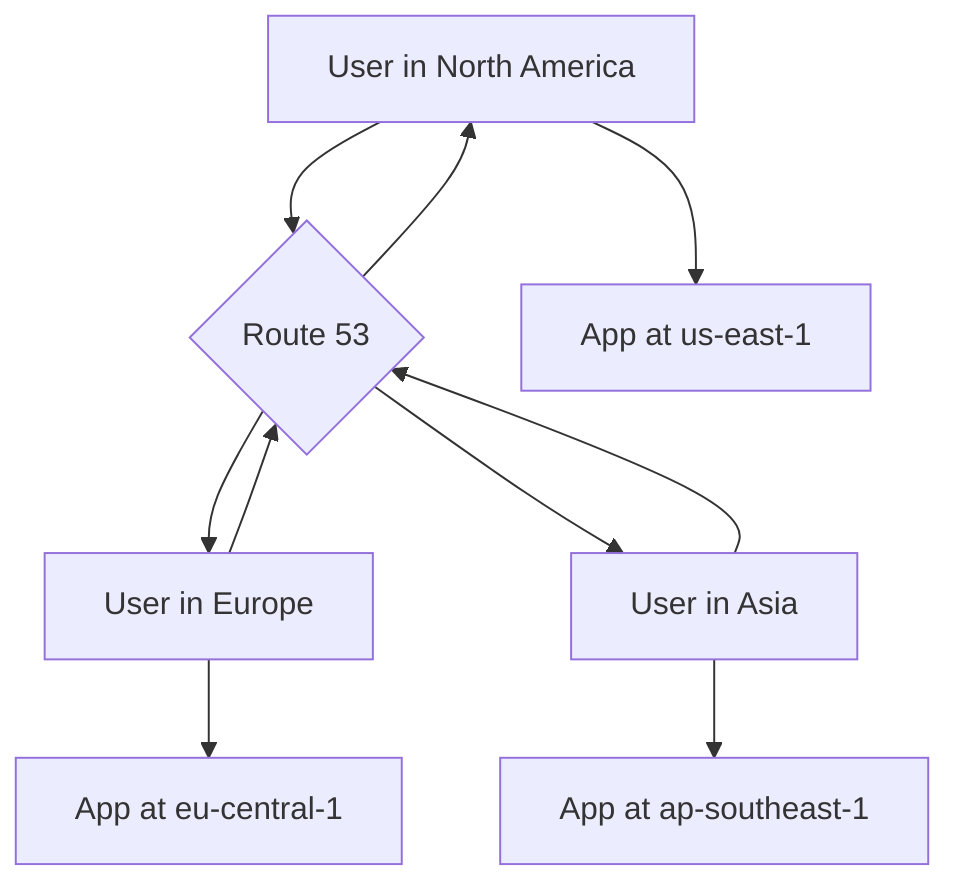
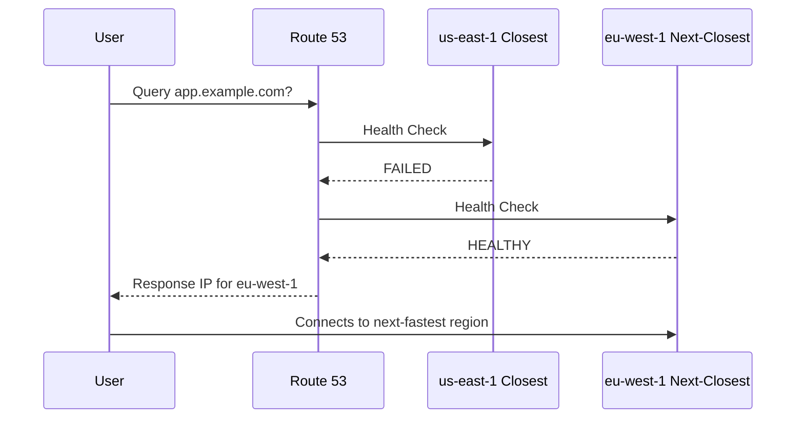

Here is a comprehensive learning guide in `README.md` format based on the transcript you provided, enhanced with diagrams, analogies, and key "missing concepts" to create a rich learning experience.

-----

# 🏎️ Route 53: The Latency-Based Routing Policy

This guide explores the **Latency-Based Routing Policy** in Amazon Route 53. Think of this policy as your application's smart GPS: it doesn't just give your users *a* route to your application, it gives them the *fastest* route available.

-----

## \#\# What is Latency-Based Routing?

The **Latency-Based Routing Policy** directs your users to the AWS region that provides the **lowest network latency** (i.e., the fastest response time) *for them*.

When a user tries to access your domain, Route 53 looks at where the user's query is coming from, checks its internal latency data, and returns the IP address for your application endpoint (e.g., a server in `us-east-1` or `ap-southeast-1`) that will give that specific user the fastest connection.

This is ideal for global applications where speed and responsiveness are critical.

-----

## \#\# 🔮 How Does Route 53 Know the Latency?

This is a key concept. Route 53 **does not ping your users in real-time**. That would be slow and inefficient.

Instead, Route 53 maintains a massive, constantly updated database of internet latency measurements from all over the world *to* all AWS regions. When a query comes from a user's DNS resolver, Route 53 uses this pre-computed data to determine which of your endpoints will be fastest for that user.

-----

## \#\# ⚙️ How to Configure It

As seen in the demo, the configuration has a few specific steps:

1.  **Create Multiple Records**: You must create multiple records (e.g., `A` records) that all have the **exact same name** (e.g., `latency.yourdomain.com`).
2.  **Set Policy to `Latency`**: For each of these records, you set the routing policy to `Latency`.
3.  **Specify the Region**: This is the most critical step. You must tell Route 53 which AWS Region the endpoint (IP or resource) is in. Route 53 cannot guess this just from an IP address.
4.  **Set a Unique Record ID**: Each record in the set needs a unique ID (e.g., "us-east-1-server", "apac-server"). This is just a label for you to identify the specific record.

-----

## \#\# ⚠️ The "Gotcha": Bare IPs vs. Alias Records

As the transcript highlights, if you use a bare IP address for your endpoint, you **must manually** select the correct AWS Region from the dropdown menu.

A "smarter" way to configure this is to use an **Alias record** that points directly to an AWS resource like an **Elastic Load Balancer (ALB)** or a **CloudFront distribution**. When you use an Alias record, Route 53 *already knows* what region the resource is in, so you don't have to specify it manually.

-----

## \#\# The Real Power: Latency + Health Checks

The transcript mentions health checks, but their interaction is a crucial feature.

**What happens if the lowest-latency region for a user is unhealthy?**

Route 53 is smart. It will:

1.  Detect that the endpoint (e.g., the server in `us-east-1`) is failing its health check.
2.  **Temporarily stop returning** that unhealthy endpoint's IP address.
3.  Automatically route the user to the region with the **next-lowest latency** that is still healthy (e.g., `eu-central-1`).

This combines high performance with high availability, ensuring your users are not only routed to the *fastest* server, but to the *fastest **healthy*** server.

-----

## \#\# 🎯 When to Use Latency Routing

  * **Global Applications**: When you have users all over the world and you've deployed your application in multiple AWS regions to serve them.
  * **Media & Content Delivery**: For serving video, images, or files where low latency is key to the user experience.
  * **Online Gaming**: Essential for minimizing lag for players in different parts of theworld.