-----

# 🩺 Route 53 Health Checks: Enabling Automated DNS Failover

This guide explains Amazon Route 53 Health Checks, the critical feature that enables high availability and automated DNS failover for your applications.

-----

## \#\# What's the Point of a Health Check?

Routing policies (like Latency or Weighted) are great for distributing traffic, but they have a blind spot: they don't inherently know if your application is actually *working*.

Imagine you have a multi-region setup to serve users from the fastest location. What happens if your application in the `us-east-1` region crashes? Without a health check, Route 53 will keep sending users there, leading them to a dead-end.

**Health Checks** are the solution. They constantly monitor your endpoints. When a health check fails, Route 53 automatically **stops sending traffic** to the unhealthy resource, enabling true **automated DNS failover**.

```mermaid
graph TD
    User[🌐 User] -- Query mydomain.com? --> R53{Route 53}

    subgraph Region 1 Healthy
        R53 -- Health Check PASS --> App1[ALB @ us-east-1]
    end

    subgraph Region 2 Unhealthy
        R53 -- Health Check FAIL --> App2[ALB @ eu-west-1]
    end

    R53 -- Returns only healthy IP --> User
    User -- Connects failover works --> App1
```

-----

## \#\# The Three Types of Health Checks

Route 53 provides three different ways to monitor your resources.

1.  **Endpoint Monitoring**: The most common type. This directly checks a public-facing resource, like a server or load balancer.
2.  **Calculated Health Checks**: A "meta-check" that monitors *other* health checks.
3.  **CloudWatch Alarm Monitoring**: Monitors the state of a CloudWatch Alarm. This is the key to monitoring private resources.

-----

## \#\# 1. Deep Dive: Endpoint Monitoring

This is how you monitor your public applications (ALBs, EC2 public IPs, etc.).

### \#\#\# How It Works

It's not just one server. Route 53 uses a global network of \~15 **health checkers** located all over the world. These checkers send requests to your endpoint at a set interval.

  * **Protocol**: HTTP, HTTPS, or TCP.
  * **Interval**: **Standard** (30 seconds) or **Fast** (10 seconds, at a higher cost).
  * **Failure Threshold**: If **more than 18%** of the health checkers report the endpoint as unhealthy, Route 53 marks it as `Unhealthy`. This prevents a single, local network blip from triggering a global failover.
  * **Success Criteria**:
      * For HTTP/S, it looks for a `2xx` or `3xx` status code.
      * It can optionally perform **String Matching** by checking for a specific string within the first 5,120 bytes of the response body.

<!-- end list -->

> ⚠️ **Critical Firewall Rule**
> Your resource's Security Group or firewall **must** allow incoming requests from the **Route 53 Health Checker IP ranges**. These are public IPs, and if you block them, your health checks will fail (and your failover will trigger) even if your application is working perfectly.

-----

## \#\# 2. Deep Dive: Calculated Health Checks

This is a "check of checks." A calculated health check doesn't monitor an endpoint directly. Instead, it monitors a group of other **child health checks** that you specify.

You define the logic:

  * **OR**: The parent is healthy if *at least one* child is healthy.
  * **AND**: The parent is healthy only if *all* children are healthy.
  * **NOT**: The parent's health is the opposite of the child's.

You can also set a threshold, such as "Parent is healthy if **at least 2 of 5** child checks are healthy."

**Use Case**: Imagine you're performing maintenance on one server in a large fleet. You don't want your *entire website* to be marked as unhealthy. A calculated check can be set to "healthy if at least 80% of servers are up," preventing a failover during routine maintenance.

-----

## \#\# 3. Deep Dive: Monitoring Private Resources

**The Problem**: Route 53's health checkers live on the public internet. They **cannot** access private resources inside your VPC, like a database or an internal backend server.

**The Solution**: Use a CloudWatch Alarm as a middle-man.

This is a clever workaround that follows these steps:

1.  **Create a Metric**: Your private resource (e.g., an EC2 instance) must publish a custom metric to CloudWatch (e.g., a "heartbeat" or a status check).
2.  **Create an Alarm**: You create a CloudWatch Alarm that monitors this metric. If the metric fails (e.g., the heartbeat stops), the alarm goes into the `ALARM` state.
3.  **Create the Health Check**: You create a Route 53 Health Check that, instead of monitoring an endpoint, is set to **monitor the state of the CloudWatch Alarm**.
4.  **Link to DNS**: If the alarm goes to `ALARM`, the Route 53 health check becomes `Unhealthy`, and Route 53 will failover your DNS record.

This effectively lets you trigger a DNS failover based on the status of a completely private, internal resource.

