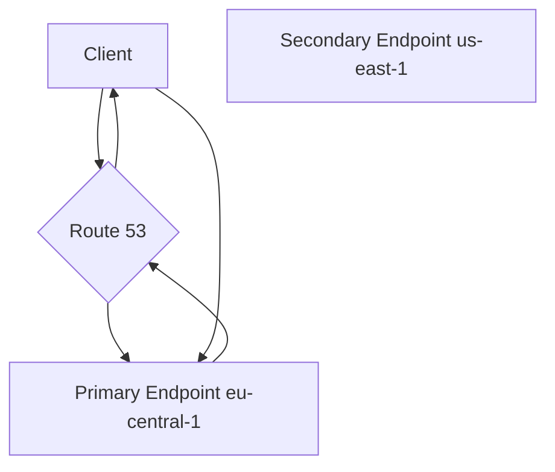
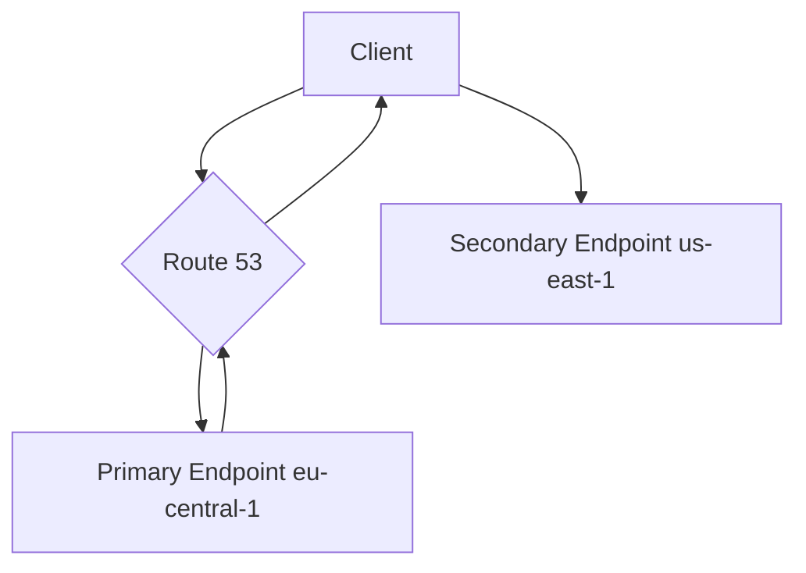

-----

# 🚀 Route 53: The Failover Routing Policy (Active-Passive DR)

This guide explains the **Failover Routing Policy** in Amazon Route 53. Think of this policy as your application's automatic "backup generator." It runs your application from a primary location, but if that location fails, it automatically switches traffic to a secondary, standby location.

This pattern is a classic example of an **Active-Passive** setup, which is a foundational concept for high availability and disaster recovery (DR).

-----

## \#\# How It Works: The Core Logic

The Failover policy is designed to route traffic to a primary resource as long as it's healthy. If the primary resource becomes unhealthy, Route 53 automatically begins routing traffic to a secondary (failover) resource.

To make this work, you create two records with the exact same name (e.g., `app.yourdomain.com`):

1.  One record is designated as **`Primary`**.
2.  The other record is designated as **`Secondary`**.

The magic is in the health check: a **health check on the `Primary` record is mandatory**. This health check is the trigger.

### \#\#\# Normal Operation (Primary is Healthy)

During normal operation, the health check on the Primary endpoint passes, and Route 53 returns its IP address to all users. The Secondary endpoint sits idle, receiving no traffic.

### \#\#\# During a Failover (Primary is Unhealthy)

When the health check on the Primary endpoint fails, Route 53 automatically detects this and stops returning the Primary IP. It "fails over" and starts returning the IP address of the Secondary endpoint instead.

-----

## \#\# 🔑 Key Rules & Missing Concepts

### \#\#\# 1. Mandatory Primary Health Check

You **must** associate a health check with your `Primary` record. This is the entire mechanism that triggers the failover. Without it, Route 53 would have no way of knowing the primary is down.

### \#\#\# 2. Optional Secondary Health Check

The transcript mentions this, but it's a critical concept to understand:

  * **Why is it optional?** You can failover to a secondary resource *without* a health check. For example, your "secondary" site might be a simple, highly-reliable S3 static webpage that just says, "Our site is down for maintenance, we'll be back soon." This type of endpoint doesn't really need a health check.
  * **Why is it recommended?** If your secondary resource is *another* full application stack (like in the demo), you **should absolutely** add a health check to it. If you don't, you run the risk of a "double fault":
    1.  Your Primary (EU) site fails.
    2.  Route 53 fails over to your Secondary (US) site.
    3.  ...but your Secondary (US) site is *also* down for some reason\!
    4.  Route 53 will keep sending users to the dead US site because it has no way of knowing it's unhealthy.

By adding a health check to the secondary, Route 53 will only failover if the primary is unhealthy *and* the secondary is healthy.

### \#\#\# 3. Automatic Failback

This is a key "missing concept" from the initial explanation. What happens when the primary site recovers?
As soon as the health check associated with the **`Primary`** record starts passing again, Route 53 will **automatically stop** sending traffic to the secondary and "fail back" to the primary. This automatic recovery is a core feature of the policy.

-----

## \#\# Demo Walkthrough: Simulating a Disaster

The hands-on demo from the transcript perfectly illustrates this flow:

1.  **Setup**: Two records are created for `failover.stephanetheteacher.com`:
      * **Primary**: An `A` record pointing to the EU server, associated with the `EU-central-1` health check.
      * **Secondary**: An `A` record pointing to the US server (no health check associated).
2.  **Verify**: Accessing the URL returns "Hello World" from the **EU (Primary)** server, as expected.
3.  **Simulate Failure**: The security group for the EU server is edited to **block port 80**. This makes the server unreachable by the public health checkers.
4.  **Detect Failure**: After a short wait, the `EU-central-1` health check in the Route 53 console flips to **`Unhealthy`**.
5.  **Automatic Failover**: Refreshing the URL now returns "Hello World" from the **US (Secondary)** server. The failover worked perfectly, with no manual intervention.
6.  **Simulate Recovery**: To fix it (as mentioned in the transcript), you would re-add the port 80 rule to the security group. After a short wait, the health check would become `Healthy` again, and Route 53 would automatically fail back, sending all new traffic to the EU server.