-----

# 📍 Route 53: The Geolocation Routing Policy

This guide explores the **Geolocation Routing Policy** in Amazon Route 53. Think of this policy as your application's smart receptionist, directing users to different resources based on their physical, geographic location.

This policy is **very different from Latency-based routing**. Latency is concerned with *speed* (what's fastest?), while Geolocation is concerned with *geography* (where are you?).

-----

## \#\# What is Geolocation Routing?

The **Geolocation Routing Policy** lets you choose where your traffic will be routed based on the geographic location of your users (i.e., where their DNS queries originate from).

You can create rules based on:

  * Continent
  * Country
  * U.S. State

This allows you to serve localized content, restrict access, and balance load in a geographically-aware way.

### \#\#\# Geolocation vs. Latency: A Critical Distinction

This is a common point of confusion.

  * **Latency Routing:** Answers the question, "Which of my servers is *fastest* for this user?" A user in London might get routed to Virginia (`us-east-1`) if the network path is faster than the one to Ireland (`eu-west-1`).
  * **Geolocation Routing:** Answers the question, "Which server did I *designate* for this user's location?" With this policy, you can create a rule that **forces** all users from the "United Kingdom" to your Ireland (`eu-west-1`) server, even if the Virginia one is technically faster. This is essential for data sovereignty and content localization.

-----

## \#\# How It Works: The Matching Logic

You create multiple records with the same name (e.g., `app.yourdomain.com`) and apply a specific geographic rule to each.

### \#\#\# 1. Rule Precedence

Route 53 always uses the **most specific rule** that matches the user's location. The order of specificity is:

1.  **U.S. State** (most specific)
2.  **Country**
3.  **Continent** (least specific)

If you have a rule for "California" and a rule for "United States," a user in Los Angeles will be routed by the "California" rule.

### \#\#\# 2. The `Default` Record

You must create a `Default` record. This is the **critical catch-all** for any users who do not match any of your specific location rules. If you have rules for "Asia" and the "United States," a user from Brazil will be routed to your `Default` record.

```mermaid
graph TD
    User[🌐 User Query] --> R53{Route 53}
    R53 -- Location? --> Match{Find Most Specific Rule}
    Match -- User in California --> State[Rule: California]
    Match -- User in France --> Country[Rule: France]
    Match -- User in Egypt --> Continent[Rule: Africa]
    Match -- User in Brazil --> Default[Rule: Default]
```

-----

## \#\# Common Use Cases

  * **Website Localization (Language/Currency):**

      * Route users from Germany to `my-app.de` (German language, Euros).
      * Route users from France to `my-app.fr` (French language, Euros).
      * Route all other users (`Default`) to `my-app.com` (English, USD).

  * **Content Restriction (Digital Rights):**

      * You have streaming rights for a show *only* in the United States.
      * **Rule 1 (USA):** Point to your ALB with the video content.
      * **Rule 2 (Default):** Point to a static S3 website that says, "This content is not available in your region."

-----

## \#\# The Real Power: Geolocation + Health Checks

You can (and should) associate health checks with your geolocation records. This adds a layer of resilience.

**What happens if a location-specific endpoint fails?**
Imagine your "Asia" server in `ap-southeast-1` fails its health check.

  * Route 53 will detect the failure and stop returning that IP address.
  * A user from India (Asia) queries your domain.
  * The "Asia" rule is now ignored because its endpoint is unhealthy.
  * The query no longer matches "Asia," so it falls back to the next-least-specific rule, which is the **`Default` record**.
  * The user from India is seamlessly routed to your `Default` server (e.g., in the EU), ensuring they can still access your site.

-----

## \#\# Demo Walkthrough: A Practical Example

Here is a summary of the demo from the transcript, which perfectly illustrates the policy.

### \#\#\# The Setup

Three records were created for `geo.stephanetheteacher.com`:

| Location Rule | Target Resource | Record ID |
| :--- | :--- | :--- |
| **Asia** (Continent) | `ap-southeast-1` IP | `ap-southeast-1` |
| **United States** (Country)| `us-east-1` IP | `U.S.` |
| **Default** | `eu-central-1` IP | `Default EU` |

### \#\#\# The Test Results (Using a VPN)

  * **Test 1: From Europe (e.g., Germany)**

      * **Match:** Does not match "Asia" or "United States."
      * **Result:** Routed to the **`Default` (eu-central-1)** server. ✅

  * **Test 2: From India**

      * **Match:** Matches **"Asia"**.
      * **Result:** Routed to the **`ap-southeast-1`** server. ✅

  * **Test 3: From United States**

      * **Match:** Matches **"United States"**.
      * **Result:** Routed to the **`us-east-1`** server. ✅

  * **Test 4: From Mexico**

      * **Match:** Does not match "Asia" or "United States."
      * **Result:** Routed to the **`Default` (eu-central-1)** server. ✅