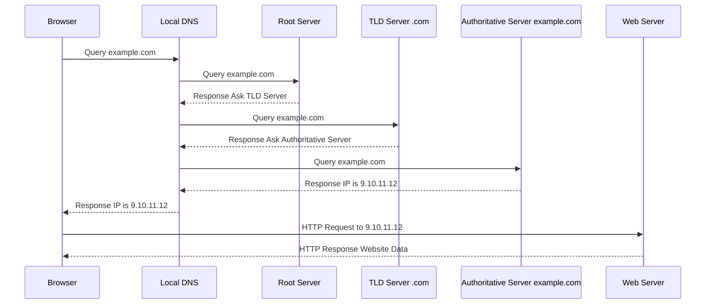

-----

# 🌐 DNS: The Phonebook of the Internet

This guide breaks down the Domain Name System (DNS), the fundamental technology that translates human-friendly domain names (like `www.google.com`) into computer-friendly IP addresses (like `142.250.191.78`).

-----

## \#\# What is DNS?

At its core, **DNS** is a globally distributed directory service. You can think of it as the internet's phonebook. Instead of memorizing long, complex strings of numbers (**IP addresses**) for every website you want to visit, you only need to remember a simple name. DNS handles the lookup for you behind the scenes.

Without DNS, you'd have to type `142.250.191.78` into your browser instead of `google.com`. It's the essential backbone that makes the internet navigable for humans.

-----

## \#\# Deconstructing a Domain Name

DNS has a hierarchical structure, much like a family tree. Let's break down a Fully Qualified Domain Name (FQDN) to understand the parts.

Consider the URL: `https://api.www.example.com.`

  * **`.` (the final dot)**: This is the **Root** of the entire DNS system. It's often invisible in browsers but is technically part of the name.
  * **`.com`**: This is the **Top-Level Domain (TLD)**. Other examples include `.org`, `.gov`, and country codes like `.us` or `.in`.
  * **`example.com`**: This is the **Second-Level Domain**. This is the unique name you register with a domain registrar.
  * **`www.example.com`**: This is a **Subdomain**. `www` is a common subdomain, but you can create others like `api` or `blog`.
  * **`api.www.example.com`**: This is the full **FQDN**.

-----

## \#\# The DNS Resolution Journey 🗺️

So, what actually happens when you type `example.com` into your browser and hit Enter? It's a multi-step query process that happens in milliseconds.

Let's say you want to reach a web server with the IP address `9.10.11.12`, which is associated with `example.com`.

1.  **Your Browser to Local DNS**: Your browser first asks a **Local DNS Server** (usually provided by your Wi-Fi network or Internet Service Provider), "What is the IP for `example.com`?"
2.  **Local DNS to Root Server**: If the Local DNS server doesn't have the answer cached, it starts from the top. It asks a **Root DNS Server**, "Where can I find `.com`?" The Root server doesn't know about `example.com`, but it knows the address of the TLD Name Servers responsible for all `.com` domains and points the Local DNS server there.
3.  **Local DNS to TLD Server**: The Local DNS server then asks the **.com TLD Name Server**, "Where can I find `example.com`?" The TLD server doesn't have the final IP, but it knows which **Authoritative Name Servers** are responsible for the `example.com` domain (e.g., the servers at your domain registrar like Amazon Route 53 or GoDaddy) and provides their addresses.
4.  **Local DNS to Authoritative Server**: Finally, the Local DNS server asks the `example.com` **Authoritative Name Server**, "What is the IP for `example.com`?" This server holds the actual **DNS records** (the "zone file") and responds with the definitive answer: "The `A` record for `example.com` is `9.10.11.12`."
5.  **Answer Returned & Cached**: The Local DNS server sends this IP address back to your browser. Crucially, it also **caches** (stores) this answer for a period of time. The next time anyone on your network asks for `example.com`, the Local DNS server can answer instantly without repeating the entire journey.
6.  **Browser to Web Server**: Your browser now has the IP address and can establish a direct connection to the web server at `9.10.11.12`.

<!-- end list -->

