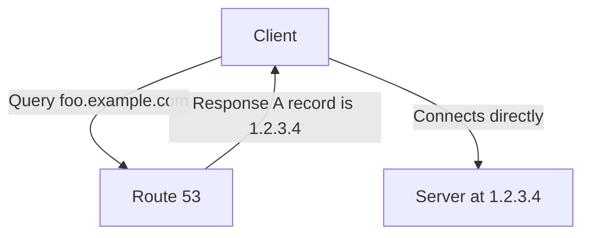
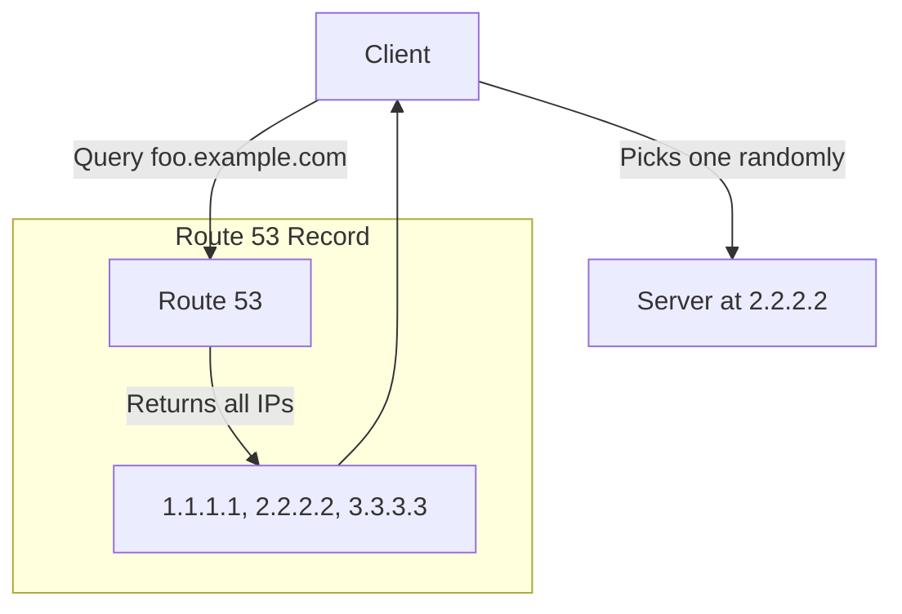

----

# 🧭 Amazon Route 53: Introduction to Routing Policies

This guide explains what Route 53 Routing Policies are and takes a deep dive into the most fundamental one: the **Simple Routing Policy**.

-----

## \#\# What is a Routing Policy?

First, let's clear up a common misconception. A Route 53 **Routing Policy** doesn't actually *route* traffic in the way a load balancer does. The user's traffic **never passes through** Route 53.

Instead, a routing policy is simply a rule that tells the Route 53 DNS server **how to respond** to a DNS query. Based on the policy, Route 53 provides an IP address (or addresses) to the client. It's then up to the client (e.g., your web browser) to establish a direct connection to that IP address.

Route 53 supports several powerful routing policies:

  * **Simple** (we'll cover this here)
  * Weighted
  * Failover
  * Latency-based
  * Geolocation
  * Multi-value Answer
  * Geoproximity

-----

## \#\# The Simple Routing Policy

This is the most basic routing policy and the default when you create a record. Think of it like a standard business card. It gives you a straightforward answer without any complex logic.

The Simple Routing Policy is typically used to route traffic to a single resource, such as a web server.

### \#\#\# How It Works

#### **Case 1: A Single Value**

This is the most common use case. A client asks for a domain name, and Route 53 provides a single IP address in response.

#### **Case 2: Multiple Values**

You can also enter multiple IP addresses in a single record. In this scenario, Route 53 will return **all** of the specified IP addresses to the client.

It is then the **client's responsibility** to choose one of the IPs to connect to, typically at random. This provides a very basic form of client-side load balancing.

-----

## \#\# Key Characteristics & Limitations

  * **No Health Checks**: This is the most important limitation. The Simple Routing Policy has no awareness of the health of your endpoints. If one of your servers goes down, Route 53 will continue to return its IP address in DNS queries, potentially sending users to a dead server.
  * **Basic Load Balancing**: When multiple values are provided, the random, client-side selection of an IP provides a rudimentary load balancing mechanism, but it's not intelligent or weighted.
  * **Alias Record Restriction**: If you use an Alias record with a Simple policy, you can only specify one target AWS resource.

### \#\#\# When should you use a Simple Routing Policy?

Use it for straightforward, single-server setups or when you need a very basic, non-critical round-robin mechanism and don't require health checks.