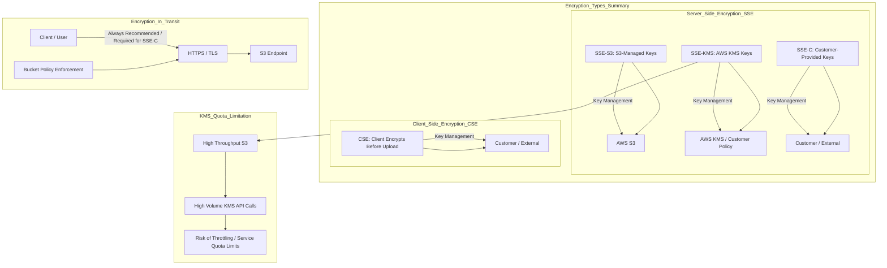

# Amazon S3 Data Protection: A Comprehensive Learning Guide

This guide breaks down the different methods of encrypting data at rest (within Amazon S3) and data in transit, based on the provided transcript. Understanding these concepts is crucial for securing data on AWS.

-----

## 1\. Data Encryption at Rest: Server-Side and Client-Side

Data encryption at rest ensures that data stored in your S3 buckets is encrypted. Amazon S3 offers three main Server-Side Encryption (SSE) options and one Client-Side Encryption (CSE) option.

### 1.1 Server-Side Encryption with AWS KMS ($\text{SSE-KMS}$)

This method uses AWS Key Management Service ($\text{KMS}$) to manage the encryption keys.

| Aspect | Description |
| :--- | :--- |
| **Key Location/Source** | Keys are created and managed by **AWS KMS**. |
| **Encryption Process** | When you upload an object, you specify the $\text{KMS}$ key in the header. S3 blends the object with the key from $\text{AWS KMS}$ to perform encryption before storing it. |
| **Decryption Access** | To read the file, you need access to the object **and** the underlying $\text{KMS}$ key used for encryption. This adds a layer of security. |
| **Key Management** | $\text{AWS}$ handles the encryption and decryption, but you control the key's access policy ($\text{IAM}$ and $\text{KMS}$ policies). |
| **Limitation** | Every encryption and decryption operation involves $\text{API}$ calls to the $\text{KMS}$ service ($\text{GenerateDataKey}$, $\text{Decrypt}$). These calls count towards your $\text{KMS}$ quotas ($\text{5,000}$ to $\text{30,000}$ requests per second, adjustable via **Service Quotas Console**). High-throughput S3 buckets may hit this **KMS quota limit** (**throttling**). |

### 1.2 Server-Side Encryption with Customer-Provided Keys ($\text{SSE-C}$)

This method lets you provide your own encryption key while still having S3 perform the encryption.

| Aspect | Description |
| :--- | :--- |
| **Key Location/Source** | Keys are managed **outside of AWS** by the user (client). |
| **Encryption Process** | The user uploads the file and passes the key as part of **HTTP headers** (must use $\text{HTTPS}$). S3 uses the provided key to encrypt the object, then **discards** the key, never storing it. |
| **Decryption Access** | To read the file, the user must **again provide the exact same key** that was used to encrypt it. |
| **Key Management** | The **client/user** is entirely responsible for key management, security, and rotation. |
| **Protocol Requirement** | **Must use $\text{HTTPS}$** to transmit the key securely in the header. |

-----

## 2\. Client-Side Encryption ($\text{CSE}$)

In Client-Side Encryption, the encryption and decryption happen entirely on the client side, before data leaves or after it arrives from AWS.

| Aspect | Description |
| :--- | :--- |
| **Key Location/Source** | Keys are managed **outside of AWS** by the client. |
| **Encryption Process** | The **client** uses a client-side library (like the $\text{AWS}$ $\text{SDK}$) and their own key to **encrypt the data themselves**. The already encrypted file is then uploaded to S3. |
| **Decryption Process** | The client retrieves the encrypted file from S3, and the **client** performs the decryption outside of S3. |
| **Key Management** | The **client fully manages** the keys and the entire encryption lifecycle. |
| **S3's Role** | S3 simply stores the already-encrypted file as-is, treating it as any other object. |

-----

## 3\. Encryption in Transit ($\text{SSL}$/$\text{TLS}$)

Encryption in transit (or in flight) protects data while it is moving between your client and Amazon S3. This is achieved using **Secure Sockets Layer ($\text{SSL}$) / Transport Layer Security ($\text{TLS}$)**, which is what $\text{HTTPS}$ uses.

### $\text{HTTP}$ vs. $\text{HTTPS}$ Endpoints

Amazon S3 buckets have two endpoints:

1.  **$\text{HTTP}$ Endpoint:** Not encrypted.
2.  **$\text{HTTPS}$ Endpoint:** Has encryption in flight (using $\text{SSL}$/$\text{TLS}$).

Most modern clients use the $\text{HTTPS}$ endpoint by default.

### Forcing Encryption in Transit

You can enforce the use of $\text{HTTPS}$ (encryption in transit) on your S3 bucket using a **Bucket Policy**. This is a critical security best practice.

The policy uses a **Deny** statement with the `aws:SecureTransport` condition key.

```json
{
    "Id": "DenyNonSecureTransport",
    "Version": "2012-10-17",
    "Statement": [
        {
            "Sid": "AllowSSLRequestsOnly",
            "Action": "s3:*",
            "Effect": "Deny",
            "Resource": [
                "arn:aws:s3:::<YourBucketName>",
                "arn:aws:s3:::<YourBucketName>/*"
            ],
            "Condition": {
                "Bool": {
                    "aws:SecureTransport": "false"
                }
            }
        }
    ]
}
```

  * The condition `"aws:SecureTransport": "false"` evaluates to **true** if the request is made over **$\text{HTTP}$** (unencrypted) and **false** if it's over **$\text{HTTPS}$** (encrypted).
  * The policy effectively says: **Deny** any S3 action (`s3:*`) on this bucket if the connection is **not secure** (`"aws:SecureTransport": "false"`).

-----

## 4\. Missing Concept: Server-Side Encryption with S3-Managed Keys ($\text{SSE-S3}$)

The transcript describes three key encryption methods ($\text{SSE-KMS}$, $\text{SSE-C}$, $\text{CSE}$), but the most fundamental and default Server-Side Encryption method, **$\text{SSE-S3}$**, is not covered.

### 4.1 Server-Side Encryption with S3-Managed Keys ($\text{SSE-S3}$)

| Aspect | Description |
| :--- | :--- |
| **Key Location/Source** | Keys are managed by **Amazon S3**. |
| **Encryption Process** | S3 handles all encryption and decryption transparently. It uses $\text{AES-256}$ encryption. |
| **Key Management** | $\text{AWS}$ manages the encryption keys, including their rotation. The customer does not manage the keys or have access to the $\text{KMS}$ $\text{API}$s. |
| **Benefit** | Simplest option for encryption at rest, as it requires minimal effort from the user. |

-----

## 5\. Summary and Conceptual Diagram

The following diagram illustrates the different encryption methods and where the key management responsibility lies.


