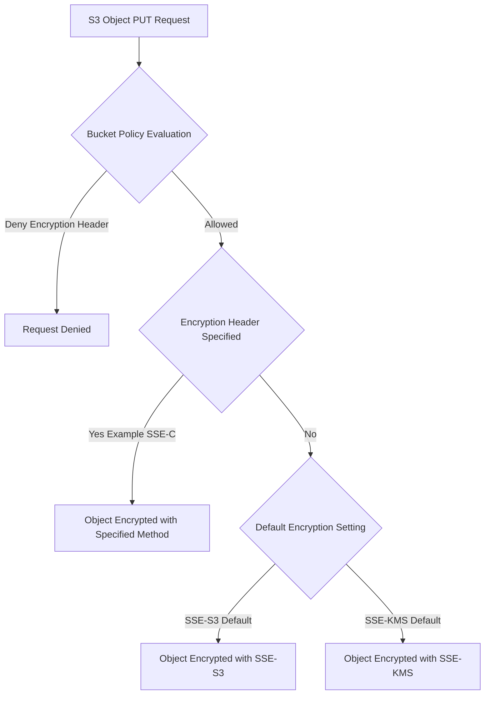

# 🔒 S3 Encryption Strategy: Default vs. Policy Enforcement 🛡️

This guide outlines the critical differences and interaction between Amazon S3's default encryption setting and the use of bucket policies to enforce specific encryption methods. Understanding this hierarchy is essential for robust data protection and compliance.

-----

## 1\. Default Bucket Encryption (Baseline Security)

| Feature | Description | Default Setting (Current) | Custom Setting |
| :--- | :--- | :--- | :--- |
| **Purpose** | Sets the **default** encryption method for new objects uploaded *without* specific encryption headers. | **SSE-S3** (Server-Side Encryption with Amazon S3-Managed Keys) | **SSE-KMS** (Server-Side Encryption with AWS KMS) |
| **Mechanism** | Automatically applied by S3 to new object uploads. | Uses AES-256 with keys managed by Amazon. | Uses AES-256 with keys managed via AWS KMS (providing more control and auditability). |
| **Enforcement** | **Not an enforcement mechanism.** If a user explicitly specifies a *different* encryption method (or none, if allowed), the default is overridden or applied, respectively. | **Applies automatically** to new objects, but can be **overridden** by an explicit encryption header in the PUT request. |

-----

## 2\. Bucket Policy Enforcement (Mandatory Security)

| Feature | Description | Key Action | Condition Keys |
| :--- | :--- | :--- | :--- |
| **Purpose** | **Forces** a specific encryption method for all object uploads and **denies** non-compliant requests. | `Deny` the `s3:PutObject` action. | Evaluate the presence and value of encryption headers in the request using `Condition` blocks. |
| **Mechanism** | Uses **explicit deny** statements in a bucket policy, which are evaluated *before* the default encryption setting. | If the `PUT object` request does not contain the required encryption header (e.g., `x-amz-server-side-encryption` set to `aws:kms`), the request is denied. | `s3:x-amz-server-side-encryption` (for SSE-S3/SSE-KMS) and `s3:x-amz-server-side-encryption-customer-algorithm` (for SSE-C). |

### 📝 Example Policy Logic (Enforcing SSE-KMS)

A bucket policy statement would typically use the `StringNotEquals` condition to deny a `PutObject` request unless the header is set to the desired value (`aws:kms` in this case).

```json
{
  "Sid": "DenyUnencryptedObjectUploads",
  "Effect": "Deny",
  "Principal": "*",
  "Action": "s3:PutObject",
  "Resource": "arn:aws:s3:::your-bucket-name/*",
  "Condition": {
    "StringNotEquals": {
      "s3:x-amz-server-side-encryption": "aws:kms"
    }
  }
}
```

*Note: This specific example would also deny objects uploaded with no encryption header, as `StringNotEquals` is effectively checking if the header's value is not `aws:kms` (which is true if it's absent or different).*

-----

## 3\. Hierarchy and Key Takeaway

The crucial takeaway is the order of operations:

1.  **Bucket Policies** (Explicit Deny) are **always evaluated first**. If a request is denied by a policy, it fails immediately. This is the **enforcement** layer.
2.  If the request is **allowed** by the bucket policy (i.e., it passed the encryption checks):
      * If the upload specified an encryption header, that method is used.
      * If the upload *did not* specify an encryption header, the **Default Bucket Encryption** setting is applied. This is the **automatic coverage** layer.

### 🧠 Concept Missing from Transcript: Explicit SSE-S3/KMS Overrides

While the transcript mentions that a user can change the default to SSE-KMS, it doesn't explicitly state that even with a default set, a user can still override it by supplying a different valid encryption header (e.g., SSE-S3 if the default is SSE-KMS). The bucket policy is the only mechanism to truly **enforce** one specific type and deny all others, as noted by the example policy logic.

-----

## 4\. Hierarchy Flowchart (Mermaid)

This diagram visualizes the evaluation order, which is crucial for understanding the difference between the two security controls.



-----