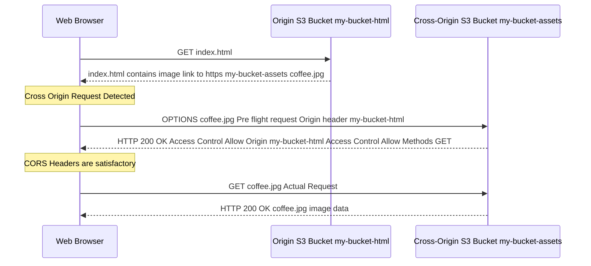

# 🌐 Cross-Origin Resource Sharing (CORS) in Amazon S3

This guide details the fundamentals of CORS and its essential application when hosting static websites and assets on **Amazon S3**. Understanding CORS is crucial for modern web architecture and is a frequent topic in AWS certification exams.

-----

## 1\. CORS Fundamentals

| Concept | Definition | Key Components of an Origin |
| :--- | :--- | :--- |
| **CORS** | **Cross-Origin Resource Sharing**. A **web browser security mechanism** that allows a web page from one origin (the main site) to request restricted resources from another origin (the cross-origin). | **Scheme/Protocol:** (`http` or `https`) |
| **Same-Origin Policy** | A fundamental security measure enforced by browsers. It prevents a document or script loaded from one origin from interacting with a resource from another origin. | **Host/Domain:** (`www.example.com`) |
| **Origin** | A scheme (protocol), host (domain), and port combination. All three must match for two URLs to be considered the **same origin**. | **Port:** (e.g., `80` for HTTP, `443` for HTTPS) |

### 🚨 When is a Request Cross-Origin?

A request is cross-origin if the target resource has a **different scheme, host, or port** than the initiating webpage.

| Origin 1 | Origin 2 | Result | Reason |
| :--- | :--- | :--- | :--- |
| `https://a.com` | `http://a.com` | **Different** | Scheme (`https` vs. `http`) |
| `https://a.com` | `https://b.com` | **Different** | Host (`a.com` vs. `b.com`) |
| `https://a.com:443` | `https://a.com:8080` | **Different** | Port (`443` vs. `8080`) |

-----

## 2\. The CORS Request Flow

The browser enforces the Same-Origin Policy. When a JavaScript-initiated request attempts to access a cross-origin resource, the following handshake occurs:

1.  **Pre-flight Request (for complex requests)**:
      * The browser first sends an `OPTIONS` HTTP request (the "pre-flight") to the cross-origin server.
      * This request includes headers like `Origin` (the site making the request) and `Access-Control-Request-Method` (e.g., `PUT`, `DELETE`).
2.  **Server Response (CORS Headers)**:
      * The cross-origin server (e.g., an S3 bucket) responds with **CORS Headers** (starting with `Access-Control-Allow-`).
      * These headers tell the browser which origins, methods, and headers are allowed.
3.  **Actual Request**:
      * If the browser is **satisfied** with the response's CORS headers, it proceeds to send the actual request (e.g., `GET`, `PUT`, or `DELETE`).
      * If the browser is **not satisfied** (e.g., the origin is not whitelisted), the request is **blocked** by the browser and fails with a CORS error.

### 💡 Application to S3

If you host a website on **Bucket A** and its assets (images, JavaScript, fonts) on **Bucket B** (which has a different URL/origin), the browser will **block** requests from Bucket A to Bucket B unless you configure a **CORS policy** on **Bucket B** to allow the origin of Bucket A.

-----

## 3\. S3 CORS Configuration

CORS is configured on the **S3 bucket** hosting the assets (the cross-origin resource). The configuration is a JSON array of rules:

### 📝 Example: Allowing GET/PUT from a Specific Domain

```json
[
    {
        "AllowedHeaders": [
            "*" 
        ],
        "AllowedMethods": [
            "GET",
            "PUT"
        ],
        "AllowedOrigins": [
            "https://www.example.com" 
        ],
        "ExposeHeaders": [],
        "MaxAgeSeconds": 3000
    }
]
```

### Key CORS Rule Elements in S3

| Element | Description | Common Value | Notes |
| :--- | :--- | :--- | :--- |
| **`AllowedOrigins`** | The domains allowed to make cross-origin requests. | `*` (All origins) or a specific domain (e.g., `https://my-website.com`). | **Must match** the scheme, host, and port exactly. |
| **`AllowedMethods`** | The HTTP methods allowed for the cross-origin request. | `GET`, `HEAD`, `PUT`, `POST`, `DELETE`. | `GET` and `HEAD` are typically sufficient for static assets. |
| **`AllowedHeaders`** | Headers (other than standard ones) allowed in the pre-flight request. | `*` (All headers) is common but less secure. | Essential for authenticated requests (e.g., includes `Authorization`). |
| **`ExposeHeaders`** | Response headers that the browser's client-side script can access. | List of headers (e.g., `x-amz-server-side-encryption`). | Required for specific client-side logic. |
| **`MaxAgeSeconds`** | The time (in seconds) the pre-flight response can be cached by the browser. | `3000` (50 minutes) or higher. | Reduces the number of `OPTIONS` requests sent to S3. |

-----

## 4\. CORS Request Flow Diagram

This shows the S3-specific interaction when an asset is requested from a different S3-hosted website.

