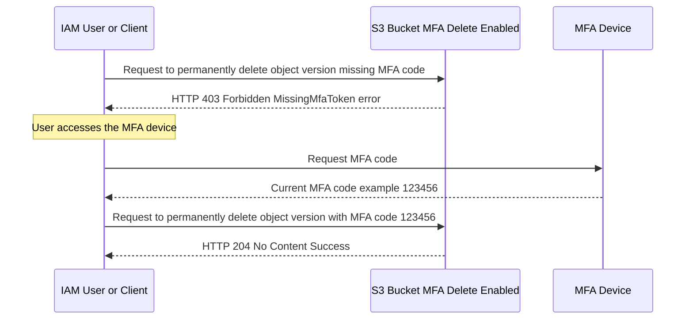

## 🔒 Amazon S3 MFA Delete: The Ultimate Safety Net

This guide explains **MFA Delete** in **Amazon S3**, a critical security feature that adds an essential layer of protection against accidental or malicious data loss in versioned buckets.

-----

## 1\. What is MFA Delete?

**MFA Delete** leverages **Multi-Factor Authentication (MFA)** to require a one-time passcode from an authorized MFA device before executing high-risk operations on an S3 bucket.

This feature is designed to prevent irreversible actions, providing a "nuclear option" safeguard for your data.

### 🔑 The MFA Component

  * **MFA (Multi-Factor Authentication):** Requires an additional authentication factor—something the user *has* (the device) in addition to something they *know* (the password).
  * **MFA Devices:** Can be a **virtual MFA device** (like Google Authenticator on a mobile phone) or a **hardware MFA device** (like a YubiKey).
  * **Requirement:** A valid MFA code (typically a 6-digit code that changes every 30 seconds) must be supplied with the request to perform a protected action.

-----

## 2\. When is MFA Delete Required?

MFA Delete is specifically an extra protection for highly destructive actions related to **S3 Versioning**. It is required for the following two operations:

1.  **Permanently deleting an object version.**
      * *Why?* Deleting a specific object version is an irreversible action that bypasses the protection offered by Versioning (which keeps previous versions).
2.  **Suspending Versioning on the bucket.**
      * *Why?* Suspending Versioning removes the safety net for all future object modifications and deletions, which is considered a critical security change.

### 🚫 When is MFA Delete NOT Required?

MFA Delete is **NOT** required for operations that are less dangerous or are designed to improve data recovery:

  * **Enabling Versioning:** This is a protective action.
  * **Listing deleted versions:** This is a read/audit action.
  * **Deleting a delete marker:** Deleting a delete marker restores the object to its previous version, which is a recovery action.

-----

## 3\. Configuration & Management

The power of MFA Delete means its management must be strictly controlled.

| Aspect | Requirement | Note |
| :--- | :--- | :--- |
| **Prerequisite** | **Versioning** must be enabled on the S3 bucket. | MFA Delete is a versioning-specific protection. |
| **Enforcement** | Can only be enabled or disabled by the **Bucket Owner (AWS Root Account)**. | This restriction ensures a very high bar for the most critical security setting. You'll typically use the AWS Console for this. |
| **Account Best Practice** | While the **Root Account** is required for configuration, it's a best practice to keep Root Account usage minimal. You will only use it for this specific, critical setup. | Once enabled, *any* user, including IAM users, must supply the MFA code to perform the restricted operations, provided their IAM policy allows it. |

-----

## 4\. Conceptual Flow of a Protected Operation

This diagram illustrates how MFA Delete intersects with the standard S3 request flow for a destructive action.

-----

## 📝 Missing Concept: Security Hierarchy

The provided transcript focuses on MFA Delete, but it's important to place it in the context of S3's overall deletion protection.

The general hierarchy of S3 deletion protection is:

1.  **S3 Versioning (Base Protection):**
      * **Action:** When a file is "deleted," a **Delete Marker** is created, and the object's previous versions are retained.
      * **Result:** The object is only *logically* deleted (hidden).
2.  **S3 MFA Delete (Ultimate Protection):**
      * **Action:** Prevents the **permanent deletion** of object versions and the **suspension of Versioning** without a valid MFA code.
      * **Result:** Ensures that data is *physically* un-deletable without the security token.

**In summary: Versioning saves your data from accidental deletion; MFA Delete saves your data from intentional, unverified permanent deletion.**