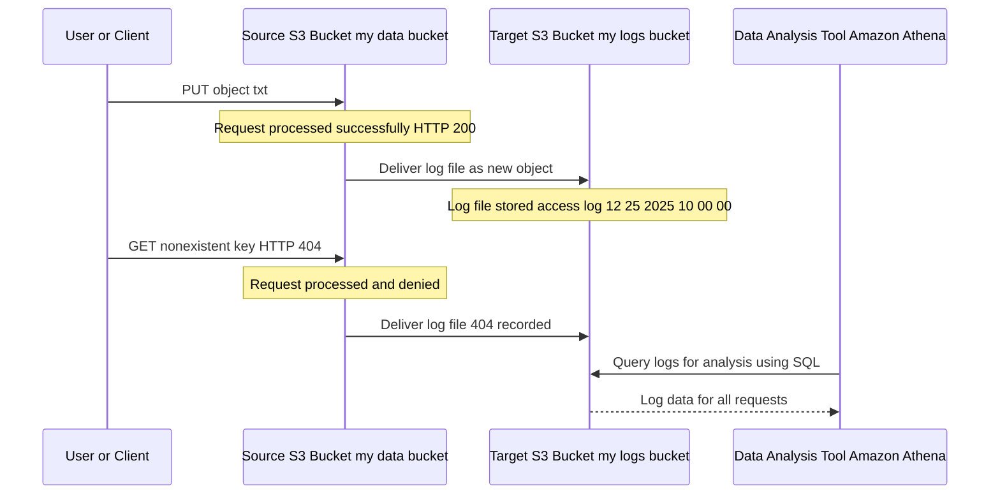

## 📊 S3 Access Logs: Auditing Every Request

This guide covers **Amazon S3 Access Logs**, a crucial feature for security, auditing, and understanding how your data is accessed. Access logs record details for every request made to an S3 bucket, whether successful or denied.

-----

## 1\. What are S3 Access Logs?

S3 Access Logs provide a **detailed record of all requests** made to an S3 bucket.

  * **Purpose:** Primarily for **audit purposes**, security analysis, and understanding traffic patterns.
  * **Data Captured:** Logs include details like the requester, bucket name, request time, request action (e.g., `GET`, `PUT`), HTTP status code (success or failure), error code (if any), and the amount of data transferred.
  * **Logging Mechanism:** The logs are delivered as a file (in a specific log format) to a separate, designated S3 bucket.

### 📝 Key Log Details

| Detail | Description | Value Example |
| :--- | :--- | :--- |
| **Requester** | The identity that made the request. | AWS Access Key ID, canonical ID, or `-` |
| **Operation** | The S3 API operation performed. | `REST.GET.OBJECT`, `REST.PUT.OBJECT` |
| **HTTP Status** | The result of the request. | `200` (Success), `403` (Denied/Forbidden) |
| **Error Code** | Specific S3 error code for failed requests. | `NoSuchKey`, `AccessDenied` |

-----

## 2\. Setting Up S3 Access Logging

To enable S3 access logging, you need two distinct buckets:

1.  **Source Bucket:** The bucket you want to monitor.
2.  **Target Logging Bucket:** The separate bucket where the log files will be delivered.

### ⚠️ Critical Requirements & Warnings

| Rule | Description | Importance |
| :--- | :--- | :--- |
| **Separate Buckets** | **NEVER** set the target logging bucket to be the same as the source bucket you are monitoring. | **CRITICAL\!** This causes a **logging loop**, where logging a file creates a request, which creates a new log file, causing **exponential growth** and immense cost. |
| **Region** | The target logging bucket **must** be in the **same AWS Region** as the source bucket. | Log delivery will fail if the regions do not match. |
| **Permissions** | S3 requires specific permissions to write logs to the target bucket. S3 automatically manages a predefined grant to the **S3 Log Delivery Group** to write objects to the target bucket. | You must ensure the bucket policy of the target logging bucket doesn't accidentally block the S3 log delivery service. |
| **Delivery Time** | Log delivery is **best effort** and can take some time. Logs are typically delivered within a few hours of the request. | Do not rely on S3 Access Logs for real-time security monitoring. |

-----

## 3\. The Logging Flow

The process of logging requests involves routing every interaction to a separate storage location.

-----

## 4\. Analysis and Auditing

Once logs are stored, they become raw data that can be analyzed for security and compliance.

  * **Amazon Athena:** A common and highly effective tool. It is a serverless interactive query service that makes it easy to analyze data directly in S3 using standard **SQL**.
      * You define a table structure (schema) matching the S3 log format, and Athena can query the logs without you having to load the data elsewhere.
  * **Security Audits:** Review logs for unauthorized access attempts (`403` errors) or unexpected object deletions.
  * **Cost Analysis:** Understand which objects or clients are generating the most requests, which helps in optimizing costs.

💡 **Pro-Tip:** Over time, log files can become very large. Implement an S3 **Lifecycle Policy** on the **target logging bucket** to transition older logs to a lower-cost storage class (like S3 Glacier) or to automatically expire them.