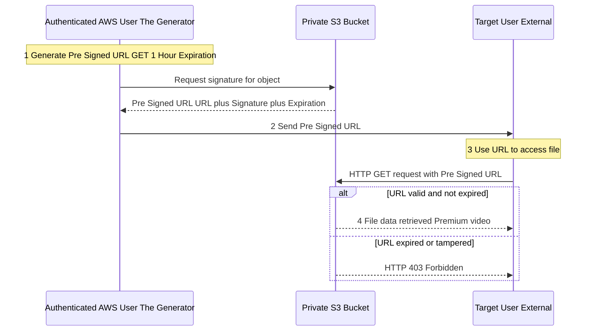

## 🔑 Amazon S3 Pre-Signed URLs: Temporary Access for Private Data

This guide explores **Amazon S3 Pre-Signed URLs**, a powerful mechanism to grant temporary and secure access to private S3 objects for users who do not have AWS credentials.

-----

## 1\. What is an S3 Pre-Signed URL?

A **Pre-Signed URL** is a time-limited token that grants a user **temporary access** to a specific S3 object. It is essentially a secret key that authorizes the holder to perform a designated action (usually `GET` or `PUT`) on a private resource, without needing to log into AWS.

### Key Characteristics

  * **Temporary:** The URL has an **expiration time** set at the time of generation.
  * **Permissions Inheritance:** The permissions granted by the URL are those of the **AWS user who generated it**. If the generating user has permission to read the file, the URL grants temporary read permission.
  * **Actions:** Most commonly used for:
      * **GET:** Allowing a user to **download** a private file.
      * **PUT:** Allowing a user to **upload** a file to a specific private location.
  * **Security:** This method allows you to share private data without making the object or the bucket public, thus maintaining your overall security posture.

### Expiration Limits

| Generation Method | Maximum Expiration Time |
| :--- | :--- |
| **S3 Console** | Up to **12 hours** |
| **CLI / SDK** | Up to **168 hours** (7 days) |

-----

## 2\. The Pre-Signed URL Use Case Flow

The entire process is designed to delegate granular, time-bound access to a specific object.

1.  **Preparation:** An S3 bucket contains a **private file** (e.g., a premium video).
2.  **Generation:** An authenticated AWS user (e.g., an application server or an admin) generates a pre-signed URL for the private object, specifying the action (`GET`/`PUT`) and the expiration time.
3.  **Delivery:** The generated URL is sent to the target, external user (e.g., a logged-in customer).
4.  **Access:** The target user uses the URL (via a standard HTTP request) to interact directly with S3. S3 validates the URL's signature and expiration.
5.  **Fulfillment:** If valid, S3 fulfills the request (sends the file or accepts the upload). After expiration, the URL is useless.

<!-- end list -->

-----

## 3\. Common Use Cases

Pre-Signed URLs are the standard solution for temporary, controlled access to private S3 data:

  * **Premium Content Delivery:** Only allow paying, logged-in users to download premium video files, without exposing them publicly.
  * **Dynamic Access Control:** Allow a continuously changing list of users to download files by dynamically generating a new URL for each request upon successful application login/authorization.
  * **Secure User Uploads:** Allow a customer to upload a profile picture to a precise, pre-defined path in your private S3 bucket without granting them general write access to the bucket.

## 4\. 💡 Missing Concept: The Signature

The transcript mentions the URL carries over credentials, but the mechanism is the **Signature**.

A pre-signed URL is a standard S3 endpoint URL with additional query parameters that constitute the signature:

  * `X-Amz-Algorithm`: The hashing algorithm used (e.g., `AWS4-HMAC-SHA256`).
  * `X-Amz-Credential`: The identity of the user who signed the URL.
  * `X-Amz-Date`: The timestamp of when the URL was created.
  * `X-Amz-Expires`: The expiration time in seconds.
  * **`X-Amz-Signature`**: The **secret cryptographic hash** calculated over the request components using the signer's secret access key. This is what S3 validates.

The URL works because S3 can re-calculate the expected signature using the public components and compare it to the signature in the URL. **Any modification** to the object key, method, or parameters in the URL will cause the signature to fail validation.