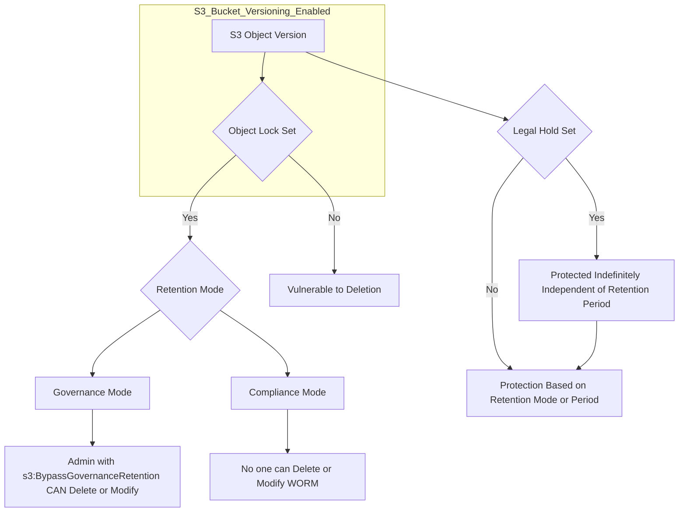

## 🛡️ WORM Compliance: Glacier Vault Lock & S3 Object Lock

This guide details the two powerful mechanisms in AWS for implementing a **Write Once Read Many (WORM)** model for data immutability: **Glacier Vault Lock** and **S3 Object Lock**. These features are essential for meeting regulatory compliance and long-term data retention requirements.

-----

## 1\. WORM Model Overview

The fundamental concept behind both features is **WORM**:

  * **W**rite **O**nce: Data is written to storage (Glacier Vault or S3 Bucket) one time.
  * **R**ead **M**any: Data can be read (retrieved) many times.
  * **Immutability:** Once locked, the data **cannot be modified or deleted** for the specified retention period or until the lock is lifted (if applicable).

-----

## 2\. Glacier Vault Lock

Glacier Vault Lock applies a WORM policy **at the entire vault level**. It is the ultimate form of un-deletable storage.

| Feature | Description | Key Characteristic |
| :--- | :--- | :--- |
| **Scope** | Applies the policy to the **entire Glacier Vault**. | **Vault-Level Lock** |
| **Mechanism** | You create a **Vault Lock Policy** (similar to a Bucket Policy). |
| **Immutability** | Once the policy is set and **locked**, it **cannot be changed or deleted by anyone**, including the AWS Root user or AWS itself. | **Irreversible Policy** |
| **Use Case** | Ideal for extremely strict compliance and legal data retention where absolute assurance against deletion is required. |

-----

## 3\. S3 Object Lock

S3 Object Lock provides more granular, object-level WORM capabilities within a standard S3 bucket.

### Prerequisites

  * **Versioning** must be enabled on the S3 bucket **before** enabling S3 Object Lock.

### Protection Modes

S3 Object Lock allows you to apply a retention period to **individual object versions** using one of two modes:

#### A. Compliance Mode (Strict WORM)

| Characteristic | Description | Similarity to Glacier |
| :--- | :--- | :--- |
| **Protection** | Object versions **cannot be overwritten or deleted** by *any* user. | Similar to Glacier Vault Lock. |
| **Control** | The **retention period cannot be shortened**, and the **lock settings cannot be altered**. | **Absolutely irreversible** for the retention period. |
| **Use Case** | Data requiring the highest level of regulatory compliance (e.g., financial records, medical archives). |

#### B. Governance Mode (Flexible WORM)

| Characteristic | Description | Differentiator |
| :--- | :--- | :--- |
| **Protection** | Most users **cannot** override, delete, or alter lock settings. | |
| **Control** | **Admin users** with specific IAM permissions (`s3:BypassGovernanceRetention`) **CAN** still shorten the retention period or delete the object version. | Provides an **"escape hatch"** for privileged administrators. |
| **Use Case** | Situations where compliance is needed, but an authorized administrator must retain the ability to make changes in an emergency or legally mandated scenario. |

### Retention Period

Both Compliance and Governance modes use a **Retention Period**.

  * This defines a fixed period of time (e.g., 5 years) for which the object version is protected.
  * The retention period **can be extended** in both modes, but **cannot be shortened** in Compliance Mode.

-----

## 4\. Legal Hold: The Indefinite Lock

Legal Hold is a distinct feature within S3 Object Lock that provides **indefinite WORM protection**, independent of any set retention period.

| Feature | Description | Key Control |
| :--- | :--- | :--- |
| **Protection** | Protects the object indefinitely, regardless of the retention mode or period. | **Indefinite Protection** |
| **Mechanism** | A simple on/off flag placed on an object version. |
| **Permissions** | Requires the IAM permission **`s3:PutObjectLegalHold`** to **apply or remove** the legal hold. | **Flexible Control** via IAM |
| **Use Case** | Used for legal or investigation purposes (e.g., an eDiscovery process) where an object must be preserved until a specific legal action is concluded. |

