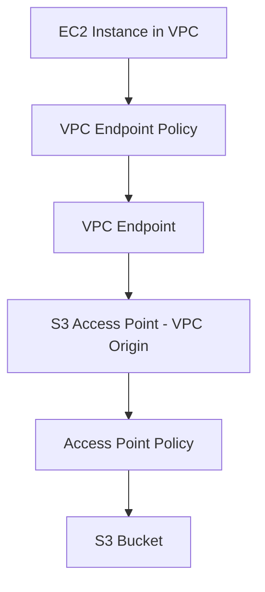

## 🎯 Amazon S3 Access Points: Scaling Security Management

This guide explores **Amazon S3 Access Points**, a feature designed to simplify the management of data access at scale by creating distinct, tailored access policies for a single S3 bucket.

-----

## 1\. The Challenge of Scaling S3 Security

When an S3 bucket holds vast amounts of data for different groups (e.g., Finance, Sales, Analytics) that require varying access levels (read/write, read-only) to specific prefixes, managing security via a single, monolithic **S3 Bucket Policy** becomes complex and difficult to audit.

**S3 Access Points** solve this by decentralizing security management.

### Key Benefits of Access Points

  * **Simplifies Security:** Moves complex access rules from one massive Bucket Policy to multiple, small, and targeted **Access Point Policies**.
  * **Scalability:** Easily add new teams or prefixes without modifying the main bucket policy.
  * **Granularity:** Each Access Point can grant unique permissions (e.g., read-only) to a specific set of prefixes (e.g., `/finance/*` and `/sales/*`).

-----

## 2\. How S3 Access Points Work

An S3 Access Point is a named network endpoint that is attached to a bucket and used to perform S3 operations.

| Component | Description | Example Policy Action |
| :--- | :--- | :--- |
| **Access Point** | A new resource with its own **DNS name** for accessing the bucket. | `finance-ap.s3-accesspoint.REGION.amazonaws.com` |
| **Access Point Policy** | A resource policy **attached to the Access Point**. It defines which users/groups can access the bucket **through this specific endpoint** and for which prefixes. | Grant Read/Write access to the `finance/` prefix. |
| **S3 Bucket Policy** | The bucket's native policy, which remains **simple and broad**, delegating most of the granular control to the Access Points. | Ensure the Bucket Policy allows Access Points to apply their own rules. |

### Access Point Flow Example

| Group | Access Point Name | Access Point Policy | Resulting Access |
| :--- | :--- | :--- | :--- |
| **Finance** | `finance-ap` | Read/Write access to `s3://my-bucket/finance/*` | Can only manage Finance data. |
| **Sales** | `sales-ap` | Read/Write access to `s3://my-bucket/sales/*` | Can only manage Sales data. |
| **Analytics** | `analytics-ap` | Read-Only access to `s3://my-bucket/finance/*` and `s3://my-bucket/sales/*` | Can read both Finance and Sales data, but cannot write. |

-----

## 3\. Network Origin: Public vs. Private

Each Access Point must be configured with a network origin, which dictates how clients connect to it.

### A. Internet Origin (Public Access)

  * **Connectivity:** The Access Point is accessible from the **Internet**.
  * **DNS Name:** Users connect via the Access Point's unique public DNS name.
  * **Use Case:** Ideal for access from EC2 instances in public subnets or from external applications over the internet.

### B. VPC Origin (Private Access)

  * **Connectivity:** The Access Point is configured to be accessible **only** from a specified **VPC** (Virtual Private Cloud). This is for private, secure traffic that never traverses the public internet.
  * **Mechanism:** To connect to a VPC-originated Access Point, a **VPC Endpoint** (specifically, a VPC Gateway Endpoint) must be created within the VPC.
  * **Security Layers:** VPC Origin access introduces three layers of security:
    1.  **VPC Endpoint Policy:** Controls which VPC users can connect to the Access Point.
    2.  **Access Point Policy:** Controls access to prefixes within the S3 bucket.
    3.  **S3 Bucket Policy:** The bucket's master policy.

### 🌐 VPC Origin Flow

