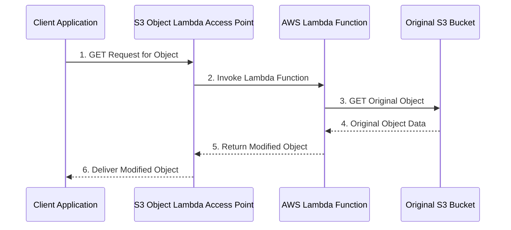

## 🧠 S3 Object Lambda: Data Transformation on the Fly

**S3 Object Lambda** is a serverless feature that allows you to execute custom code using an **AWS Lambda function** to modify, transform, or enrich data as it is retrieved from an S3 bucket. This eliminates the need to create and maintain multiple derivative copies of your data, simplifying your data architecture and reducing storage costs.

-----

## 1\. The Core Concept: On-Demand Data Modification

Instead of storing multiple versions of an object (e.g., original, redacted, enriched), you store only the **original object** and use S3 Object Lambda to apply transformations dynamically when an application requests the data.

### Key Mechanism

  * **Lambda Function:** This is the custom code (e.g., Python, Node.js) that contains the transformation logic (redacting PII, converting formats, enriching data).
  * **S3 Access Point:** S3 Object Lambda requires a new type of access point, the **S3 Object Lambda Access Point**, to intercept the standard S3 request.
  * **The Original Bucket:** The underlying S3 bucket holds the unmodified, original object.

-----

## 2\. The S3 Object Lambda Workflow

The process involves a three-step dance between the client application, the S3 service, and your Lambda function:

1.  **Request Initiation:** The client application makes a standard `GET` request, but instead of using the S3 bucket name, it uses the **S3 Object Lambda Access Point's DNS name**.
2.  **Function Invocation:** The S3 Object Lambda Access Point intercepts the request and automatically triggers the associated **Lambda function**.
3.  **Data Processing:**
      * The Lambda function retrieves the **original object** from the underlying S3 bucket.
      * It executes the custom code to perform the required **transformation** (redaction, enrichment, resizing).
      * It returns the **modified object** back to S3.
4.  **Response Delivery:** S3 delivers the **modified object** back to the calling application. The application is often unaware that the data was transformed in transit.

<!-- end list -->

-----

## 3\. Powerful Use Cases

S3 Object Lambda enables highly flexible and tailored data consumption:

| Use Case | Description | Application |
| :--- | :--- | :--- |
| **Data Redaction** | **Remove PII** (Personally Identifiable Information) or sensitive fields dynamically for analytics, testing, or non-production environments. | Analytics application receives a dataset with customer names/SSNs redacted. |
| **Data Enrichment** | **Augment** the object's content by fetching data from external sources (e.g., a DynamoDB table or customer loyalty database). | Marketing application gets a customer record enriched with real-time loyalty status. |
| **Format Conversion** | Convert an object from its stored format (e.g., **XML**) to the format required by the application (e.g., **JSON**, CSV, Parquet) on demand. | Application expects JSON; Lambda converts the XML file to JSON upon request. |
| **Dynamic Media Processing** | Resize images, apply watermarks, or add user-specific headers based on the request parameters or the authenticated user. | A specific user's ID is watermarked onto an image they download for digital rights management (DRM). |

-----

## 4\. 💡 Missing Concepts: Foundation and Billing

### A. The Requirement for a Standard Access Point

The S3 Object Lambda setup actually requires a **two-tiered Access Point structure**:

1.  A **Standard S3 Access Point** is configured for the original S3 bucket.
2.  The **S3 Object Lambda Access Point** is then created, referencing the **Standard Access Point** as its source.

This design ensures the Lambda function itself uses a defined path to securely retrieve the original data from the bucket, maintaining separation of concerns and fine-grained access control.

### B. Billing Model

S3 Object Lambda is a powerful feature but its cost model is important to understand as it involves multiple services:

1.  **S3 Standard Requests:** The Lambda function makes a standard `GET` request to the original S3 bucket (via the Standard Access Point), incurring standard S3 request charges.
2.  **AWS Lambda Compute:** Charges are incurred for the execution of the Lambda function (based on duration and memory allocated).
3.  **S3 Object Lambda Service Fee:** There are charges for requests made to the **S3 Object Lambda Access Point** and for the data transferred/processed.