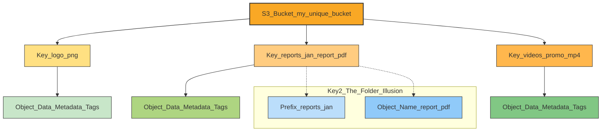

# 🗃️ Amazon S3: The Internet's Storage Drive

This guide provides a comprehensive overview of Amazon S3 (Simple Storage Service), one of the foundational services of AWS. Think of S3 as an infinitely scalable, highly durable, and secure digital filing cabinet for the cloud.

-----

## \#\# What is S3? Core Use Cases

At its core, **S3 is object storage**. This means you store files (called "objects") in containers (called "buckets"). It's not a hard drive (block storage) or a file-sharing drive (file storage), but a massive, web-accessible storage platform.

Its versatility makes it perfect for a huge variety of tasks:

  * **Backup and Storage:** Securely store your files, application logs, and database backups.
  * **Disaster Recovery (DR):** Replicate data to other AWS regions to protect against regional outages.
  * **Archival:** Move data to long-term, low-cost storage tiers like **S3 Glacier**. (Nasdaq, for example, archives 7 years of data this way).
  * **Data Lakes & Big Data:** S3 is the standard data lake for analytics, allowing tools like Sysco's to gain business insights.
  * **Media Hosting:** Store and distribute images, videos, and other media files for your applications.
  * **Static Website Hosting:** Host an entire static website (HTML, CSS, JS) directly from an S3 bucket.

-----

## \#\# How S3 Works: Buckets & Objects

S3 has two main components: buckets and objects.

### \#\#\# Buckets 🪣

A **bucket** is a top-level container, like a main "drawer" in your filing cabinet.

  * **Globally Unique Name:** A bucket's name must be **unique across all AWS accounts in the world**. `my-bucket` is taken; you'll need something like `my-company-reports-bucket-2025-us-east-1`.
  * **Regional:** This is a common point of confusion. Even though the *name* is global, the *bucket itself* is created in a specific AWS Region (e.g., `us-east-1`). S3 *looks* global, but your data physically resides in the region you choose.

### \#\#\# Objects (and the "No Folders" Illusion) 📄

An **object** is the actual file you store (e.g., `cat.jpg`, `report.pdf`). An object is made of:

  * **Key:** This is the full path and name of the file. It's the unique identifier *within the bucket*.
  * **Value:** The data itself (max 5TB).
  * **Metadata:** Data *about* your data (e.g., `Content-Type: image/jpeg`).
  * **Tags:** Key-value pairs for cost allocation, security, or lifecycle rules.
  * **Version ID:** A marker if you have versioning enabled.

A key concept is that **S3 does not have directories or folders**. It is a flat-file system. The "folders" you see in the AWS console are just a visual trick based on the object's key.

The key is simply one long string. The `/` character is just part of that string, which the UI uses to create a folder illusion.

  * **Key:** `images/vacation/my-photo.jpg`
  * **Prefix:** `images/vacation/`
  * **Object Name:** `my-photo.jpg`

<!-- end list -->

### \#\#\# Uploading Large Files

  * **Max Object Size:** 5TB
  * **Multi-part Upload:** If your file is larger than 5GB, you **must** use the multi-part upload API. This breaks the file into smaller chunks, uploads them in parallel, and then reassembles them in S3. This improves speed and reliability.

-----

## \#\# 💡 Key Concepts Not in the Transcript

The transcript provides a great start, but these concepts are essential for using S3 effectively.

### \#\#\# S3 Storage Classes

You don't pay one price for all S3 storage. You choose a "storage class" for your objects based on how often you need to access them.

| Storage Class | Use Case | Analogy |
| :--- | :--- | :--- |
| **S3 Standard** | Frequently accessed data (websites, active content) | Your desk drawer (fast, ready access) |
| **S3 Standard-IA** | Infrequently accessed, long-lived data (backups) | Your closet (still fast, but cheaper) |
| **S3 Glacier** | Long-term archival (data you *must* keep but rarely touch) | Off-site cold storage (slow retrieval, very cheap) |

### \#\#\# S3 Security

By default, all S3 buckets are **private**. You must explicitly grant access. You do this with:

1.  **IAM Policies:** Attached to a User, Group, or Role. Answers: "What can *this user* do in S3?"
2.  **Bucket Policies:** A JSON policy attached directly to the *bucket*. Answers: "Who can access *this bucket* and what can they do?" (This is how you make a bucket public for a website).
3.  **Block Public Access (BPA):** A modern, account-wide safety feature that is **ON by default**. It stops you from accidentally making a bucket public.

### \#\#\# S3 Versioning

This is a critical bucket-level feature. When enabled, S3 saves a complete history of every version of an object.

  * **Overwriting a file?** S3 just creates a *new version* and stacks it on top. The old one is still there.
  * **Deleting a file?** S3 just adds a "delete marker." The file is not actually gone.

This is your \#1 protection against accidental deletion or overwrites. You can always "roll back" to a previous version.