-----

# 🛡️ A Guide to Amazon S3 Security

Amazon S3 is the storage backbone of the internet, but by default, all new buckets and objects are **100% private**. This guide explains the different layers of S3 security, helping you understand how to grant—and block—access correctly.

-----

## \#\# The Two Pillars of S3 Access Control

Think of S3 security as having two main "doors" you can use to grant access. A user only needs *one* of these doors to be open to get in (as long as neither explicitly denies them).

### \#\#\# 1. User-Based Security (IAM Policies)

  * **What it is:** A standard **IAM Policy** (a JSON document) that you attach to an **IAM user, group, or role**.
  * **Analogy:** A **keycard**. The keycard is given to a *person* (the IAM principal) and defines every "door" (AWS API call) they can open across the entire building (your AWS account).
  * **Best for:** Giving trusted users or services *within your own account* (like EC2 instances or IAM users) granular access to S3.

### \#\#\# 2. Resource-Based Security (S3 Bucket Policies)

  * **What it is:** A **Bucket Policy** (a JSON document) that you attach directly to the *S3 bucket itself*.
  * **Analogy:** A **list of rules posted on the door** of a specific room (the S3 bucket). This list defines *who* (from anywhere) can enter *this specific room* and what they can do.
  * **Best for:** Granting access to the public (for websites), or giving other AWS accounts (cross-account access) the ability to use your bucket.

-----

## \#\# Deep Dive: The S3 Bucket Policy (The Modern Way)

For most S3-specific security, the **Bucket Policy** is the most powerful and common tool. It's a JSON file with four key components:

1.  **`Resource`**: *Which assets* this rule applies to. This is the ARN (Amazon Resource Name) of your bucket or the objects inside it (e.g., `arn:aws:s3:::my-example-bucket/*`).
2.  **`Effect`**: What to do. This is either **`Allow`** or **`Deny`**.
3.  **`Action`**: The specific S3 API call you are allowing or denying (e.g., `s3:GetObject`, `s3:PutObject`).
4.  **`Principal`**: *Who* this rule applies to. This is the key component.
      * `"Principal": "*"` means **everyone (public)**.
      * `"Principal": {"AWS": "arn:aws:iam::ACCOUNT_ID:root"}` means a specific AWS account.

### \#\#\# Example: A Public-Read Bucket Policy

This is the most common policy for hosting static websites. It allows *anyone* on the internet to read objects from your bucket.

```json
{
  "Version": "2012-10-17",
  "Statement": [
    {
      "Effect": "Allow",
      "Principal": "*",
      "Action": "s3:GetObject",
      "Resource": "arn:aws:s3:::my-public-website-bucket/*"
    }
  ]
}
```

-----

## \#\# Four Common Access Scenarios

Here’s how you would use these policies in practice.

### \#\#\# Scenario 1: IAM User in Your Account

An IAM user in your company needs to read files from a bucket.

  * **Method:** Use **User-Based** security.
  * **Action:** Attach an **IAM Policy** to the user (or their group) that allows the `s3:GetObject` action on that bucket.

```mermaid
graph TD
    User[👩‍💻 IAM User] -- "Has IAM Policy (Keycard)" --> S3[S3 Bucket];
```

<!-- end list -->



### \#\#\# Scenario 2: EC2 Instance in Your Account

Your application running on an EC2 instance needs to write log files to a bucket.

  * **Method:** Use **User-Based** security.
  * **Action:** Attach an **IAM Role** to the EC2 instance. That role contains an IAM policy allowing the `s3:PutObject` action. (Never put credentials on an EC2 instance\!).

<!-- end list -->

```mermaid
graph TD
    EC2[EC2 Instance] -- "Assumes IAM Role" --> Role[IAM Role (Keycard)] --> S3[S3 Bucket];
```

### \#\#\# Scenario 3: Public Website Access

You are hosting a static website and need the public to see your files.

  * **Method:** Use **Resource-Based** security.
  * **Action:** Attach a **Bucket Policy** to your S3 bucket with `Effect: "Allow"` and `Principal: "*"`.

```mermaid
graph TD
    User[🌐 Public User] -- "HTTP Request" --> S3[S3 Bucket];
    S3 -- "Checks Bucket Policy (Door List)" --> B_Policy["Principal: * (Allow All)"];
    B_Policy --> Access[Access Granted];
```

<!-- end list -->



### \#\#\# Scenario 4: Cross-Account Access

You need to allow a user from *another* AWS account to access your bucket.

  * **Method:** Use **Resource-Based** security.
  * **Action:** Attach a **Bucket Policy** that specifies the other account's ID or a specific user's ARN as the `Principal`.

<!-- end list -->

```mermaid
graph TD
    User[IAM User (Account B)] -- "Makes Request" --> S3[S3 Bucket (Account A)];
    S3 -- "Checks Bucket Policy (Door List)" --> B_Policy["Principal: Account B"];
    B_Policy -- "Effect: Allow" --> Access[Access Granted];
```

-----

## \#\# 🛡️ The Ultimate Safety Net: S3 Block Public Access (BPA)

This is a modern, account-wide safety feature designed to prevent accidental data leaks. Think of it as a **master safety switch** that is **ON by default**.

  * **What it does:** BPA provides four settings that, when enabled, **override** any bucket policies that would grant public access.
  * **Why it exists:** Even if you write a bucket policy with `"Principal": "*"`, as long as "Block all public access" is turned ON, S3 will **block** the public request.
  * **Golden Rule:** To make a bucket public (like for a website), you must do **two things**:
    1.  Create a public bucket policy.
    2.  Go to the "Block Public Access" settings and **turn them OFF**.

This feature is your best defense against configuration errors and is a primary reason S3 is now secure by default.

-----

## \#\# A Note on ACLs (The Legacy Way)

You may also see references to **Access Control Lists (ACLs)**.

  * **What they are:** An older, fine-grained security mechanism that can be set on individual objects.
  * **Why they aren't the focus:** ACLs are complex and pre-date bucket policies. The modern best practice is to **disable ACLs** on your bucket and rely *only* on IAM policies and Bucket Policies for a simpler, more robust security model.