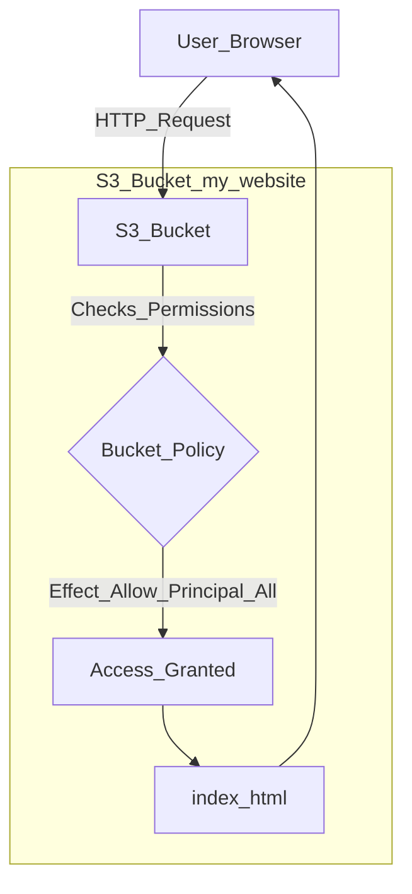

-----

# 🌐 Hosting a Static Website on Amazon S3

Amazon S3 isn't just for storage; you can use it to host a complete static website (e.g., HTML, CSS, JavaScript, and images) and make it accessible to the world.

-----

## \#\# The Core Concept

S3 has a built-in feature that can serve your bucket's content over HTTP as a website. You simply:

1.  Upload your `index.html`, `error.html`, and other assets (like CSS and image files).
2.  Enable the "Static website hosting" property on your bucket.
3.  Make your files publicly readable.

Once enabled, S3 provides you with a unique website endpoint URL, such as:

  * `http://my-bucket.s3-website.us-east-1.amazonaws.com`
  * `http://my-bucket.s3-website-us-east-1.amazonaws.com`

(Note: The format, using a `.` or a `-`, varies by region, but the concept is the same.)

-----

## \#\# 🚨 The "403 Forbidden" Error: Your First Hurdle

This is the most common problem new users face. You've uploaded your `index.html` file, enabled static website hosting, and you click the URL... only to get a **`403 FORBIDDEN`** error.

This error doesn't mean your files are missing. It's a permissions error that means **your bucket is not public**.

By default, all S3 buckets are **100% private**. To host a website, you must *explicitly* allow public read access to your objects. This is a two-step process.

### \#\#\# Step 1: Disable "Block Public Access"

AWS has a modern, account-wide safety feature called **Block Public Access** that is **ON by default**. This master switch overrides any policies you write. You must first disable this.

1.  Go to your S3 bucket's **Permissions** tab.
2.  Find **Block public access (bucket settings)** and click **Edit**.
3.  **Uncheck** "Block *all* public access" and save your changes.

### \#\#\# Step 2: Add a Public Bucket Policy

Disabling the block doesn't make the bucket public—it just *allows* you to make it public. The next step is to attach a **Bucket Policy** that grants public read permissions.

This is a JSON policy you paste into the **Bucket policy** editor on the same **Permissions** tab.

#### **Example Public-Read Bucket Policy:**

This is the policy you need. It says, "Allow *anyone* (`Principal: "*"`) to perform the `s3:GetObject` action (read a file) on *any object* (`Resource: "arn:aws:s3:::YOUR-BUCKET-NAME/*"`) in this bucket."

```json
{
  "Version": "2012-10-17",
  "Statement": [
    {
      "Sid": "PublicReadGetObject",
      "Effect": "Allow",
      "Principal": "*",
      "Action": "s3:GetObject",
      "Resource": "arn:aws:s3:::YOUR-BUCKET-NAME/*"
    }
  ]
}
```

*Remember to replace `YOUR-BUCKET-NAME` with your actual bucket name.*

-----

## \#\# Summary: The Flow of a Static Website

This diagram shows how a user's request is handled by a properly configured S3 static website.

