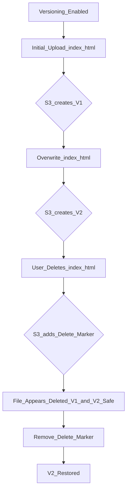

## 💻 Amazon S3 Versioning: A Developer's Safety Net

This guide explores the essential concept of **Versioning in Amazon Simple Storage Service (S3)**, a crucial feature for safe and controlled updates to your stored data, especially when hosting static websites.

-----

### What is S3 Versioning?

**Amazon S3 Versioning** is a configuration setting applied at the **bucket level** that allows you to keep multiple variants of an object in the same bucket. When versioning is enabled, every file upload or modification for a specific key (file name) doesn't overwrite the previous one; instead, it stores the new file as a new version.

Imagine your S3 bucket as a time-traveling warehouse ⏳ where every update leaves a historical record, protecting you from mistakes\!

### ⚙️ How Versioning Works

1.  **Enabling Versioning:** You must explicitly enable this feature on your S3 bucket.
2.  **Initial Upload:** When you upload a file (e.g., `index.html`) to a version-enabled bucket, it creates the first version (e.g., v1).
3.  **Overwriting/Updating:** If you upload a file with the **same key** (`index.html`), S3 stores it as a new version (e.g., v2) instead of overwriting v1.
4.  **Deleting a File:** When you "delete" a file, S3 doesn't permanently remove it. Instead, it adds a **Delete Marker** to the file's key, making it appear deleted to the user. The previous versions remain safely stored.

-----

### 🛡️ Why Version Your Buckets? (Best Practice)

Versioning is considered a **best practice** for data management in S3 due to two main benefits:

1.  **Protection Against Unintended Deletes:**
      * If a file is accidentally deleted, you can simply remove the **Delete Marker** to instantly restore the latest version of the file. The actual content versions were never truly erased\!
2.  **Easy Rollback to Previous Versions:**
      * If a new file update (e.g., a website deployment) introduces a bug or error, you can instantly revert, or **roll back**, to a stable, previous version of that file. This is crucial for maintaining website uptime and integrity.

-----

### 📝 Important Notes on Versioning

  * **Pre-Versioning Files (The `null` Version):** Any object already existing in the bucket *before* you enable versioning will be assigned a special version ID: **`null`**.
  * **Suspending Versioning:** If you later **suspend** versioning on your bucket, it is a safe operation. It **does not delete** any of the previously created versions. New uploads will simply overwrite the current version, and no new version IDs will be generated.

-----

### 🏗️ Conceptual Diagram (Mermaid)

This diagram illustrates the core lifecycle of a file when S3 versioning is enabled.

-----

### 💡 Missing Concept: Cost Implications 💰

A crucial concept missing from the transcript is **Cost**.

  * **Increased Storage Costs:** Since versioning keeps *multiple* copies of your files, it directly increases the amount of storage you consume. You are billed for every version stored, including the current one, previous versions, and even the storage space occupied by **Delete Markers**.
  * **Lifecycle Policies:** To manage these costs, it's best practice to implement **S3 Lifecycle Policies**. These policies can automatically transition older, less-frequently-accessed versions to cheaper storage classes (like S3 Glacier) or permanently delete them after a specified period. This balances the safety of versioning with cost efficiency.