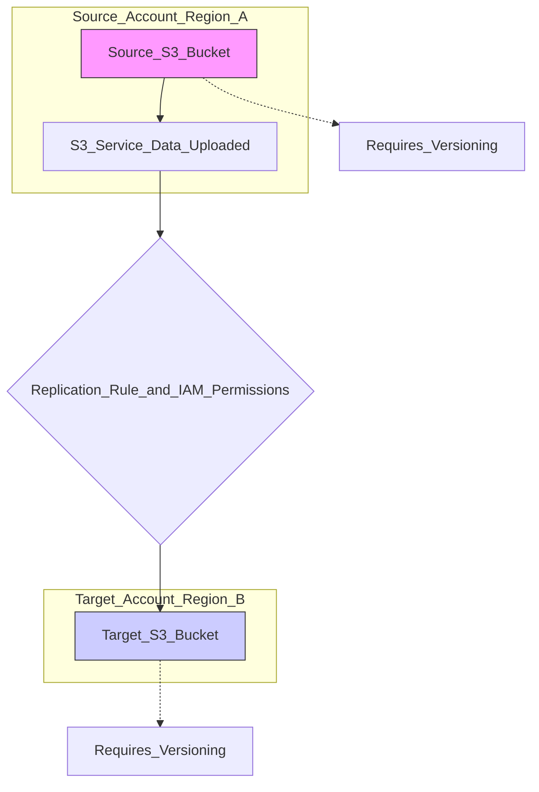

## 🌐 Amazon S3 Replication: CRR vs. SRR

This guide details **Amazon S3 Replication**, a powerful feature for automatically copying objects between buckets. It covers the two main types: **Cross-Region Replication (CRR)** and **Same-Region Replication (SRR)**.

-----

### What is S3 Replication?

S3 replication allows you to automatically and **asynchronously** copy objects from a source S3 bucket to a destination S3 bucket. This process happens **behind the scenes**, in the background, ensuring data is kept in sync across your chosen locations or accounts.

-----

### 🔀 Types of Replication

| Feature | Cross-Region Replication (CRR) | Same-Region Replication (SRR) |
| :--- | :--- | :--- |
| **Regions** | Source and Target buckets **must be** in different AWS Regions. | Source and Target buckets **must be** in the same AWS Region. |
| **Primary Use** | Disaster Recovery, Compliance, Lower Latency Access. | Log Aggregation, Live Test/Prod environments, Account Migration. |

Both CRR and SRR allow the source and destination buckets to be owned by **different AWS accounts**, enabling robust cross-account data sharing.

-----

### 🔑 Prerequisites & Permissions

Two core steps are essential to enabling any S3 replication:

1.  **Versioning Requirement:** You **must** enable **Versioning** on **both** the source bucket and the destination bucket. Replication relies on S3 Versioning to manage the asynchronous copy process.
2.  **IAM Permissions:** The S3 service must be granted the necessary **IAM permissions** to perform the replication. This usually involves granting S3 the rights to **read** objects from the source bucket and **write** objects to the destination bucket.

-----

### 🎯 Use Cases for S3 Replication

| Replication Type | Use Cases |
| :--- | :--- |
| **CRR (Cross-Region)** | **Compliance & Disaster Recovery:** Store data copies in geographically distant regions to meet regulatory requirements or protect against regional outages. |
| | **Lower Latency Access:** Replicate data closer to users in different parts of the world, reducing download times. |
| | **Cross-Account Replication:** Copy data to a completely separate AWS account (e.g., for backup isolation or partner sharing). |
| **SRR (Same-Region)** | **Log Aggregation:** Consolidate logs from multiple production buckets into a single, centralized analysis bucket. |
| | **Live Test/Prod Environments:** Replicate production data into a separate test or staging account/bucket for realistic development and testing. |
| | **Data Structure Reorganization:** Replicate data to a new bucket with different storage settings (e.g., encryption or object tagging) in the same region. |

-----

### 🏗️ Conceptual Diagram (Mermaid)

This diagram shows the basic flow of Cross-Region Replication (CRR), highlighting the key requirements.

-----

### 💡 Missing Concept: Replication Configuration and Deletes 🗑️

While the transcript covers the basics, a few key configuration details are missing:

  * **Replication Configuration:** Replication is set up using a **Replication Configuration** on the source bucket. You can define rules to replicate **all objects** or only objects with specific **prefixes** (folders) or **tags**.
  * **Deletion Behavior:** By default, if an object is **deleted** from the source bucket by a user with a `DELETE` request, the corresponding object in the destination bucket **is not deleted**. Instead, a **Delete Marker** is replicated. This helps prevent accidental data loss in the destination. However, if the source bucket's object is deleted by removing its **Version ID** (a permanent delete), that delete is *not* replicated. This is a critical nuance for data retention and protection.
  * **Initial Sync:** Replication only copies **new** objects uploaded *after* the rule is created. Objects that existed in the source bucket *before* the replication rule was active are **not** automatically copied and must be copied manually (e.g., using a batch operation).