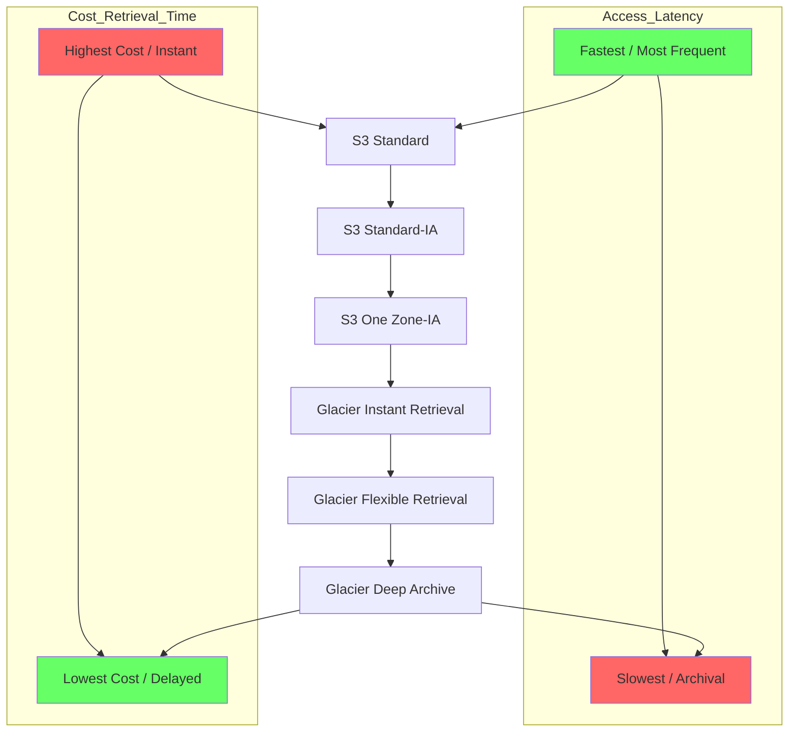

## 🗄️ Amazon S3 Storage Classes: The Hierarchy of Cost and Access

This guide provides an in-depth look at the diverse **Amazon S3 Storage Classes**, which allow you to optimize storage costs based on your data's access patterns and retrieval needs.

-----

### Core S3 Concepts: Durability vs. Availability

Before diving into the classes, it is essential to understand two foundational metrics:

| Concept | Definition | All S3 Classes |
| :--- | :--- | :--- |
| **Durability** | The likelihood of an object being lost. | **Eleven Nines (99.999999999%)**. This means if you store 10 million objects, you expect to lose one object every 10,000 years, on average. **It is the same for ALL S3 storage classes.** |
| **Availability** | How readily accessible the service is. | **Varies by Class.** Measures the uptime of the service (e.g., how often you get errors). |

-----

### 📦 The S3 Storage Class Spectrum

S3 offers a range of classes, moving from the most frequently accessed and available (high cost) to archive/long-term storage (lowest cost).

#### 1\. Standard (Frequent Access)

| Class | Availability | Use Case | Key Feature |
| :--- | :--- | :--- | :--- |
| **S3 Standard** (General Purpose) | 99.99% | Frequently accessed data, Big Data Analytics, Mobile/Gaming apps, Content Distribution. | Default, low latency, high throughput, can sustain **two** concurrent facility failures. |

#### 2\. Infrequent Access (IA)

These classes are for data that is accessed less often, but still requires rapid retrieval when needed. **Retrieval costs apply.**

| Class | Availability | Multi-AZ? | Use Case |
| :--- | :--- | :--- | :--- |
| **S3 Standard-IA** (Infrequent Access) | 99.9% | Yes (Multi-AZ) | Disaster Recovery, Backups. Low cost storage, but you pay a retrieval fee. |
| **S3 One Zone-IA** (One Zone-Infrequent Access) | 99.5% | No (Single-AZ) | Storing secondary copies of backups, or data that can be easily recreated. **Data is lost if the single AZ is destroyed.** |

#### 3\. Glacier (Archival)

These classes are designed for archiving and backups, offering the lowest storage costs but requiring payment for both storage and retrieval.

| Class | Minimum Duration | Retrieval Time | Use Case |
| :--- | :--- | :--- | :--- |
| **Glacier Instant Retrieval** | 90 days | **Milliseconds** | Data accessed once a quarter (e.g., medical images, news media) but needs instant access. |
| **Glacier Flexible Retrieval** | 90 days | **Expedited** (1-5 min), **Standard** (3-5 hours), **Bulk** (5-12 hours - free) | Long-term backups where some retrieval waiting time is acceptable. (Formerly just S3 Glacier). |
| **Glacier Deep Archive** | 180 days | **Standard** (12 hours), **Bulk** (48 hours) | Longest term, lowest cost storage for highly regulated archives (e.g., financial records). |

-----

### 🧠 S3 Intelligent-Tiering

This class is designed to automate cost savings by monitoring access patterns and moving objects between tiers automatically, incurring only a small monthly monitoring fee.

  * **No Retrieval Charges** in Intelligent-Tiering.

| Tier Name | Access Pattern | Movement Trigger |
| :--- | :--- | :--- |
| **Frequent Access Tier** | Default, for objects being accessed. | Automatic. |
| **Infrequent Access Tier** | Objects not accessed for **30 days**. | Automatic. |
| **Archive Instant Access Tier** | Objects not accessed for **90 days**. | Automatic. |
| **Archive Access Tier** | Objects not accessed for **90+ days**. | **Optional**. Requires configuration (e.g., 90 to 700+ days). |
| **Deep Archive Access Tier** | Objects not accessed for **180+ days**. | **Optional**. Requires configuration (e.g., 180 to 700+ days). |

-----

### 🚀 Automation: Lifecycle Configuration

You don't have to manually change an object's storage class.

  * **S3 Lifecycle Configurations** can be set on a bucket to automatically transition objects between storage classes (e.g., from Standard to Standard-IA after 30 days) or even permanently delete them after a certain period. This is the best way to manage costs at scale.

-----

### 🏗️ Conceptual Diagram: Cost vs. Access (Mermaid)

This diagram illustrates the trade-off inherent in choosing an S3 Storage Class.

-----

### 💡 Missing Concept: Standard-IA Minimum Billable Size 📏

While the transcript covers the minimum duration for Glacier, a critical cost detail for the Infrequent Access classes is missing:

  * **S3 Standard-IA and S3 One Zone-IA have a minimum billable object size of 128 KB.**
      * This means if you store a 5 KB file in S3 Standard-IA, you will be billed for 128 KB of storage.
      * **S3 Standard does NOT have this limitation.**

This constraint is vital when choosing a storage class, especially when dealing with millions of small files (like logs or thumbnails), as using an IA class for them could unintentionally lead to higher costs than using S3 Standard.