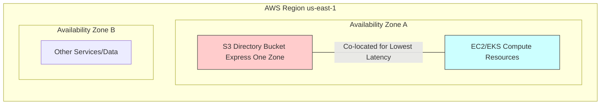

## ⚡️ S3 Express One Zone: High-Performance, Single-AZ Storage

The **Amazon S3 Express One Zone** storage class represents a specialized, high-performance option for latency-sensitive and data-intensive workloads. It fundamentally alters the standard S3 architecture to deliver faster access speeds and higher request rates.

-----

### Key Architectural Differences

Unlike most S3 classes, which distribute data across a minimum of three Availability Zones (AZs) for high resilience, S3 Express One Zone is designed for a **single AZ**.

| Feature | S3 Standard | S3 Express One Zone |
| :--- | :--- | :--- |
| **Bucket Type** | Standard S3 Bucket (General Purpose) | **Directory Bucket** (A special S3 bucket type) |
| **Availability Zone (AZ) Scope** | Multi-AZ (Minimum 3) | **Single-AZ** (You choose the specific AZ) |
| **Performance** | High Throughput | **10x Faster** (Approx.) |
| **Latency** | Milliseconds (Variable) | **Consistent Single-Digit Millisecond** |
| **Request Rate** | High, but scaled | **Hundreds of thousands of requests per second** |
| **Cost** | Baseline | Up to **50% Lower** request costs (but higher storage cost per GB) |

### The Power of Co-location

The primary benefit of the single-AZ design is the ability to **co-locate your storage and compute resources** (e.g., EC2, EKS) in the same Availability Zone.

  * **Reduced Latency:** By eliminating network hops between AZs, you achieve the lowest possible latency for your applications.
  * **Reduced Networking Cost:** Storing and accessing data within the same AZ can also help reduce inter-AZ networking costs.

### 🎯 Ideal Use Cases

The trade-off of lower availability (due to being in a single AZ) is accepted in exchange for performance, making this class ideal for:

  * **AI and ML Training:** Accelerating model training by rapidly accessing massive datasets.
  * **Data Intensive Applications:** Handling big data analytics, where faster data access accelerates query times (e.g., with **Athena** or **EMR**).
  * **Financial Modeling:** Running time-sensitive calculations (High Performance Computing - HPC).
  * **Media Processing:** Video rendering, transcoding, and content processing.
  * **Integration:** It is best integrated with key AWS services like **SageMaker Model Training**, **Athena**, **EMR**, and **Glue**.

-----

### ⚠️ Availability and Durability

While **Durability** (the likelihood of data loss due to corruption or disk failure) remains the high **Eleven Nines (99.999999999%)** within the single AZ, the **Availability** (the service uptime) is necessarily lower than Multi-AZ classes like S3 Standard (99.95% availability SLA, according to search results).

  * **Risk:** If the chosen single Availability Zone experiences a major failure, your application will be directly affected.

-----

### 🏗️ Conceptual Diagram: Single AZ Co-location (Mermaid)

-----

### 💡 Missing Concept: Session-Based Authentication 🔑

A crucial technical detail that enables the ultra-low latency of S3 Express One Zone is its unique authentication model:

  * **Session-Based Authorization:** Unlike traditional S3, where every request goes through IAM for authentication, S3 Express One Zone utilizes a **session-based authentication model**. Applications use a `CreateSession` API call to obtain a temporary, short-lived token. Subsequent requests using this token bypass the full IAM path, which significantly **reduces the time overhead (latency) per request**, contributing directly to the single-digit millisecond performance. This functionality is generally handled automatically by the newest AWS SDKs.