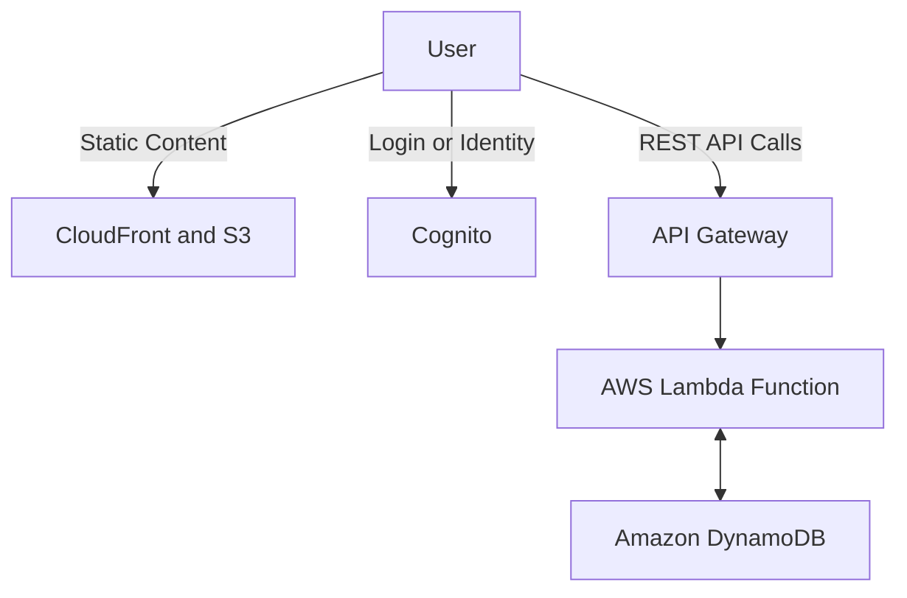

## 💡 What is Serverless? A Foundational Guide

This guide introduces the concept of **Serverless** computing on AWS, outlining its core meaning, benefits, and the key services that fit into this paradigm.

-----

## 🎯 Core Concept: Serverless Defined

The term "Serverless" is often misunderstood. It **does not mean there are no servers**, but rather that developers and users are completely **abstracted** from managing them.

  * **Serverless = No Server Management:** When using a serverless service, you do not have to provision, maintain, patch, or scale the underlying servers or infrastructure. AWS handles all of that.
  * **Original Meaning (FaaS):** Initially, serverless was synonymous with **Function as a Service (FaaS)**, pioneered by **AWS Lambda**, where you deployed only functions (code).
  * **Modern Meaning (Managed Services):** Today, "serverless" applies to any service that automatically scales and eliminates server management, including:
      * **Compute** (e.g., Lambda, Fargate)
      * **Databases** (e.g., DynamoDB, Aurora Serverless)
      * **Messaging** (e.g., SQS, SNS)
      * **Storage** (e.g., S3)

-----

## ☁️ The AWS Serverless Ecosystem

The following services are considered serverless because they scale on demand and require no server provisioning from the user:

| Category | Serverless AWS Services | Reason |
| :--- | :--- | :--- |
| **Compute** | **AWS Lambda, AWS Fargate** | You deploy code/containers; AWS manages runtime environment and scaling. |
| **Storage** | **Amazon S3** | You manage objects; AWS handles the storage infrastructure. |
| **Database** | **Amazon DynamoDB, Aurora Serverless** | No servers to provision; automatically scales capacity for performance. |
| **Messaging** | **Amazon SNS, Amazon SQS** | Scales automatically to handle hundreds of thousands of messages; pay-per-use. |
| **Integration** | **API Gateway, Step Functions** | Fully managed services for building and orchestrating application workflows. |
| **Data Streaming** | **Kinesis Data Firehose** | Scales based on throughput; you pay for what you use without provisioning stream servers. |
| **Identity** | **Amazon Cognito** | Fully managed service for user authentication and authorization. |

-----

## 🧩 Reference Serverless Architecture

A common serverless reference architecture combines these components to build highly scalable, cost-effective web applications and APIs.

### **Benefits for Developers**

By using serverless services, developers can focus entirely on writing application logic, leading to:

  * **Faster Time to Market:** Less time spent on configuration.
  * **Automatic Scaling:** Handles traffic spikes without manual intervention.
  * **Cost Efficiency:** You only pay for the exact compute time, requests, or storage consumed (pay-per-use).