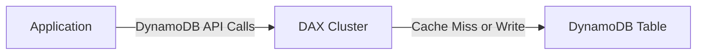
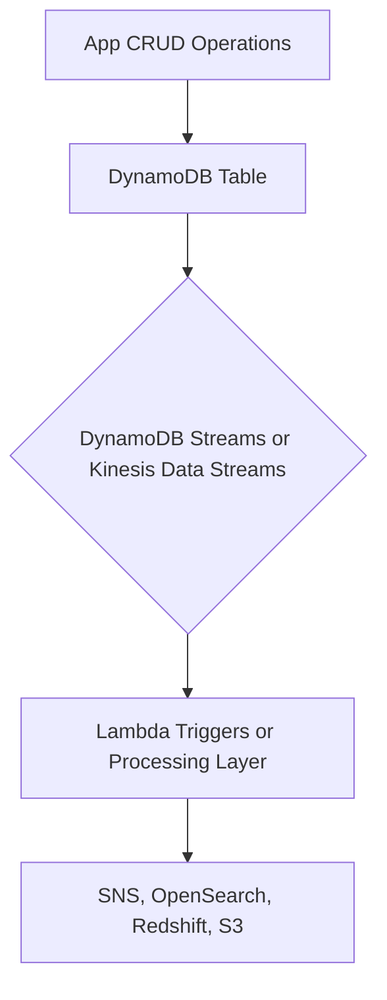

## 🔧 Advanced Amazon DynamoDB Features (Learning Guide)

This guide covers advanced features and architectural patterns for **Amazon DynamoDB** that are frequently tested in AWS exams, including caching, stream processing, global replication, and backup strategies.

-----

## 1\. DynamoDB Accelerator (DAX) 🚀

**DAX** is AWS's purpose-built caching solution for DynamoDB, designed to solve read congestion and provide extremely low latency access.

  * **Function:** A **fully managed, highly available, in-memory cache** that sits directly in front of your DynamoDB table.
  * **Latency:** Provides **microseconds latency** for cached data.
  * **Seamless Integration:** It is **API compatible** with existing DynamoDB API calls, meaning you **do not need to change your application logic** to benefit from the cache—just point your application to the DAX cluster endpoint instead of the DynamoDB endpoint.
  * **Use Cases:** Ideal for caching **individual object reads** and results from **query and scan queries**.
  * **TTL:** The cache has a default **Time To Live (TTL) of five minutes** (configurable).
  * **DAX vs. ElastiCache:**
      * **DAX:** Caches specific DynamoDB query results and individual items (read-through/write-through).
      * **ElastiCache:** More flexible, often used to store **aggregation results** or complex computation output *on top of* DynamoDB data. They are complementary.

<!-- end list -->

-----

## 2\. Stream Processing (Reacting to Data Changes) 🌊

DynamoDB can capture changes (Create, Update, Delete) to your data in near real-time, allowing applications to react to these **data modifications**.

### **A. DynamoDB Streams**

  * **Purpose:** Captures time-ordered sequence of item-level modifications.
  * **Retention:** **24 hours**.
  * **Consumers:** Limited number of consumers, commonly used with:
      * **Lambda Triggers:** The primary use case for reacting to table changes in real-time (e.g., sending a welcome email on a new user record).
      * **DynamoDB Streams Kinesis Adapter (KCL Adapter):** Allows non-Lambda applications (e.g., on EC2) to process the stream.

### **B. Kinesis Data Streams (Optional)**

  * **Purpose:** Alternative where table changes are routed to Kinesis Data Streams for higher capacity.
  * **Retention:** Up to **one year**.
  * **Consumers:** Supports a much **higher number of consumers** and various processing tools (Kinesis Data Analytics, Kinesis Data Firehose, Glue Streaming ETLs).

**Stream Processing Architecture:**

-----

## 3\. Global Tables (Multi-Region Replication) 🌎

**Global Tables** provide a fully managed solution for deploying multi-region, multi-master databases with DynamoDB.

  * **Mechanism:** Replicates a DynamoDB table across multiple specified regions (**Active-Active** replication).
  * **Benefit:** Enables **low-latency access** for applications globally, as they can read and write to the closest regional replica.
  * **Pre-Requisite:** You **must enable DynamoDB Streams** on the tables, as the stream is the underlying mechanism used for cross-region data replication.

-----

## 4\. Time To Live (TTL) ⏳

**TTL** is a mechanism to automatically manage data retention by deleting items after a specified expiration time.

  * **Mechanism:** You define one attribute on your table (e.g., `ExpTime`) as the TTL column, which holds a **timestamp** value. DynamoDB automatically expires and eventually deletes the item when the current time exceeds this timestamp.
  * **Use Cases (Exam Keywords):**
      * **Web Session Handling:** Storing user session data that should automatically expire (e.g., after 2 hours).
      * **Data Retention/Auditing:** Adhering to regulatory obligations by deleting old data after a defined period (e.g., 2 years).
      * **Maintaining Current Data:** Keeping only the most relevant, recent items.

-----

## 5\. Backups and Disaster Recovery 🛡️

DynamoDB offers robust backup options without impacting performance or latency:

  * **Point-in-Time Recovery (PITR):**
      * **Continuous Backups** enabled optionally.
      * Retained for the last **35 days**.
      * Allows recovery to **any single second** within the backup window.
  * **On-Demand Backups:**
      * Retained until you **explicitly delete them**.
      * Used for **long-term backups**.
  * **Recovery:** Performing a recovery from any backup (PITR or On-Demand) always **creates a new DynamoDB table**.
  * **AWS Backup Service:** Can be used to manage backup policies, retention, and **copy backups across regions** for disaster recovery.

-----

## 6\. S3 Integration (Export/Import) 📦

DynamoDB can seamlessly exchange data with Amazon S3 for analytics, auditing, and bulk loading.

  * **Export to S3:**
      * Requires **PITR to be enabled**.
      * You can export data from any point in time during the last **35 days**.
      * **Does not affect read capacity or performance.**
      * **Use Case:** Performing data analysis on DynamoDB data using services like **Amazon Athena** (which queries S3).
  * **Import from S3:**
      * Allows bulk data loading from S3 (CSV, JSON, ION format) into a **new DynamoDB table**.
      * **Does not consume any write capacity** from the target table.
