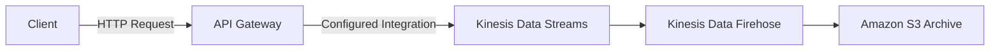

## 🚪 Amazon API Gateway: The Serverless Front Door (Learning Guide)

This guide summarizes the features, integrations, deployment models, and security options for **Amazon API Gateway**, the fully managed service for creating, publishing, maintaining, monitoring, and securing REST, HTTP, and WebSocket APIs.

-----

## 1\. Core Purpose and Benefits 💡

API Gateway acts as the intermediary between clients and your backend services, providing a **full serverless API stack** without managing any servers.

  * **Function:** It is a **REST API builder** that handles traffic management, authorization, access control, monitoring, and API version management.
  * **Architectural Role:** Replaces the need for clients to directly call Lambda functions or backends, offering a feature-rich layer instead of simple HTTP exposure via an Application Load Balancer (ALB).
  * **Key Features:**
      * **Authentication & Authorization:** Multiple options, including IAM, Cognito, and custom Lambda functions.
      * **Throttling/Rate Limiting:** Protects your backend from being overwhelmed by setting usage plans and API keys.
      * **Caching:** Caches API responses to reduce latency and load on the backend.
      * **Versioning & Stages:** Handles API versions (v1, v2) and deployment environments (dev, test, prod).
      * **Request/Response Validation & Transformation:** Ensures data integrity before reaching the backend.
      * **OpenAPI Support:** Easy import/export using Swagger or OpenAPI 3.0 specifications.

-----

## 2\. Backend Integrations 🔗

API Gateway can proxy requests to three main types of backend services:

| Integration Type | Description | Use Case |
| :--- | :--- | :--- |
| **Lambda Function** | The most common serverless pattern. API Gateway triggers the function. | Full **serverless application** backend (Compute + API). |
| **HTTP Endpoint** | Proxies to any HTTP endpoint (e.g., an ALB, an on-premises API). | Used to **add security, caching, and rate limiting** on top of existing external APIs. |
| **AWS Service** | Directly invokes AWS service actions (e.g., Kinesis, SQS, Step Functions). | Exposes internal AWS services publicly while providing a **secure layer** for authentication and rate control (without exposing AWS credentials). |

### **Example: Exposing Kinesis Securely**

Clients can send secure HTTP requests to the API Gateway, which is configured to forward the messages as records to **Kinesis Data Streams**, eliminating the need for clients to have AWS credentials.

-----

## 3\. Deployment (Endpoint) Types 🌍

API Gateway offers three different endpoint types that control accessibility and latency optimization:

| Endpoint Type | Access Level | Optimization | Best Used For |
| :--- | :--- | :--- | :--- |
| **Edge-Optimized (Default)** | Public | Routes requests through **CloudFront Edge Locations** for global client low-latency access. | **Global clients** accessing the API from around the world. |
| **Regional** | Public | API is deployed only to the region where it was created. | Clients expected to be **within the same AWS region**. Can be manually integrated with your own custom CloudFront distribution for more control. |
| **Private** | Private | Accessible **ONLY from within your VPC** using **Interface VPC Endpoints (ENIs)**. | Internal APIs, microservices, or APIs accessed from on-premises over VPN/Direct Connect. |

-----

## 4\. Security and Authorization 🔒

API Gateway provides multiple ways to control who can access your API:

  * **IAM Roles:** Used for **internal applications** (e.g., an EC2 instance with an IAM Role) to access the API.
  * **Amazon Cognito User Pools:** Ideal for **mobile and web applications** to manage external user sign-up, sign-in, and authorization.
  * **Custom Authorizers (Lambda Functions):** Allows you to write **custom logic** (in a Lambda function) to handle token-based authentication (like validating JWTs from a non-Cognito provider).
  * **Custom Domains (HTTPS):** Integrates with **AWS Certificate Manager (ACM)** to provide HTTPS security via your own domain name.
      * **Edge-Optimized:** Requires the ACM certificate to be in the **US East (N. Virginia) region (us-east-1)**.
      * **Regional:** Certificate can be in the **same region** as the API Gateway stage.

-----

## 5\. Missing Concept: API Gateway Types

The transcript covers the older **REST API** model (and its WebSocket support) but implies the newer, simpler **HTTP API** is also part of the offering.

  * **REST API:** The full-featured, original API Gateway offering. Supports caching, usage plans, and custom authorizers.
  * **HTTP API:** A newer, lower-latency, and cheaper option for creating HTTP endpoints. It supports basic security (Cognito, Lambda Authorizers) but lacks some of the deep features like API keys and the built-in caching engine of the REST API.