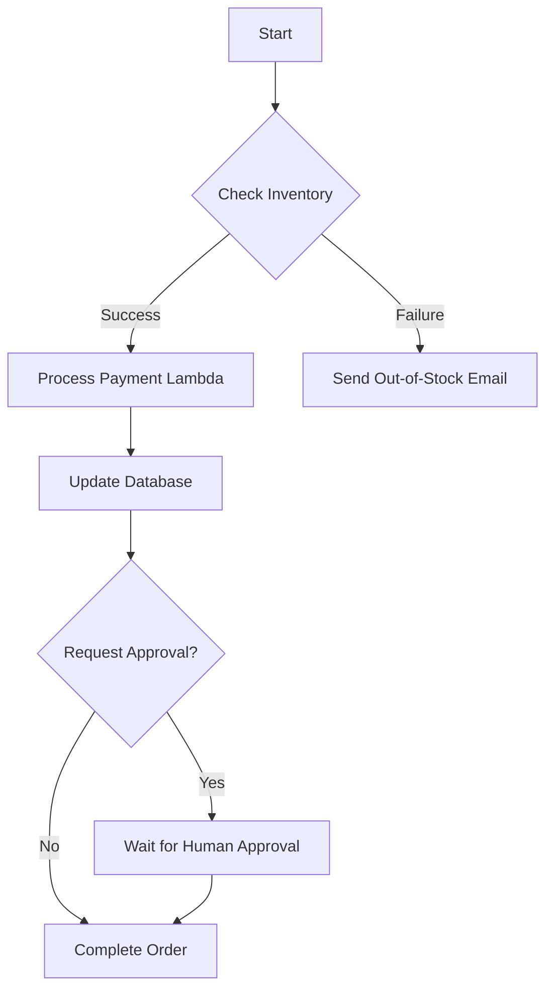

## 🧩 AWS Step Functions: Orchestrating Serverless Workflows (Learning Guide)

This guide introduces **AWS Step Functions**, a serverless service that allows you to visually design, coordinate, and execute complex workflows and business processes.

-----

## 1\. Core Concept: Serverless Visual Workflow 🎨

Step Functions enables you to define a sequence of steps, called a **state machine**, to choreograph multiple AWS services into complex, scalable applications.

  * **Function:** It builds a **serverless visual workflow** (an orchestration graph) where you define the logic and flow of your application steps.
  * **Key Features (Internal Flow Control):**
      * **Sequencing:** Running steps one after the other.
      * **Parallel Functions:** Running multiple steps concurrently.
      * **Conditions/Branching:** Implementing decision logic (If/Else).
      * **Timeouts:** Ensuring steps don't run indefinitely.
      * **Error Handling:** Defining actions to take upon success or failure of a step.
      * **Human Approval:** A unique feature allowing the workflow to pause and wait for a human user to approve or reject the next step.
  * **Use Cases:**
      * Order Fulfillment (e.g., checking inventory, processing payment, confirming shipment).
      * Complex Data Processing and ETL pipelines.
      * Coordinating multiple microservices in a web application.

-----

## 2\. Integration: The Orchestration Hub 🔄

While Step Functions is commonly used with **AWS Lambda** (to stitch together short-lived functions), its true power lies in its ability to integrate with a vast range of AWS services and external resources.

  * **Key Integrations:**
      * **Compute:** Lambda Functions, Amazon ECS Tasks, Amazon EC2 instances.
      * **Messaging:** Amazon SQS queues, Amazon SNS (Simple Notification Service).
      * **APIs/Gateways:** Amazon API Gateway.
      * **Databases:** Amazon DynamoDB.
      * **External/Legacy Systems:** On-premises servers.
      * **Other AWS Services:** Integrates with many other AWS services to start jobs, monitor status, and pass data.

### **Visualizing a State Machine**

-----

## 3\. Missing Concept: Workflow Types

The transcript provides a good general overview, but for completeness, Step Functions offers two distinct types of workflows, each optimized for different use cases:

| Workflow Type | Execution | Max Duration | Use Case |
| :--- | :--- | :--- | :--- |
| **Standard** | **"At least once"** execution (designed for long-running, non-time-critical jobs). | **One year** | Human approval processes, large data migrations, complex batch jobs. |
| **Express** | **"At most once"** execution (designed for high-volume, low-latency jobs). | **Five minutes** | High-speed, high-rate workloads like streaming data processing or short-lived microservice orchestration. |

Understanding these two types helps you choose the right tool for the job based on speed and duration requirements.