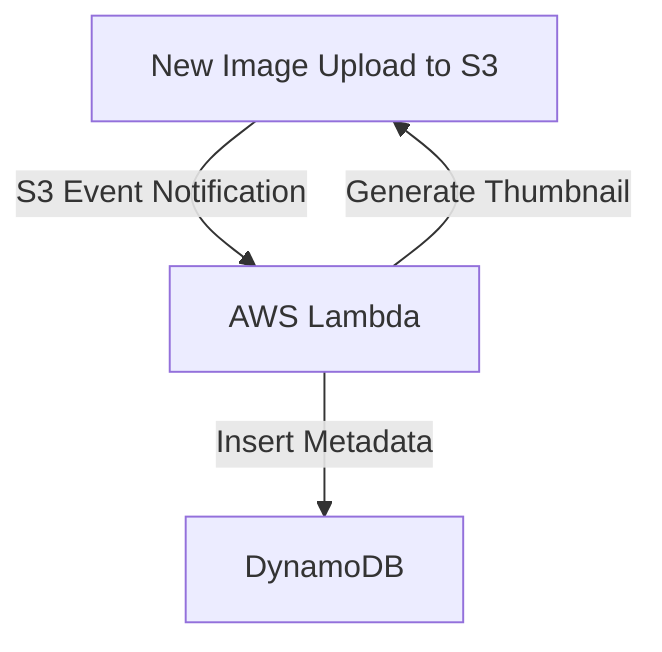
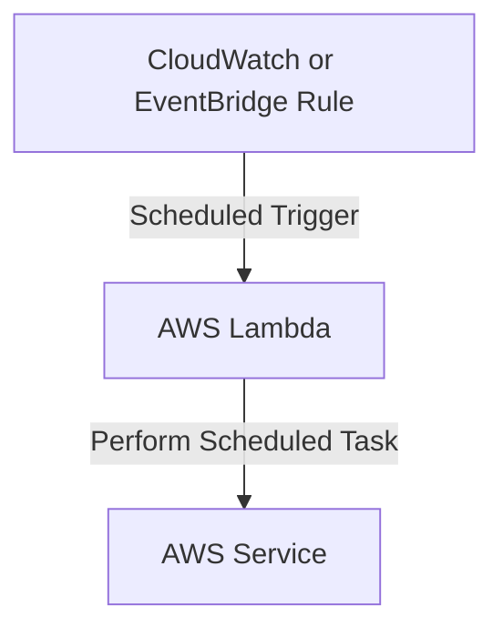

## ⚙️ AWS Lambda: The Serverless Compute Engine (Learning Guide)

This guide provides a comprehensive overview of **AWS Lambda**, the pioneering service for **Function as a Service (FaaS)**, highlighting its operational model, benefits, and key architectural use cases.

-----

## 🎯 Lambda vs. EC2: A Paradigm Shift

AWS Lambda represents a major shift from the traditional server model (like EC2) by abstracting away server management.

| Feature | Amazon EC2 (Virtual Servers) | AWS Lambda (Virtual Functions) |
| :--- | :--- | :--- |
| **Server Management** | You must **provision and maintain** the server. | **No servers to manage** (fully managed by AWS). |
| **Execution Model** | **Continuously Running** (even when idle). | **Runs On Demand** when invoked (event-driven). |
| **Billing Model** | Pay for instance time **running** (per hour/second). | Pay per **request/invocation** and **compute time** (per millisecond). |
| **Scaling** | Manual or automated via **Auto Scaling Groups** (requires configuration). | **Automated scaling** (AWS handles concurrency provisioning). |
| **Execution Limit** | None. | **Short Execution:** Up to **15 minutes** (maximum timeout). |

-----

## 💰 Lambda Pricing and Free Tier

Lambda's pricing model is highly cost-effective as you only pay when your code is executing.

  * **Requests (Invocations):**
      * **Free Tier:** First **1 million requests** per month are free.
      * Subsequent requests are very cheap (e.g., $0.20 per additional million).
  * **Compute Time (Duration):** Measured in **millisecond increments**.
      * **Free Tier:** **400,000 Gigabyte-Seconds** of compute time per month.
      * **Gigabyte-Seconds:** This unit combines the duration of execution with the allocated memory (RAM).
        > **Example:** 400,000 Gigabyte-Seconds means you get 400,000 seconds of execution time if the function has 1 GB of RAM.

-----

## 🛠️ Configuration and Runtime

### **Performance Tuning**

  * **Memory Provisioning:** You can allocate up to **10 GB of RAM** per function.
  * **The RAM/CPU Link:** **Increasing the RAM allocated to your function also proportionally increases the allocated CPU and network performance.** This is a critical factor for performance tuning in Lambda.

### **Supported Runtimes**

Lambda supports many popular languages natively, as well as custom environments:

  * **Native:** Node.js, Python, Java, C\#, Ruby, PowerShell.
  * **Custom:** Supports other languages (like Rust or Golang) via the **Custom Runtime API**.
  * **Containers:** Supports custom **container images** (which must implement the Lambda Runtime API). However, for general Docker image execution, **ECS or Fargate** is usually the preferred and simpler choice for the exam.

-----

## 🔗 Key Lambda Integration Use Cases

Lambda's power comes from its seamless integration with nearly all AWS services, making it the glue for serverless architectures.

| AWS Service | Use Case / Integration Type |
| :--- | :--- |
| **API Gateway** | Creates **REST APIs** that invoke Lambda functions for backend logic. |
| **Amazon S3** | **Event-Driven Processing** (e.g., trigger Lambda when a file is uploaded). |
| **DynamoDB** | **Database Triggers** (e.g., Lambda is triggered when a record is inserted/updated). |
| **SQS / SNS** | Processes messages from **SQS queues** or reacts to **SNS topic notifications**. |
| **CloudWatch Events / EventBridge** | **Automation and Scheduling** (e.g., run code based on time schedules or infrastructure state changes). |
| **CloudFront (Lambda@Edge)** | Run Lambda functions **globally at Edge locations** for request modification or customization (separate lecture concept). |
| **Cognito** | Reacts to user lifecycle events (e.g., a user signing up or logging in). |

-----

## 🎨 Serverless Architecture Examples

### **1. Serverless Thumbnail Creation (Event-Driven)**

This creates a reactive architecture where code only runs when needed.

  * **Flow:** New Image Upload in **S3** $\rightarrow$ Triggers **Lambda Function** $\rightarrow$ Lambda generates a thumbnail $\rightarrow$ Uploads thumbnail back to **S3** and inserts metadata into **DynamoDB**.

<!-- end list -->

### **2. Serverless CRON Job (Scheduled)**

This replaces traditional CRON jobs running on always-on EC2 instances with a cost-effective, serverless scheduler.

  * **Flow:** **CloudWatch Event Rule** (or EventBridge Rule) with a schedule (e.g., every 1 hour) $\rightarrow$ Invokes **Lambda Function** $\rightarrow$ Lambda performs the scheduled task.

<!-- end list -->

The serverless nature of both **CloudWatch Events/EventBridge** and **Lambda** means you only pay for the time the function runs, avoiding wasted instance time.