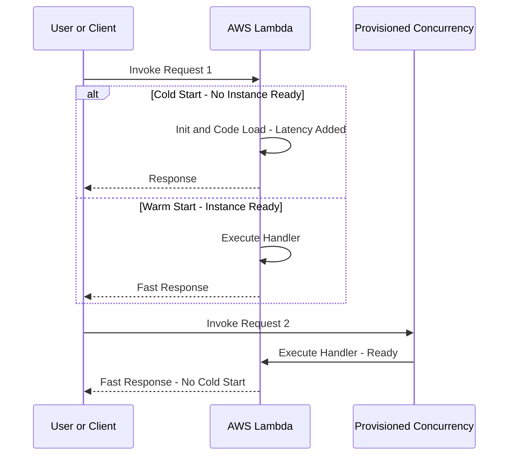

## ⚡ AWS Lambda Concurrency, Throttling, and Cold Starts (Learning Guide)

This guide covers the crucial concepts of how AWS Lambda manages scale, prevents overload, and minimizes latency through concurrency controls and provisioning.

-----

## 1\. Concurrency and Throttling 🚦

**Concurrency** is the number of Lambda function instances running at any given time. By default, Lambda can scale very quickly.

### **Account-Level Concurrency Limit**

  * The default total maximum concurrency across **all functions** in an AWS account (per region) is **1,000**. This is a **soft limit** and can be increased by requesting a limit increase via a support ticket.
  * **Crucial Rule:** If one high-traffic function consumes all available concurrency (up to 1,000), **all other functions in the same account/region will be throttled.**

### **Reserved Concurrency (Guardrail)**

  * **Mechanism:** Setting a specific **limit** on the number of concurrent executions a specific function can run (e.g., reserving 50 slots). This is set at the **function level**.
  * **Benefit 1 (Guardrail):** Prevents a runaway function from bankrupting your account or hogging all regional concurrency.
  * **Benefit 2 (Guarantee):** **Guarantees** that specific function will always have that many slots available, protecting it from being throttled by other functions.

### **Throttling Behavior**

When an invocation exceeds the available concurrency, it is **throttled** (returns a 429 error). The subsequent behavior depends on the invocation type:

| Invocation Type | Throttled Response | Retry Behavior |
| :--- | :--- | :--- |
| **Synchronous** (e.g., API Gateway, ALB, CLI/SDK) | **Returns a `429 Throttle Error`** immediately to the client. | **No automatic retry** by Lambda. The client must handle the retry. |
| **Asynchronous** (e.g., S3 Events, SNS, EventBridge) | **Returns the event to the internal event queue.** | **Automatic Retry** for up to **6 hours** with an **exponential backoff** strategy (retry interval increases over time, up to 5 minutes). Failed events eventually go to a **Dead Letter Queue (DLQ)** if configured. |

-----

## 2\. Cold Starts and Provisioned Concurrency ⏱️

### **Cold Starts**

A **cold start** occurs when a Lambda function is invoked, but a running instance is not available. AWS must perform **initialization** work:

1.  Create a new container instance.
2.  Load the function code.
3.  Execute the code outside the handler (the initialization phase, which includes connecting to databases, loading large dependencies, etc.).

<!-- end list -->

  * **Impact:** This initial process adds **latency** to the first request served by the new instance, which can negatively impact user experience.

### **Provisioned Concurrency (Latency Killer)**

  * **Mechanism:** You **allocate concurrency in advance** to keep a specified number of function instances initialized and ready to serve requests immediately.
  * **Benefit:** **Eliminates cold starts** for all invocations served by the provisioned instances, resulting in consistently low latency.
  * **Management:** You can use **Application Auto Scaling** (Scheduled or Target Tracking policies) to automatically adjust the number of provisioned concurrency instances based on predictable or observed traffic patterns.

> **Note on VPC Cold Starts:** AWS has significantly optimized the networking setup for Lambda functions running inside a VPC, dramatically reducing the cold start latency that was previously associated with VPC access.

