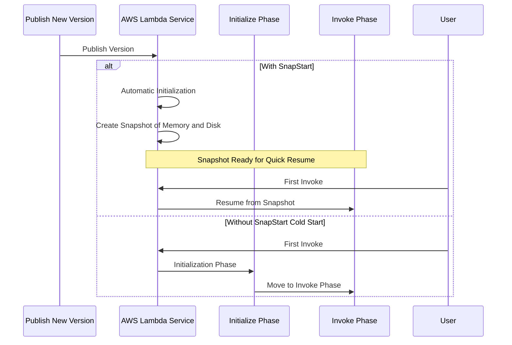

## 🚀 AWS Lambda SnapStart: Performance Boost Explained

This guide explains **AWS Lambda SnapStart**, a performance feature that dramatically reduces the latency caused by cold starts, particularly for runtimes that have longer initialization times.

-----

## 💡 What is Lambda SnapStart?

**SnapStart** is a feature that significantly improves the **startup performance** (reduces cold start latency) of your Lambda functions by pre-initializing the function's environment.

  * **Impact:** Can improve function performance up to **10x** at **no extra cost**.
  * **Supported Runtimes:** Primarily targets languages with significant initialization overhead: **Java**, **Python**, and **.NET**.
  * **Mechanism:** When you publish a new function version, Lambda proactively initializes the function's code and runtime environment and then takes a **snapshot of the memory and disk state**.

### **The Lifecycle with SnapStart**

SnapStart effectively removes the lengthy `Initialize` phase from the critical execution path.

| Phase | **Without SnapStart** (Standard Cold Start) | **With SnapStart** (Optimized) |
| :--- | :--- | :--- |
| **Initialization** | Takes place **during the first invocation**, adding latency. | Handled **proactively** when the function version is published. |
| **Invocation** | Starts after initialization is complete. | Starts **instantly** by resuming from the pre-created snapshot. |
| **Shutdown** | Same. | Same. |

## ✨ How the Magic Works

The key to SnapStart is the proactive snapshotting:

1.  When you **publish a new version** of a Lambda function, AWS automatically runs the function's initialization code once.
2.  AWS then takes a snapshot of the resulting **memory and file system state**.
3.  When a user invokes the function, AWS simply loads the pre-created snapshot, allowing the function to jump directly into the **Invoke phase**, drastically reducing the latency perceived by the user.

-----

## ❓ Missing Concept: Security and Use Cases

While the performance benefit is clear, a few points round out the understanding of SnapStart:

  * **Security Consideration (Implied):** Because SnapStart resumes from a memory/disk snapshot, **randomness and security keys must be handled carefully**. AWS ensures that standard randomness and cryptographic keys are re-seeded or handled securely upon resuming to maintain security boundaries between snapshots.
  * **Use Cases:** SnapStart is most beneficial for **latency-sensitive APIs and web services** where a cold start, even if rare, can ruin the user experience. Since it targets Java and .NET (languages known for slower JVM/CLR startup), the impact is most pronounced here.