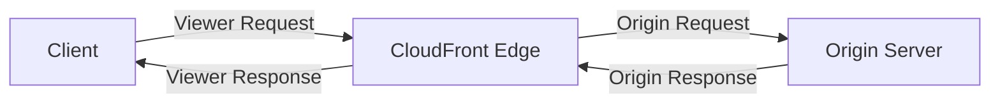

## 🌍 Edge Computing with CloudFront: Functions vs. Lambda@Edge

This guide details **Edge Functions**, which allow you to run code close to your users via **Amazon CloudFront**, focusing on the differences between **CloudFront Functions** and **Lambda@Edge**. Both are fully managed and serverless.

-----

## 1\. Edge Functions Overview and Benefits

Edge Functions are pieces of logic executed by CloudFront at its globally distributed **Edge Locations** before a request reaches your origin server or before a response reaches the client.

  * **Goal:** Execute logic **close to the user** to **minimize latency** and offload work from the origin.
  * **Deployment:** Functions are deployed globally but are authored in a single region (US East (N. Virginia) for Lambda@Edge).
  * **Use Cases (General):**
      * Website security and privacy.
      * A/B testing and intelligent routing.
      * Bot mitigation and user authentication.
      * Real-time image manipulation.

-----

## 2\. CloudFront Request Lifecycle 🔄

To understand where edge functions execute, it's essential to know the four key points in the CloudFront request/response cycle:

1.  **Viewer Request:** The client sends a request to CloudFront.
2.  **Origin Request:** CloudFront forwards the request to the Origin server.
3.  **Origin Response:** The Origin server replies back to CloudFront.
4.  **Viewer Response:** CloudFront sends the final response back to the client.

<!-- end list -->

-----

## 3\. Comparing Edge Functions

| Feature | CloudFront Functions (CF Functions) | Lambda@Edge |
| :--- | :--- | :--- |
| **Primary Goal** | **High-scale, latency-sensitive CDN customization.** | **More complex logic, external service calls, and full request/response manipulation.** |
| **Runtime Language** | **JavaScript only** (lightweight). | **Node.js or Python.** |
| **Execution Time (Limit)** | **\< 1 millisecond** (sub-millisecond startup). | **Up to 5 seconds** (Viewer events); **Up to 30 seconds** (Origin events). |
| **Scale** | **Millions** of requests per second (extremely high). | **Thousands** of requests per second. |
| **Trigger Events** | **Viewer Request** and **Viewer Response** **ONLY.** | **All four events:** Viewer Request, Origin Request, Origin Response, and Viewer Response. |
| **Access** | **No network access** to external services; no file system access. | **Network access** to external services (including AWS SDK); file system access is allowed. |
| **Code Size/Complexity** | Very small, simple functions. | Can use **third-party libraries** and perform complex processing. |

### **CloudFront Functions Use Cases (Simple & Fast)**

Since CF Functions run in less than one millisecond, they are best for simple modifications:

  * **Cache Key Normalization:** Transforming request attributes to create an optimal cache key.
  * **Header Manipulation:** Inserting, modifying, or deleting HTTP headers.
  * **URL Rewrites/Redirects:** Simple routing logic.
  * **Request Authorization:** Creating and validating JWT tokens to allow or deny a request.

### **Lambda@Edge Use Cases (Complex & Integrated)**

Due to longer execution time and network access, Lambda@Edge is used for deeper integrations:

  * **Accessing AWS Services:** Using the AWS SDK (Node.js/Python) to check DynamoDB or Secrets Manager during an Origin Request.
  * **Intelligent Origin Routing:** Deciding which origin server to route the request to based on real-time factors.
  * **Real-time Image Transformation:** Using libraries to resize or modify images before sending them to the viewer.
  * **Custom Authorization:** Complex authentication flows that require external server checks.

-----

## ❓ Missing Concept: Origin Events Execution Time

While the guide mentions the 5 to 10 seconds limit for Lambda@Edge, it's often broken down further:

  * **Viewer Request/Response:** **5 seconds** maximum execution time.
  * **Origin Request/Response:** **30 seconds** maximum execution time.

This distinction is important: functions executing *before* or *after* caching (Viewer events) must be very fast, while functions interacting with a potentially slow origin (Origin events) are given more time.