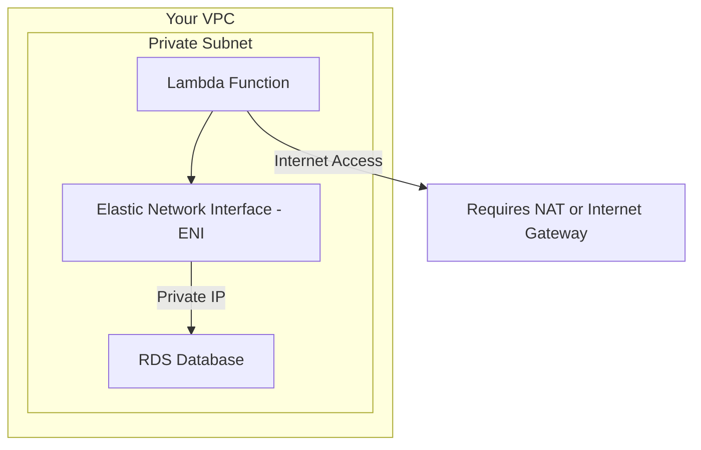
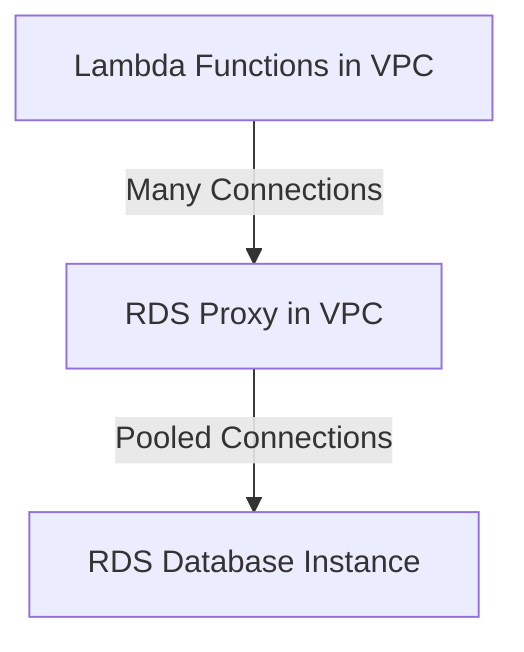

## 🌐 AWS Lambda Networking and VPC Connectivity

This guide covers the crucial networking concepts for AWS Lambda, focusing on when and why you need to connect your functions to your **Amazon Virtual Private Cloud (VPC)**, and how to manage database connections using the **RDS Proxy**.

-----

## 1\. Default Lambda Deployment (Outside the VPC)

By default, when you create a Lambda function, it is launched in an **AWS-owned VPC**, completely separate from your own network.

| Access Type | Status | Example |
| :--- | :--- | :--- |
| **Public Internet** | **Accessible** | Can call external, public APIs (e.g., Google, Twitter). |
| **AWS Public Services** | **Accessible** | Can access services that have a public endpoint (e.g., **DynamoDB**, **S3**, **SNS**). |
| **Private VPC Resources** | **NOT Accessible** | **Cannot** reach your private **RDS database**, **ElastiCache**, or internal load balancers. |

### **The Problem**

If your application needs to talk to a resource (like an RDS database) running within your private VPC subnets, the default Lambda deployment **will not work**.

-----

## 2\. Launching Lambda Inside Your VPC (Private Access)

To connect to private resources, you must configure your Lambda function to run **inside your VPC**.

  * **Configuration:** You must specify the following settings for the function:
    1.  **VPC ID**
    2.  **Subnets** (usually private subnets)
    3.  **Security Group**
  * **Mechanism:** When launched, AWS creates a **Hyperplane Elastic Network Interface (ENI)** in the specified subnets. This ENI gives your Lambda function private network connectivity, allowing it to access any resource within the VPC (e.g., RDS) that the security group allows.

<!-- end list -->

-----

## 3\. Solving Connection Sprawl with RDS Proxy

When using Lambda to access an RDS database, a common problem arises under high load:

  * **The Problem:** Lambda scales rapidly (e.g., 100 simultaneous tasks). Each task opens a new connection to the RDS database. The database may become overwhelmed by too many open connections, leading to **timeouts** and **performance issues**.

### **AWS RDS Proxy (The Connection Pool)**

The **RDS Proxy** is a fully managed, highly available database proxy service that sits between your Lambda functions and your RDS/Aurora database.

  * **Function:** It **pools and shares database connections**, allowing thousands of simultaneous Lambda connections to be consolidated into a few stable, persistent connections to the database instance.
  * **Benefits:**
      * **Scalability:** Improves scalability by **pooling connections** and reducing connection overhead on the database.
      * **Availability:** Improves availability during failovers (for RDS/Aurora) by preserving connections and **reducing failover time by up to 66%**.
      * **Security:** Allows you to enforce **IAM authentication** for database access, with credentials often stored securely in **Secrets Manager**.

### **Architectural Requirement**

  * **Crucial Point:** The **RDS Proxy is never publicly accessible**. Therefore, for your Lambda function to connect to the RDS Proxy, the Lambda function **must be launched inside your VPC**.

<!-- end list -->

-----