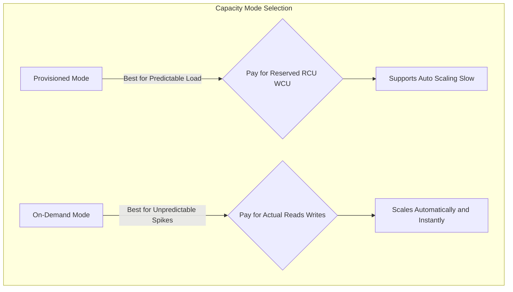

## 📘 Amazon DynamoDB: The NoSQL Powerhouse (Learning Guide)

This guide summarizes the core concepts, architecture, and capacity planning modes of **Amazon DynamoDB**, AWS's fully managed, high-performance NoSQL database.

-----

## 1\. DynamoDB Fundamentals and Architecture 🧱

DynamoDB is a cloud-native database designed for massive scale and consistent, low-latency performance.

  * **Managed & Highly Available:** It is a **fully managed** service, requiring **no maintenance or patching**. Data is automatically replicated across **multiple AZs** for high availability.
  * **Database Type:** It is a **NoSQL database**, meaning it is non-relational and highly flexible, although it still supports transactions.
  * **Scale and Performance:**
      * Designed for **massive workloads** (trillions of rows, petabytes of storage).
      * Provides **single-digit millisecond performance** (fast and consistent) for virtually any scale.
  * **Schema Flexibility:** This is a key difference from relational databases (RDS/Aurora).
      * Data is stored in **Tables** composed of **Items** (rows) which have **Attributes** (columns).
      * The schema is **flexible**: you can add or modify attributes over time without complex, pre-defined requirements. Look for scenarios where the **schema needs to rapidly evolve** as a DynamoDB keyword.
  * **Size Limit:** Maximum item size is **400 KB**. DynamoDB is not suitable for storing very large objects (e.g., files or images—use S3 instead).

### **Table Structure**

  * Every table requires a **Primary Key**, composed of a **Partition Key** and an **optional Sort Key**.
  * **Attributes** can be scalar (String, Number, Boolean), List, Map, or Set.

### **Table Classes**

| Table Class | Use Case | Cost |
| :--- | :--- | :--- |
| **Standard** | For **frequently accessed data** (standard read/write patterns). | Standard read/write/storage costs. |
| **Infrequent Access (IA)** | For data that is **infrequently accessed** (storage optimized). | Lower storage cost, higher cost for reads/writes. |

-----

## 2\. Capacity Planning Modes (RCU and WCU) 📊

You must choose one of two capacity modes when creating a table, determining how you pay for and scale your read and write traffic.

### **A. Provisioned Mode (Default)**

  * **Concept:** You explicitly define the throughput you need in advance by specifying **Read Capacity Units (RCU)** and **Write Capacity Units (WCU)** per second.
  * **Best For:** **Predictable workloads** where traffic changes smoothly.
  * **Billing:** You **pay for the capacity you provisioned**, regardless of actual usage.
  * **Scaling:** Supports **Auto Scaling** to automatically increase or decrease the provisioned RCU/WCU based on load, but scaling is generally **slower** than On-Demand.
  * **Cost:** Excellent for **cost savings** and predictable budgeting.

### **B. On-Demand Mode (Serverless)**

  * **Concept:** DynamoDB manages the capacity entirely; there is **no RCU/WCU** planning. Capacity scales **automatically and instantly** with the workload.
  * **Best For (Exam Keywords):**
      * **Unpredictable workloads** with sudden, steep spikes (e.g., scaling from 1k to 1M transactions in under a minute).
      * **Infrequent workloads** with long periods of inactivity (e.g., a batch job running only a few times a day).
  * **Billing:** You **pay exactly for what you use** (per read and write request).
  * **Cost:** Generally **more expensive** than Provisioned Mode but offers maximum operational simplicity and instant scalability.

<!-- end list -->

