```mermaid
graph TD
    subgraph Data_Migration_Process
        A[Order Snowball Edge Device via AWS Console] --> B[AWS Ships Physical Device to Customer]
        B --> C[Load Data onto Device in Customer Data Center]
        C --> D[Ship Device Back to AWS]
        D --> E[AWS Transfers Data to S3 Bucket]
    end

    subgraph Edge_Computing_Use_Case
        F[Edge Location Truck Ship Mine with Limited Connectivity] --> G[Snowball Edge Compute Optimized]
        G --> H[Run EC2 or Lambda for Data Preprocessing or ML at the Edge]
        H --> I[Send Processed Data Back to AWS or Ship Back]
    end

    subgraph Snowball_Device_Types
        J[AWS Snowball Edge] --> K[Storage Optimized 210 TB - Focus Data Transfer]
        J --> L[Compute Optimized 28 TB - Focus Edge Processing]
    end
```

# ❄️ AWS Snowball: Edge Computing and Petabyte-Scale Data Migration Guide

This guide summarizes the key features, use cases, and device types for **AWS Snowball**, a highly secure and portable device for collecting, processing, and migrating massive amounts of data in and out of the AWS Cloud.

-----

## 🚀 Primary Use Cases

AWS Snowball is primarily designed to overcome challenges associated with transferring or processing data when network conditions are poor, connectivity is limited, or data volume is excessively large.

| Use Case | Description | Key Scenarios |
| :--- | :--- | :--- |
| **Data Migration (Import/Export)** | Securely and rapidly migrating **petabytes** of data to or from AWS without relying on network bandwidth. | Migrating a data center, transferring large archival datasets, or moving massive media libraries. |
| **Edge Computing** | Processing data locally at remote, disconnected, or limited-connectivity locations before sending it to AWS. | Running analytics on a truck on the road, a ship on the sea, or a mining station on the ground. |

-----

## 📦 AWS Snowball Edge Devices

AWS Snowball devices are available in two optimized versions, with the difference primarily in their balance between storage capacity and compute power.

| Device Type | Primary Focus | Typical Storage Capacity (Example) | Core Capability |
| :--- | :--- | :--- | :--- |
| **Edge Storage Optimized** | **High Storage** (Large-scale data transfer) | 210 TB | Optimized for **data migration** jobs with maximal storage capacity. |
| **Edge Compute Optimized** | **High Compute** (Local processing) | 28 TB | Optimized for **edge computing** workloads with higher vCPUs and memory. |

### Edge Computing Capabilities

The Compute Optimized devices, due to their computing power, allow users to run AWS services directly on the device at the edge, such as:

  * **Amazon EC2 instances:** Running virtual machines for custom applications.
  * **AWS Lambda functions:** Executing event-driven, serverless code for data processing.

This local processing enables **pre-processing** the data, running **machine learning** inference, or performing **media transcoding** before the data is sent back to the cloud.

-----

## 🔁 Data Migration Workflow (Snowball Import)

The Snowball process bypasses the slow and expensive nature of transferring large data sets over limited network bandwidth.

> 💡 **Network Bottleneck Example:** Transferring $100$ terabytes of data over a $1 \text{ Gbps}$ connection would take approximately **12 days**. The recommendation is to use Snowball if network transfer is expected to take **over a week**.

The core steps for a data migration into AWS (Import Job) are:

1.  **Order Device:** Request the appropriate Snowball Edge device (Storage or Compute Optimized) via the AWS console.
2.  **Receive Device:** AWS ships the **physical, rugged device** to your infrastructure.
3.  **Load Data:** Connect the device to your local network and securely transfer the required data onto the physical machine.
4.  **Ship Back:** Return the device to AWS.
5.  **AWS Import:** AWS takes the data from the Snowball and loads it into your designated Amazon S3 bucket.

-----

## 🔒 Security and Portability

Snowball devices are designed to be **highly secure** and **tamper-resistant** for data-in-transit. They feature:

  * **256-bit encryption** for all data.
  * **Tamper-resistant enclosures** and continuous monitoring.
  * A process of **software erasure** upon completion of the job at AWS, adhering to NIST guidelines.
  * **Physical portability** with a rugged design, making them suitable for use in harsh or remote environments.

-----

## 📐 Conceptual Diagram (Mermaid)

-----

## 📌 Missing Concept (Security)

While the transcript mentions that the device is **highly secure**, it could be helpful to explicitly add that the data transferred to Snowball is **encrypted** (using 256-bit encryption and AWS KMS), which is a critical security feature for a physical transfer service. This has been added to the Security and Portability section.