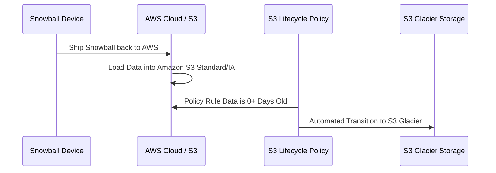

## 🧊 AWS Snowball & Amazon Glacier Data Import Strategy

This guide focuses on a specific but common exam scenario regarding data import from **AWS Snowball** to **Amazon S3 Glacier**. It highlights a critical limitation of the Snowball service and the required workaround using S3 lifecycle policies.

-----

## 🚫 The Snowball-to-Glacier Direct Import Limitation

A common point of confusion is how to get large, archival datasets transferred via Snowball into the highly cost-effective **Amazon S3 Glacier** storage class.

| Service | Limitation |
| :--- | :--- |
| **AWS Snowball** | **Cannot** import data directly into **Amazon S3 Glacier** or **S3 Glacier Deep Archive**. |
| **Why?** | Snowball's import process is designed to load data into a standard S3 bucket where S3's advanced features, like Lifecycle Policies, can then manage its tiering. |

-----

## 🛠️ The Required Workaround: S3 Lifecycle Policy

To successfully move data imported via Snowball into Glacier, you must use an intermediary step with **Amazon S3** and its **Lifecycle Policy** feature.

### 1\. The 3-Step Solution

1.  **Snowball Imports to S3:** The Snowball device is returned to AWS and the data is loaded into a **standard Amazon S3 bucket** (e.g., S3 Standard or S3 Standard-IA).
2.  **Create Lifecycle Policy:** A rule is configured on the S3 bucket.
3.  **Transition to Glacier:** The rule automatically **transitions** the data objects from the S3 storage class to the desired **S3 Glacier** or **S3 Glacier Deep Archive** storage class after a specified time period (e.g., 0 days, 30 days, etc.).

### 2\. Conceptual Flow

The required workflow ensures the data lands in a Glacier-class storage tier, achieving the cost savings and long-term archiving goal.

-----

## 💡 Missing Concept: Lifecycle Transition Timing

For an exam-focused guide, it's worth noting that if the goal is immediate archiving (as close to **zero-day transition** as possible), the lifecycle policy can be set to transition objects after **0 days**. However, you should be aware of:

  * **Minimum Storage Duration:** Even if you transition immediately, S3 storage classes often have a minimum billing duration (e.g., 30 days for S3 Standard-IA/S3 Glacier) you will be charged for.
  * **Transition Charges:** AWS charges a request fee for the transition itself. Using larger file sizes (batching smaller files) can help minimize these transition costs.

This **S3 Lifecycle Policy** is the standard, official mechanism to utilize Snowball for data movement into archival S3 tiers.